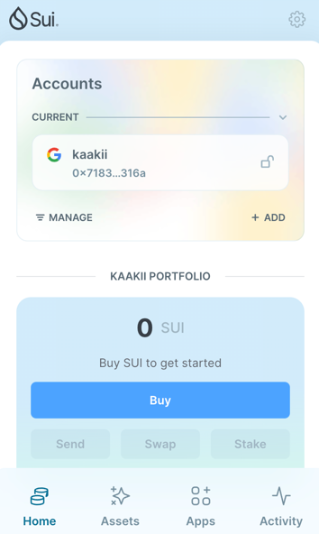
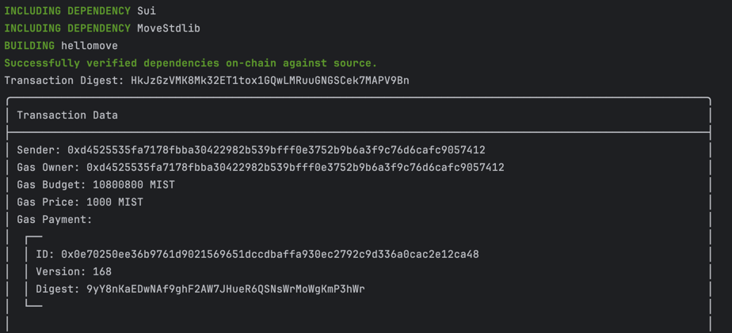
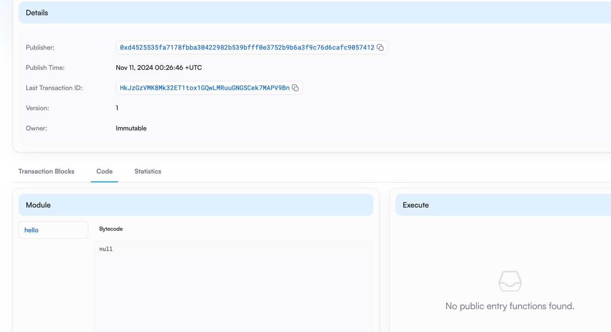

## 基本信息
- Sui钱包地址: `0x718314d4e9e34570f27ab0162b20da5d75930db5825598ba440ff429b873316a`
> 首次参与需要完成第一个任务注册好钱包地址才被合并，并且后续学习奖励会打入这个地址
- github: `kaakii`

## 个人简介
- 工作经验: 5年
- 技术栈: `java` `python`
> 重要提示 请认真写自己的简介
- web3小韭菜，想学一门web3开发语言，踏踏实实build搞钱
- 联系方式: tg: `https://t.me/weiliwoo0` 

## 任务

##   01 hello move  
- [x] Sui cli version: sui 1.37.1-7839b9501066
- [x] Sui钱包截图: 
- [x] package id: 0xd7f7ef200cdf6d5c3cba6d5d28c650052ce9f4f7bbbf3dbc7176ad7509809fec
- [x] package id 在 scan上的查看截图:
 

##   02 move coin
- [x] My Coin package id : 0x38c23f79f7f71b046cbcb3cf83cb9bb905c1808e1f0fec4e278227a42ee4be47
- [x] Faucet package id : 0xdc08824abbae44a21376facc1d68e171b6900f65235160f9fe57d836df82b814
- [x] 转账 `My Coin` hash: 2pJJZDPekvMXufiGvwdmBj8YDtSFQALuLTY8ZmUXVYBs
- [x] `Faucet Coin` address1 mint hash: jJQpNwiukwEpvvvk6NGeMqSGGVRKyMw6Bv7fm4RRau4
- [x] `Faucet Coin` address2 mint hash: 4uUr2wrmTxrxLfm9nFxqhQSKmN3syPTc1BM8eyXwdibg

##   03 move NFT
- [] nft package id : 
- [] nft object id : 
- [] 转账 nft  hash:
- [] scan上的NFT截图:

##   04 Move Game
- [] game package id :
- [] deposit Coin hash:
- [] withdraw `Coin` hash:
- [] play game hash:

##   05 Move Swap
- [] swap package id :
- [] call swap CoinA-> CoinB  hash :
- [] call swap CoinB-> CoinA  hash :

##   06 Dapp-kit SDK PTB
- [] save hash :

##   07 Move CTF Check In
- [] CLI call 截图 : 
- [] flag hash :

##   08 Move CTF Lets Move
- [] proof : 
- [] flag hash :
