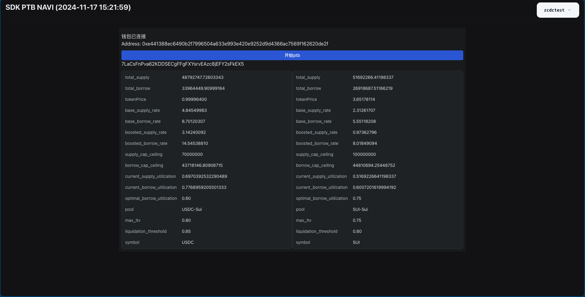

# sdk_ptb_navi

1.[存入Navi Protocol 1 SUI]
2.[借出当前日期的USDC 0.[月][天][小时] 的 USDC]
3.[然后在存入等额的USDC]

> 当前时间是2024年4月25日15点 借出的金额就是 `0.042515`   月 天 小时 必须是两位数 2024年5月1日2点  `0.050102`

## 访问地址
[https://4mjqn8g7bpt52zb1sepiqc48q5l9i3kw561f6epd40c3iz2my3.walrus.site](https://4mjqn8g7bpt52zb1sepiqc48q5l9i3kw561f6epd40c3iz2my3.walrus.site)

## 执行结果


## Starting your dApp

To install dependencies you can run

```bash
pnpm install
```

To start your dApp in development mode run

```bash
pnpm dev
```

## Building

To build your app for deployment you can run

```bash
pnpm build
```
