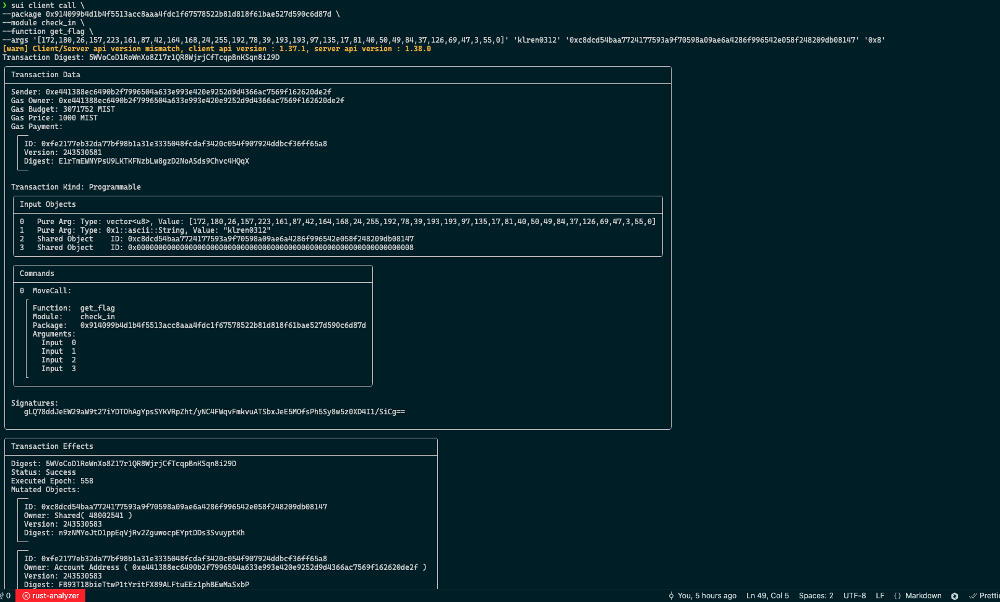

## 基本信息
- Sui钱包地址: `0xe441388ec6490b2f7996504a633e993e420e9252d9d4366ac7569f162620de2f`
> 首次参与需要完成第一个任务注册好钱包地址才被合并，并且后续学习奖励会打入这个地址
- github: `klren0312`

## 个人简介
- 工作经验: 6年
- 技术栈: `NodeJS` `Vue` `React` `Java`
- 想在web3平台上做出些有趣的东西，还需探索。

## 任务

##   01 hello move  
- [x] Sui cli version: 1.36.2-homebrew
- [x] Sui钱包截图: 
- [x] package id: [0x19ecfa4aa8ffa59df60f36a7e99f09bed0e20be6701b6b9fac7d54ac936366c8](https://suiscan.xyz/mainnet/object/0x19ecfa4aa8ffa59df60f36a7e99f09bed0e20be6701b6b9fac7d54ac936366c8)
- [x] package id 在 scan上的查看截图:

##   02 move coin
- [x] My Coin package id : [0x443d66aba5c1406566704a5dee8f59ff79e2c667b32022a5daf054530d4ab1e3](https://suiscan.xyz/mainnet/object/0x443d66aba5c1406566704a5dee8f59ff79e2c667b32022a5daf054530d4ab1e3)
- [x] Faucet package id : [0xc9fbe1280a650aecbfdad2a06fcb3d9caee10c07a1c0ae405e8494727d3a29a5](https://suiscan.xyz/mainnet/object/0xc9fbe1280a650aecbfdad2a06fcb3d9caee10c07a1c0ae405e8494727d3a29a5)
- [x] 转账 `My Coin` hash: [DcRuXAFu9jy4bZQNhkb2TJUuQSABwa43UQMakhF3cJLU](https://suiscan.xyz/mainnet/tx/DcRuXAFu9jy4bZQNhkb2TJUuQSABwa43UQMakhF3cJLU)
- [x] `Faucet Coin` address1 mint hash: [BL5vT4kPB8APRRSPvt3otdJkuvfNdSYsvwJ2DF6HccZ9](https://suiscan.xyz/mainnet/tx/BL5vT4kPB8APRRSPvt3otdJkuvfNdSYsvwJ2DF6HccZ9)
- [x] `Faucet Coin` address2 mint hash: [8YHg2JqyynYiBhTEd4eskz5MuKTcydAuQ2r7PC2AzaV7](https://suiscan.xyz/mainnet/tx/8YHg2JqyynYiBhTEd4eskz5MuKTcydAuQ2r7PC2AzaV7)

##   03 move NFT
- [x] nft package id : [0xd81c359458980b859baacdb4e1894ea24675b5246b204cfc41f661682e8887c8](https://suiscan.xyz/mainnet/object/0xd81c359458980b859baacdb4e1894ea24675b5246b204cfc41f661682e8887c8)
- [x] nft object id : [0xa0b73885bf55dd06c18bfc5b0c3a1e5dc4af5c8075ab32fdd6e08f6c8e279400](https://suiscan.xyz/mainnet/object/0xa0b73885bf55dd06c18bfc5b0c3a1e5dc4af5c8075ab32fdd6e08f6c8e279400)
- [x] 转账 nft  hash: [6MXeTQZJMagsGyUgF71DXQ9fRivzXvRtE35eg3ca92W3](https://suiscan.xyz/mainnet/tx/6MXeTQZJMagsGyUgF71DXQ9fRivzXvRtE35eg3ca92W3)
- [x] scan上的NFT截图:

##   04 Move Game
- [x] game package id: [0x413e80e5c694ee898cdb34ba412365702f2d7b5d5f2d0f3c6ccc40f89bdbb066](https://suiscan.xyz/mainnet/object/0x413e80e5c694ee898cdb34ba412365702f2d7b5d5f2d0f3c6ccc40f89bdbb066)
- [x] deposit Coin hash: [F8SrvkmhmXoCozCJdMCEeLVpco9WRLv4Nc7P8JBwsJk1](https://suiscan.xyz/mainnet/tx/F8SrvkmhmXoCozCJdMCEeLVpco9WRLv4Nc7P8JBwsJk1)
- [x] withdraw `Coin` hash: [2kcQf8D3KaDqdwU6rgBpddVuGA7E1ccvfM14XmqubzFd](https://suiscan.xyz/mainnet/tx/2kcQf8D3KaDqdwU6rgBpddVuGA7E1ccvfM14XmqubzFd)
- [x] play game hash: [JALk1BLnrTyTAV71cDZ3Be2AJPqaJYZ1WM47yT4ux4PQ](https://suiscan.xyz/mainnet/tx/JALk1BLnrTyTAV71cDZ3Be2AJPqaJYZ1WM47yT4ux4PQ)

##   05 Move Swap
- [x] swap package id : [0x2aabda497a78029660d83c04d26b294dbc66acc56873ff1e22302c9a98bb927a](https://suiscan.xyz/mainnet/object/0x2aabda497a78029660d83c04d26b294dbc66acc56873ff1e22302c9a98bb927a)
- [x] call swap CoinA-> CoinB  hash : [DB6Wy9Ba4xoUVjSnPqAm7HSJahmtiVSLyhVJH9zR8zEc](https://suiscan.xyz/mainnet/tx/DB6Wy9Ba4xoUVjSnPqAm7HSJahmtiVSLyhVJH9zR8zEc)
- [x] call swap CoinB-> CoinA  hash : [Gattj5oWZMaYggjc7vke8rUdTi9SaMMsmC1xdV9hQ9dW](https://suiscan.xyz/mainnet/tx/Gattj5oWZMaYggjc7vke8rUdTi9SaMMsmC1xdV9hQ9dW)

##   06 Dapp-kit SDK PTB
- [x] save hash : [7LaCsFnPva62KDDSECgFFgFXYsrvEAzc8jEFY2sFkEX5](https://suiscan.xyz/mainnet/tx/7LaCsFnPva62KDDSECgFFgFXYsrvEAzc8jEFY2sFkEX5)

##   07 Move CTF Check In
- [x] CLI call 截图 : 
- [x] flag hash : [5WVoCoD1RoWnXo8Z17r1QR8WjrjCfTcqpBnKSqn8i29D](https://suiscan.xyz/mainnet/tx/5WVoCoD1RoWnXo8Z17r1QR8WjrjCfTcqpBnKSqn8i29D)

##   08 Move CTF Lets Move
- [] proof : 
- [] flag hash :
