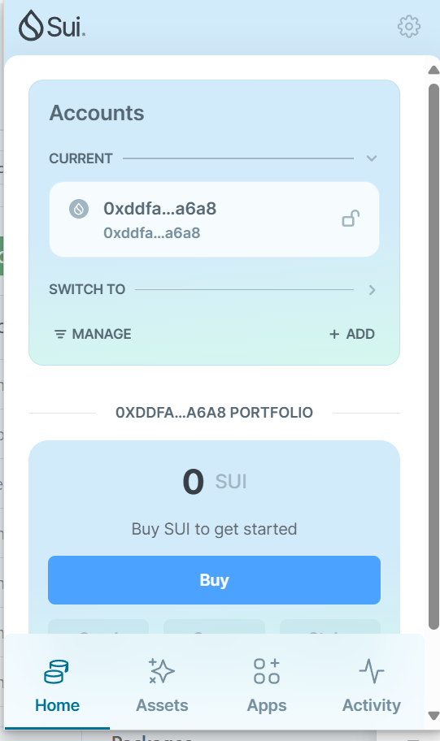
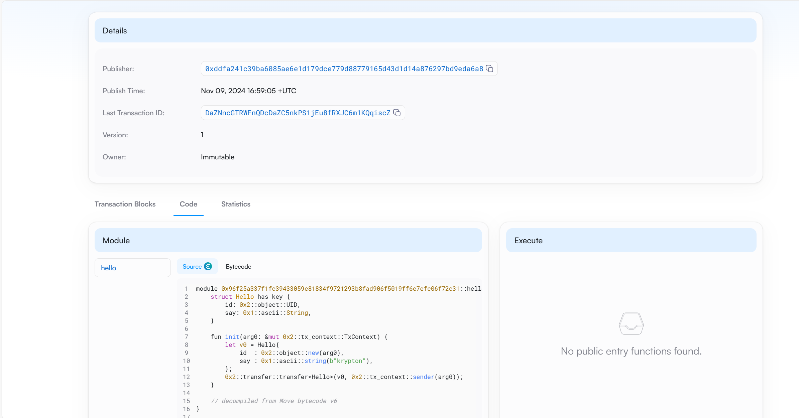
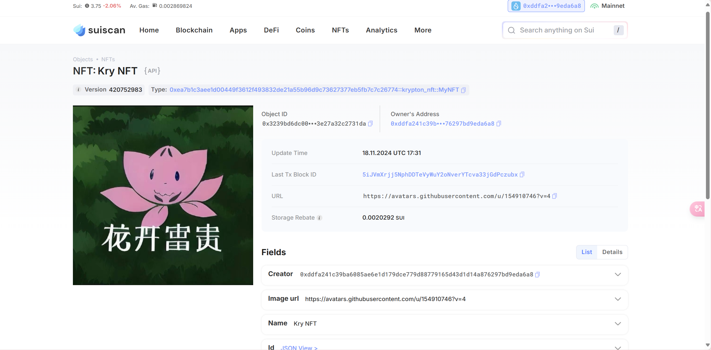

## 基本信息
- Sui钱包地址: `0xddfa241c39ba6085ae6e1d179dce779d88779165d43d1d14a876297bd9eda6a8`
> 首次参与需要完成第一个任务注册好钱包地址才被合并，并且后续学习奖励会打入这个地址
- github: `krypt0n123`

## 个人简介
- 工作经验: 0年
- 技术栈: `c` `python`
> 重要提示 请认真写自己的简介
- 本科院校大一在读生，主打一个尝鲜
- 联系方式: tg: `@kiko_kry` 

## 任务

##   01 hello move  
- [x] Sui cli version: sui 1.37.1-homebrew
- [x] Sui钱包截图: 
- [x] package id: 0xf54f02036244432d8462f5122fe8d7141efce900accfe987187caff17130624d
- [X] package id 在 scan上的查看截图:

##   02 move coin
- [x] My Coin package id : 0xe7003304adcf9c890cd223629257c7ad22fbf8661046a6068df5972935a7e5f2
- [x] Faucet package id : 0x431eb5a1aae2b113991b76fbe7c62aeec9ffda1f27521d02d64bde7084ae902a
- [x] 转账 `My Coin` hash:8A8ZHKG6BaWdc4X5Fym79w8K3opPt4ZAJtwfBNCUyx75
- [x] `Faucet Coin` address1 mint hash:Av75qLBE6eeN897DFpzE7mBX5FUaHGENqRCendh84nJ9
- [x] `Faucet Coin` address2 mint hash:Av75qLBE6eeN897DFpzE7mBX5FUaHGENqRCendh84nJ9

##   03 move NFT
- [x] nft package id :0xea7b1c3aee1d00449f3612f493832de21a55b96d9c73627377eb5fb7c7c26774
- [x] nft object id : 0x3239bd6dc00d8a991bd85a05ffa029773ef0c5c1f3eaaf9cd33e27a32c2731da
- [x] 转账 nft  hash:7qpuh7jzWznXTsXyYamqQ4fBohRya1XF4euZdjyAzxYW
- [x] scan上的NFT截图:

##   04 Move Game
- [] game package id :
- [] deposit Coin hash:
- [] withdraw `Coin` hash:
- [] play game hash:

##   05 Move Swap
- [] swap package id :
- [] call swap CoinA-> CoinB  hash :
- [] call swap CoinB-> CoinA  hash :

##   06 Dapp-kit SDK PTB
- [] save hash :

##   07 Move CTF Check In
- [] CLI call 截图 : 
- [] flag hash :

##   08 Move CTF Lets Move
- [] proof : 
- [] flag hash :
