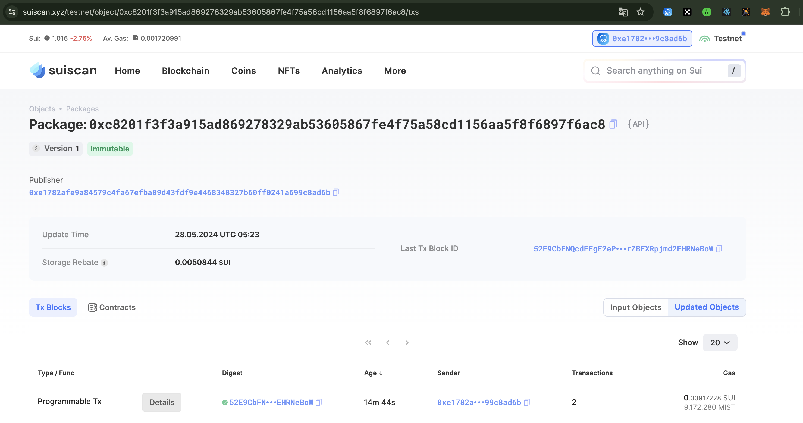

## 基本信息
- Sui钱包地址: `0xe1782afe9a84579c4fa67efba89d43fdf9e4468348327b60ff0241a699c8ad6b`

- github: `https://github.com/laozpgz`

## 个人简介
> 简介 
- 工作经验: 9年
- 技术栈:  `JS TS` `Web3D-Threejs` `unity` `Solidity` 
- 对MOVE语言、Sui生态感兴趣 
- 联系方式: email: `laozpgz@gmail.com` 

## 任务

##   01 hello move  
- [x] Sui cli version:sui-client 1.26.0
- [x] Sui钱包截图: 
- [x] package id: 0xc8201f3f3a915ad869278329ab53605867fe4f75a58cd1156aa5f8f6897f6ac8
- [x] package id 在 scan上的查看截图:

##   02 move coin
- [x] My Coin package id : 0x505116c299e1202199037b7915e8e0c80c5c5dbef5cb5105178f83412521ddc2
- [x] Faucet package id : 0x505116c299e1202199037b7915e8e0c80c5c5dbef5cb5105178f83412521ddc2
- [x] 转账 `My Coin` hash : 6fP6nJoGM1EAbFHMnAk3RviEpxr9TByhYK4ReAgmr6ko
- [x] `Faucet Coin` address1 mint hash : B3jrvXXPSeHNFZwTAF5fWrdWiNN1vUJEU862baivJ46f
- [x] `Faucet Coin` address2 mint hash : AWtLUZL41zLF1r5EjNQF2BY5Dz8QyrG5LUkY7Zkd4QBJ

##   03 move NFT
- [x] nft package id :0xc1feab0a77bfbaf5c6e2dc2a82e9574973d5f3c81fddd89657100bb30cdc1877
- [x] nft object id : 0x9e672cb5d665f3f5195e4d7730d19f8427ab1c43b6fcf5705e08e95714ce5270
- [x] 转账 nft hash:VkJGy8eEzjdER3tuVKkj667ySEVmAe2zku8tddavvZU
- [x] scan上的NFT截图:

##   04 Move Game
- [] game package id :
- [] deposit Coin hash:
- [] withdraw `Coin` hash:
- [] play game hash:

##   05 Move Swap
- [x] swap package id :0xe1782afe9a84579c4fa67efba89d43fdf9e4468348327b60ff0241a699c8ad6b
- [x] call swap CoinA-> CoinB  hash :Dyew1ABnKfmeUKqPmc4Pt9cQLYKopiSD4PpTqESzY89h
- [x] call swap CoinB-> CoinA  hash :HMTvFTzJVtCj2K9u3acDyTGUaLHdp7D8e6jEd2N2jnRZ

##   06 Dapp-kit SDK PTB
- [] save hash :
