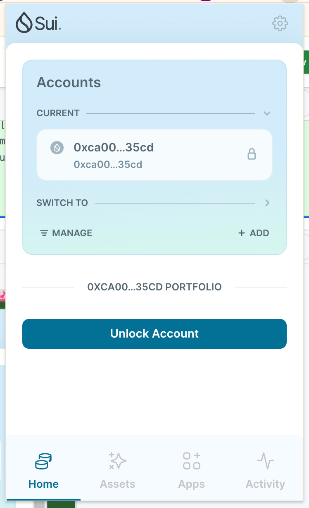
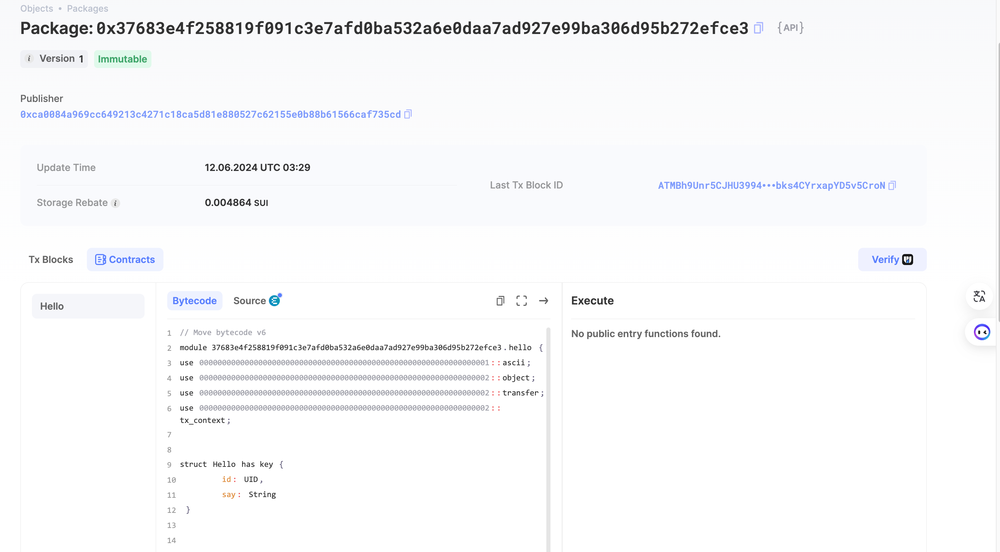

# 基本信息

- Sui钱包地址: 0xca0084a969cc649213c4271c18ca5d81e880527c62155e0b88b61566caf735cd

  > 首次参与需要完成第一个任务注册好钱包地址才被合并，并且后续学习奖励会打入这个地址
- github: leemove

## 个人简介

- 工作经验: 1年
- 技术栈: Nodejs
- 刚接触sui链，希望通过move学习能进入sui链生态
- 联系方式: hg_limu@163.com

## 任务

## 01 hello move

- [x] Sui cli version: 1.25.1
- [x] package id: 0x37683e4f258819f091c3e7afd0ba532a6e0daa7ad927e99ba306d95b272efce3
- [x] Sui钱包截图: 
- [x] package id 在 scan上的查看截图:
