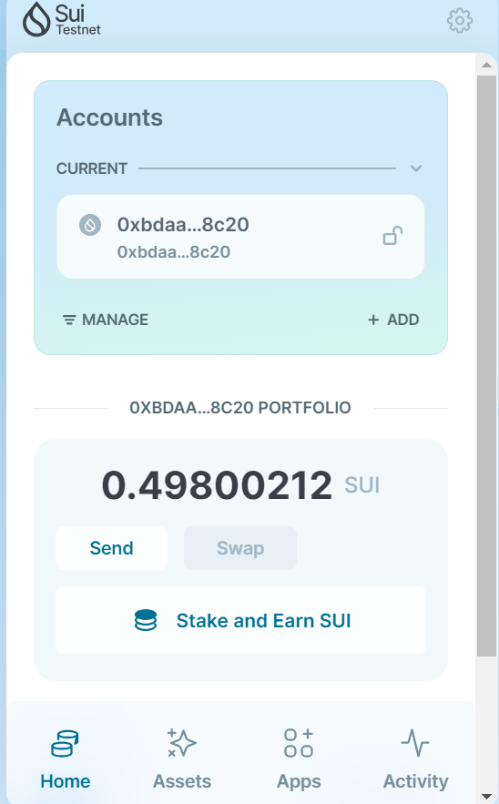
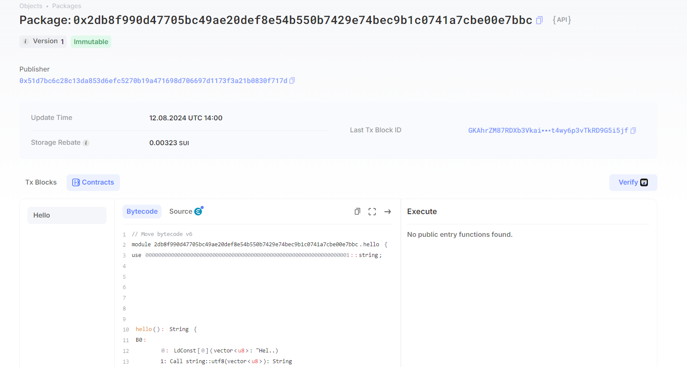
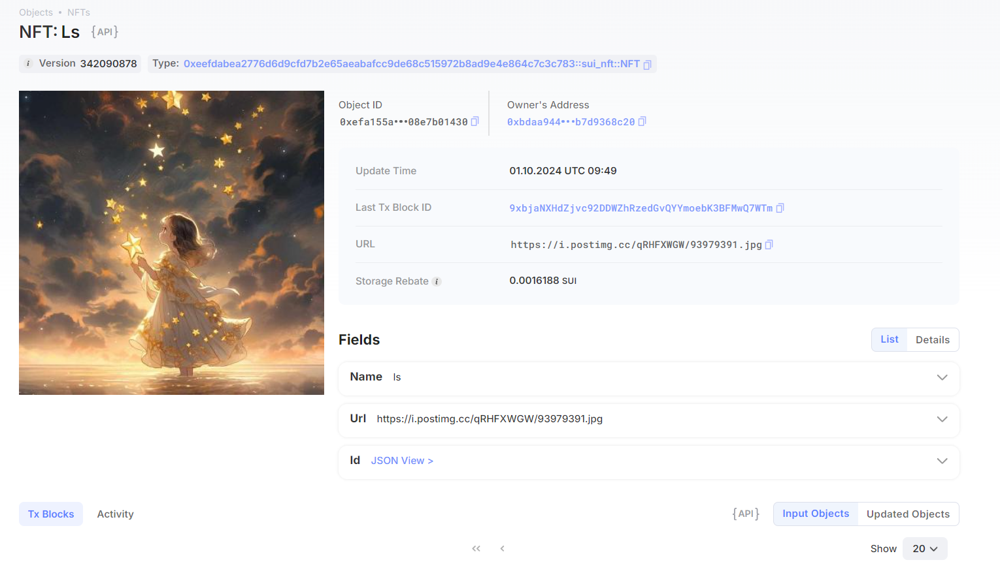

## 基本信息
- Sui钱包地址: `0xbdaa944787039ff0ff190ca8480d26ed6e730041649454574c6040b7d9368c20`
> 首次参与需要完成第一个任务注册好钱包地址才被合并，并且后续学习奖励会打入这个地址
- github: `自己的githubid`

## 个人简介
- 工作经验: 1年
- 技术栈: `React` `Solidity`
- keeplearning
- 联系方式: tg: `linsuu` 

## 任务

##   01 hello move  
- [] Sui cli version:
- [] Sui钱包截图: 
- [] package id: 0x2db8f990d47705bc49ae20def8e54b550b7429e74bec9b1c0741a7cbe00e7bbc
- [] package id 在 scan上的查看截图:

##   02 move coin
- [] My Coin package id : 0x4909c9868ff48868dccf62c40bbad19f260f5f4839d816e4f95ac1121e38e06d
- [] Faucet package id : 0x89ee915e9470b6a210938022ddb4b54c82b3da9090a6c608128ebd3682ce572b
- [] 转账 `My Coin` hash:12JkLj9gqr7YjVgsqcs5b1TVuosKJAmcesXacXzqvtau
- [] `Faucet Coin` address1 mint hash:5K6FrmDGtyYi24Fc3u1vHmBV8m5Ac2VfAm1KrCDXfZ7n
- [] `Faucet Coin` address2 mint hash:MB9apUTar9gu3T6Lz8txoFp599DokpWTMPQReAnR67Q

##   03 move NFT
- [] nft package id :0xeefdabea2776d6d9cfd7b2e65aeabafcc9de68c515972b8ad9e4e864c7c3c783
- [] nft object id : 0xefa155a7d11b8752f00c9f93cf03b2b57baaf7d4e713f62784d3e008e7b01430
- [] 转账 nft  hash:GNuHifJfeu86sZajCfM7zaRDDFg2j3ScHgEttqXGhVw6
- [] scan上的NFT截图:

##   04 Move Game
- [] game package id : 0x7dd4425d35749aa7d8cb105b6f905e6b0a3289906fefd249e2120b8d64298fd5
- [] deposit Coin hash:7VdsdHkGwkf9xqpUPCpL7BX6Dxv2KNchiMgN4e3AY7QQ
- [] withdraw `Coin` hash:CDMRq4Sbm1W9nFydiLgTSyXzFM6xCdeZJyKuW2eZJ86G
- [] play game hash:ALSdD3iHTbmVvgMQFZoF42JtqdCaywzgM7ECCmH8u1cz

##   05 Move Swap
- [] swap package id :
- [] call swap CoinA-> CoinB  hash :
- [] call swap CoinB-> CoinA  hash :

##   06 Dapp-kit SDK PTB
- [] save hash :

##   07 Move CTF Check In
- [] CLI call 截图 : 
- [] flag hash :

##   08 Move CTF Lets Move
- [] proof : 
- [] flag hash :
