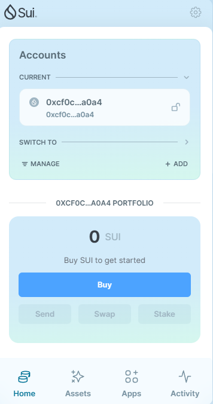
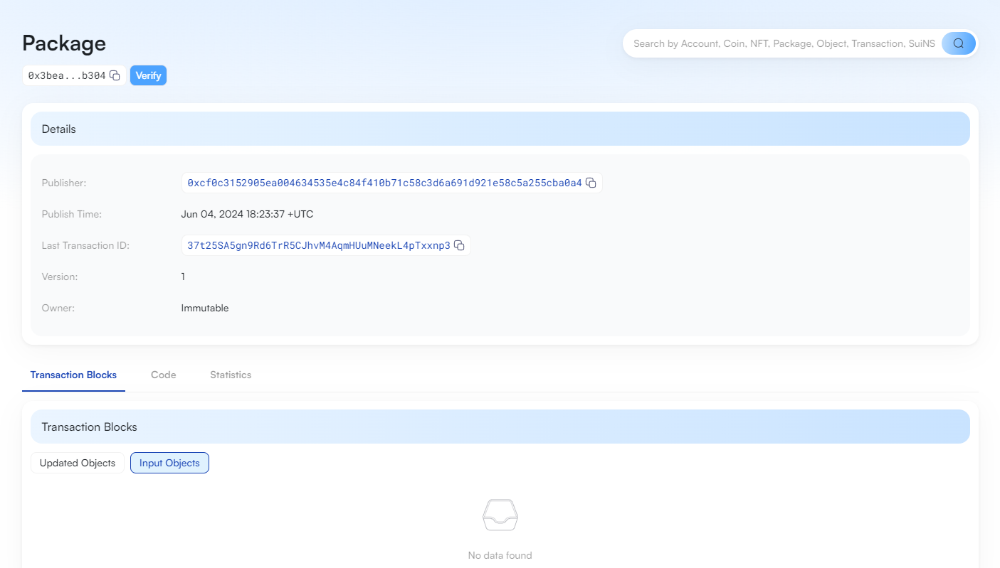

## 基本信息
- Sui钱包地址: `0xcf0c3152905ea004634535e4c84f410b71c58c3d6a691d921e58c5a255cba0a4`
> 首次参与需要完成第一个任务注册好钱包地址才被合并，并且后续学习奖励会打入这个地址
- github: `limitcool`

## 个人简介
- 工作经验: 3年
- 技术栈: `Rust` `Go` `Python`
> 重要提示 请认真写自己的简介
- 多年web2开发经验，对Move特别感兴趣，想通过Move入门区块链
- 联系方式: tg: `limitcool`

## 任务

##   01 hello move
- [X] Sui cli version: sui 1.26.1-540d384f226a-dirty
- [X] Sui钱包截图: 
- [X] package id: 0x3beafe5bed5a426f1129d00753a065d62b8db8c129c77874d277a922a68eb304
- [X]X package id 在 scan上的查看截图:

##   02 move coin
- [X] My Coin package id : 0x919db1db921191bd77910afab462a520b9f2209ca491cdf62ef608c1eaf88198
- [X] Faucet package id : 0x617ea8c5865526213b347be660c1fcff0e71c193eef676fb0618dd369ce1dccc
- [X] 转账 `My Coin` hash: BaNwozTZNZNsxnJ7HM4g19DmQV5V1ycA7jTMqBMdS46z

##   03 move NFT
- [] nft package id :
- [] nft object id :
- [] 转账 nft  hash:
- [] scan上的NFT截图:

##   04 Move Game
- [] game package id :
- [] deposit Coin hash:
- [] withdraw `Coin` hash:
- [] play game hash:

##   05 Move Swap
- [] swap package id :
- [] call swap CoinA-> CoinB  hash :
- [] call swap CoinB-> CoinA  hash :

##   06 Dapp-kit SDK PTB
- [] save hash :

##   07 Move CTF Check In
- [X] CTF hash : 7oDgwmvFSvTD26GTSCdAydrVxVA9MZnzdQKAVvkG75T

##   08 Move CTF
- [X] CTF hash : ATTnSWtoCL1Vannpt9anKQXhC4SftShabuGC92Htm2Xb
