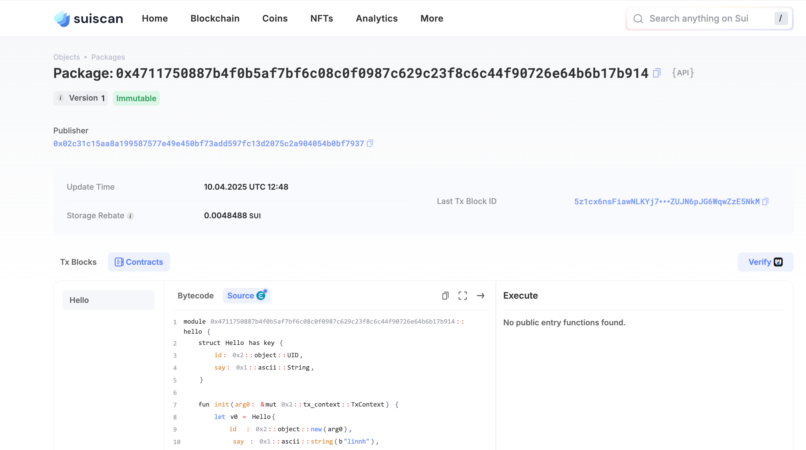

## 基本信息
- **Sui钱包地址**: `0x551a90d4f7dcff7ebb13d41adcb8580b3321ef1152939fdd79b3520eabed08d5`
- **Github Account**: [linnlh](https://github.com/linnlh)

## 个人简介

### 技术背景
- 从事 AI 大模型推理方向开发，熟悉 `python、c/c++、go` 技术栈，具备大模型推理优化以及分布式部署相关经验；
- 近期关注区块链相关技术，包括 SUI 的链上生态，系统学习 `Sui Move` 合约开发。

### 近期目标
- 学习并完成 `Move 共学营` 相关知识任务
- 参加 `Sui Overflow` 黑客松比赛
- 学习并理解 `Sui` 链的架构设计


## 任务

##   01 hello move  
- [x] Sui cli version: `sui 1.46.2-5c023dd1d5f4`
    ```bash
    $ sui --version
    sui 1.46.2-5c023dd1d5f4
    ```
- [x] Sui钱包截图: 
    <div style="text-align: center;">
        
    </div>
- [x] package id: `0x4711750887b4f0b5af7bf6c08c0f0987c629c23f8c6c44f90726e64b6b17b914`
- [x] package id 在 sui scan 上的查看截图:
    <div style="text-align: center;">
        
    </div>

##   02 move coin
- [x] `My Coin` package id : `0xbe331e96904328f7df09ed3fcd4c1f9bd5278476bd3c11525bc618334846afa2`
- [x] `Faucet Coin` package id : `0xddfdb54eb80c8ff6d023e3fb75f4c2a2add96e77673b863758af5b6f43b7ba7c`
- [x] 转账 `My Coin` hash: `ED8UguF2TuWdYB7XzEV4KZJxo75Un7a7FhaMoNzegBmv`
- [x] `Faucet Coin` address1 mint hash: `EinpSKwUMuK6gN1h11Ba5hv4qKnXm8moUjegzGQbjNDg`
- [x] `Faucet Coin` address2 mint hash: `EsNMmgdy39NqF4J5i99JgczeaSLPU4VB7bCdTpy8kUpk`