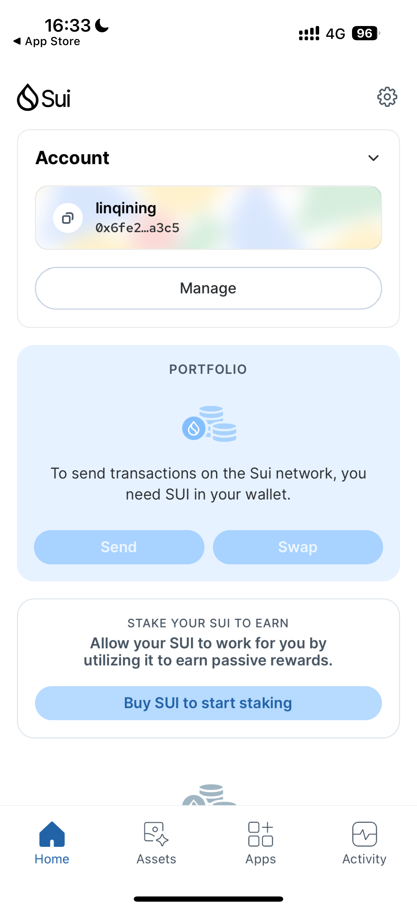
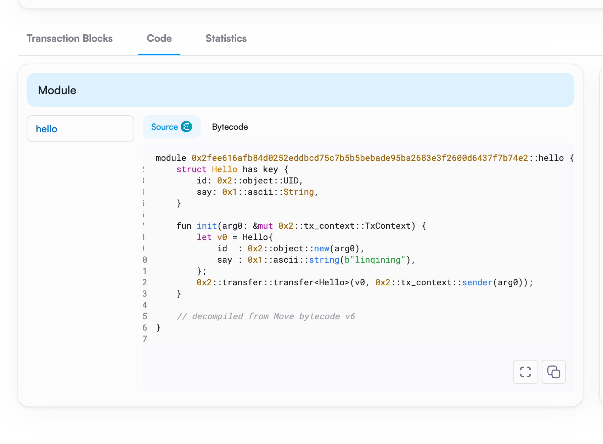
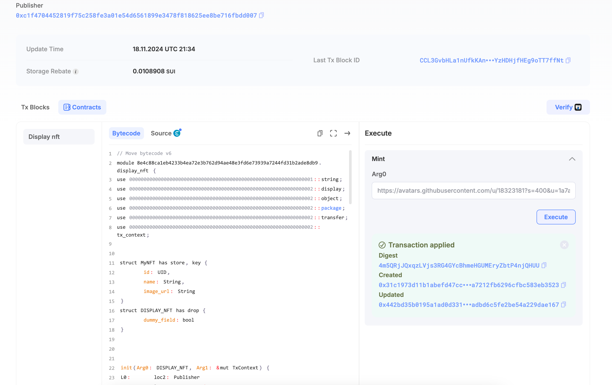

## 基本信息
- Sui钱包地址: `0x6fe2c22857412778b6b6eda51dbf2bf26f7e130d9cfc4b67e3c53d39e7f0a3c5`
> 首次参与需要完成第一个任务注册好钱包地址才被合并，并且后续学习奖励会打入这个地址
- github: `linqining`

## 个人简介
- 工作经验: 6年
- 技术栈: `golang` `python` `Rust`
> 重要提示 请认真写自己的简介
- 多年从事游戏开发，主要编程语言golang
- 熟悉golang语言，熟悉使用redis,mysql,mongo,kafka等中间件
- 参与和开发百万用户的游戏项目，掌握处理游戏并发，服务监控
- 多年游戏经验让我对Sui处理并发和共识模型高度认可，对Sui在游戏应用有浓厚兴趣
- 联系方式: tg: `@Dsin77` 

## 任务

##   01 hello move  
- [x] Sui cli version: sui 1.37.1-homebrew
- [x] Sui钱包截图: 
- [x] package id: 0x2fee616afb84d0252eddbcd75c7b5b5bebade95ba2683e3f2600d6437f7b74e2
- [x] package id 在 scan上的查看截图:

##   02 move coin
- [x] My Coin package id : 0xff6c887f84778d86304dab92b31fed7ea25fec1bdc783c9f7c9a2bfa0546f4a3
- [x] Faucet package id : 0xf855a34f6870634a444260ec3a7ad5581334849d8388f63d67e703b06428edc4
- [x] 转账 `My Coin` hash: zMbWbMhgKgaWxJBwYswUJpqHR4ZmUCVu8856P2jjz2p
- [x] `Faucet Coin` address1(0x7caaf3d123266f92398b3b642682133098afa7017b3a74b7fd0442d0368ae595) mint hash: 5XY6xTNBYmSYN4zGGf7WRUV3pB7Q4Tn8fm1WFjqktQZc
- [x] `Faucet Coin` address2(0xc1f4704452819f75c258fe3a01e54d6561899e3478f818625ee8be716fbdd007) mint hash: HYr5URs9WbfP4sEUxQJtbfPg16U33XCmNnGwv7MPyVVM

##   03 move NFT
- [x] nft package id : 0x08e4c88ca1eb4233b4ea72e3b762d94ae48e3fd6e73939a7244fd31b2ade8db9
- [x] nft object id : 0x2f7c23c9e1e90dde2164fd15bdded9e8d43e6f19e81822883a3beb93f4495899
- [x] 转账 nft  hash: PmWjBzc9RfS8UnQ14URBZKktEptWv4r1x3FN8dUCDqt
- [x] scan上的NFT截图:
  

##   04 Move Game
- [x] game package id : 0xe6e615d3803b8fc33f3bb3d0d474d0ba8c9847146419c8bedf5fa19c296bff50
- [x] deposit Coin hash: G8xWzdGqDbpbx94Vz1C6ePU6iJnrJ3E5KbLoGmGy15cx
- [x] withdraw `Coin` hash: 7wUYGYhkJbgiNRTjwA9ruJ3gAjMJeAAUht5e1rNxFrWM
- [x] play game hash: 6R8Gdu9zCuptC4y3BK9ZC543aZzDrNuE4xDB9mfd4ozT

##   05 Move Swap
- [x] swap package id : 0xac1b4e3d1361a997bfebca08f111ae1886cafd05056207db16babd7ff1d6991d
- [x] call swap CoinA(USD)-> CoinB(EIG)  hash : 9YjepaUA1UY72j8VY7xccacVwRw2oJNJoDUL5ivJetbU
- [x] call swap CoinB(EIG)-> CoinA(USD)  hash : 4TBBahEuS74s7WRTpvAu7BfCAowEaGFvNJwYZGYqsMGG

##   06 Dapp-kit SDK PTB
- [x] save hash : Cssqi4bop5TejjA8AiV9bmEryy3tThXqpWguT1qmxqt3

##   07 Move CTF Check In
- [] CLI call 截图 : 
- [] flag hash :

##   08 Move CTF Lets Move
- [] proof : 
- [] flag hash :
