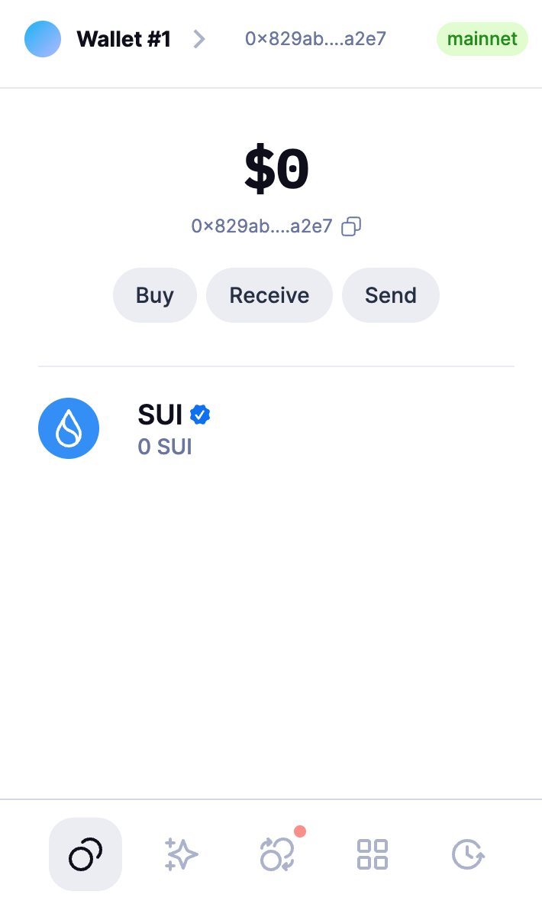
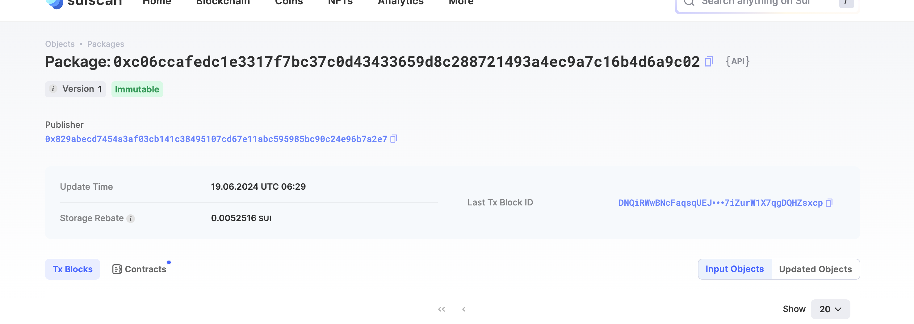
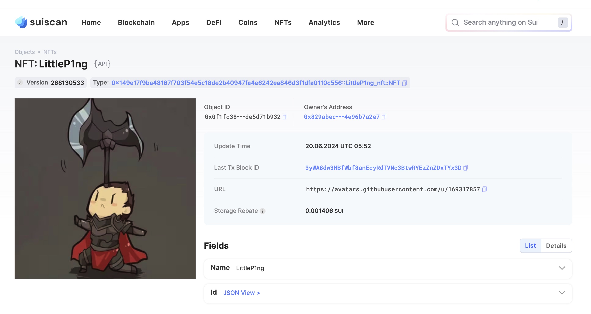
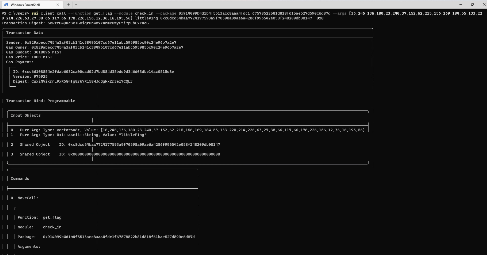

## 基本信息
- Sui钱包地址: `0x829abecd7454a3af03cb141c38495107cd67e11abc595985bc90c24e96b7a2e7`
> 首次参与需要完成第一个任务注册好钱包地址才被合并，并且后续学习奖励会打入这个地址
- github: `littleP1ng`

## 个人简介
- 工作经验: 1年
- 技术栈: `Jave` `C++`
> 重要提示 请认真写自己的简介
- java从业者，对Move和Rust感兴趣，想通过Move入门区块链
- 联系方式: tg: `littleP1ng` 

## 任务

##   01 hello move  
- [x] Sui cli version: sui 1.27.2-9e2be6ad4185
- [x] Sui钱包截图: 
- [x] package id:  0xc06ccafedc1e3317f7bc37c0d43433659d8c288721493a4ec9a7c16b4d6a9c02      
- [x] package id 在 scan上的查看截图:

##   02 move coin
- [x] My Coin package id : 0x9cb993c5469e8a006187c7f3d83cd897b08dc259127ebd92a2573cd719c4876c              
- [x] Faucet package id : 0xf384148678a81ed4e9a27fe1bd552e021c4c44cb44f657af22fe24ff8d3a3b4f            
- [x] 转账 `My Coin` hash : 5MdqLThcA3zSexwtd2S4AVENoGFkqg74kZBpewXVega7

- [x] `Faucet Coin` address1 mint hash :  8TtDy3tpRTqgAScyCSaDW3xtDQ3KiB8K2D9M4swmuRs4
- [x] `Faucet Coin` address2 mint hash :  3V58FsPsW23ZiRLfsneoSpTanPnJfydGxJAqYVPepxvL

##   03 move NFT
- [x] nft package id : 0x149e17f9ba48167f703f54e5c18de2b40947fa4e6242ea846d3f1dfa0110c556
- [x] nft object id :  0x0f1fc389b14d92e5f524459460cb19e1d6eba9c4fa83557d7dd50ade5d71b932          
- [x] 转账 nft  hash: BKaBBe7Ew9YuRwsHzKWmCJBKuJkZWb78bm18b42YTg4i
- [x] scan上的NFT截图:

##   04 Move Game
- [x] game package id : 0x370e3b0810ca9e0c23c1710a699459901193de327f54e3c942014fca473d6b6a  
- [x] deposit Coin hash: 7z4ENKcAKVBvMgFXrBAegmpmFJYrpaf69dC5vjTat4fm
- [x] withdraw `Coin` hash:  3YpDaTPU9JqcwMR6qFpCz1KHEeqgSWoecCRwCeutxewC
- [x] play game hash: AekFwTLjJHyrFSfMRapc9ofia3PjZ3F4a2cqtaPwPmj2

##   05 Move Swap
- [x] swap package id : 0x93112dedeaa9e3cad97a7dc6accfb101be05b3d5b1cfc71fc56c7f023ca15c62        
- [x] call swap CoinA-> CoinB  hash : EPpdHcyCVMbEMBdYmM7Z1CUEVQ5Ee6rZfsc2FF2ESf8L
- [x] call swap CoinB-> CoinA  hash : 92cwpiaUXEFffPRBc8fFZTNoVtXd6jekFC4gWMxkakZd

##   06 Dapp-kit SDK PTB
- [x] save hash : A8YcTiUvV75EsgZVuayCzxZMq4JFiuiLJzwhPmjauzXV

##   07 Move CTF Check In
- [x] CLI call 截图 : 
- [x] flag hash : 6ePzzD4Quc3eTGBiqrHn4m7Y4nmxDwyFti7pCbExYuoG

##   08 Move CTF Lets Move
- [x] proof : 2e1a501722db235e07ab
- [x] flag hash : 4yj3FHMpkkpj4VX9DaNELQPVFyrjJoKiWFoUpN3kapGd
