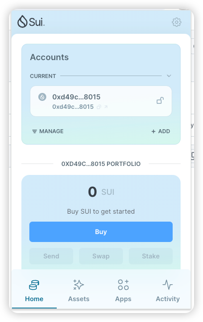
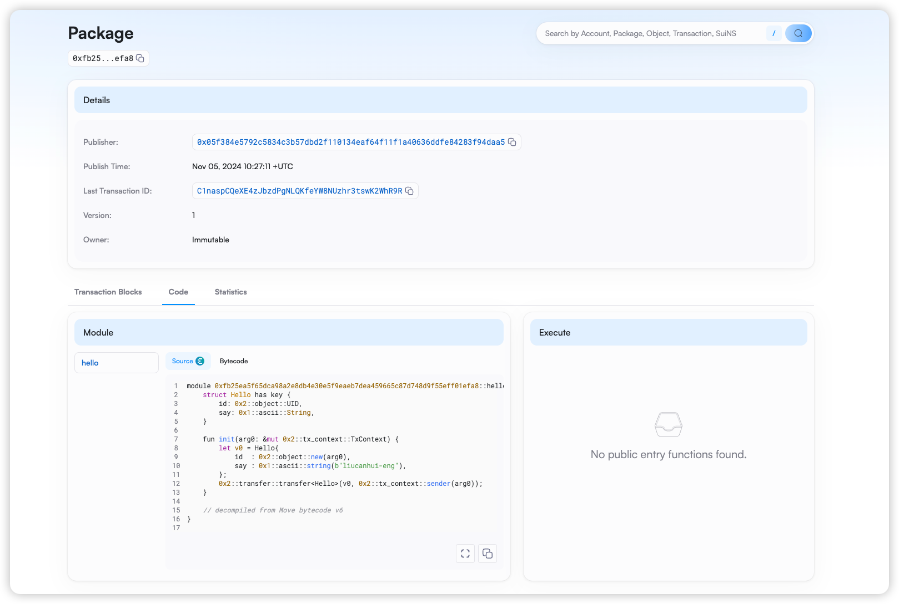
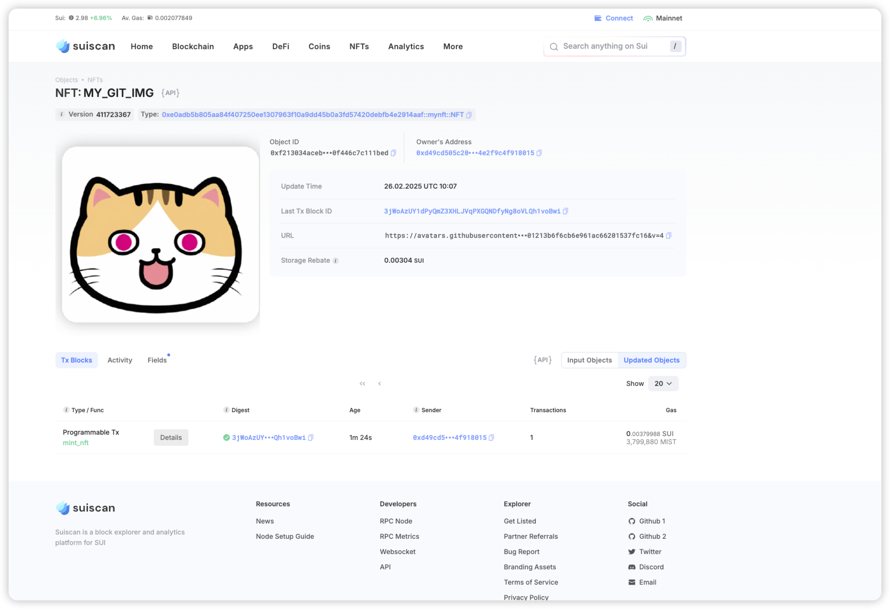

## 基本信息
- Sui钱包地址: `0xd49cd505c20c2b2acd41e918304a32fedc8801a1c6827536624e2f9c4f918015`
> 首次参与需要完成第一个任务注册好钱包地址才被合并，并且后续学习奖励会打入这个地址
- github: `liucanhui-eng`

## 个人简介
- 工作经验: 6年
- 技术栈: `java` `python` `motoko` `js` `rust`
> 重要提示 请认真写自己的简介
- 6 年 Java web2 后端开发经验。 2 年 ic 链开发经验。对sui链感兴趣。想学习move 语言
- 联系方式: tg: `Charles` 

## 任务

##   01 hello move  
- [x] Sui cli version: sui 1.37.1-homebrew
- [x] Sui钱包截图: 
- [x] package id: 0x05f384e5792c5834c3b57dbd2f110134eaf64f11f1a40636ddfe84283f94daa5
- [x] package id 在 scan上的查看截图:

##   02 move coin
- [x] My Coin package id : 0x3fa7160c7ba94f821f8575aa75d9741127cd9f80e45e2331a4dcaaa5f9cf7b83
- [x] Faucet package id : 0x76ed920226db822677e4f23b47776f9ab4e1f5731ce5f7a44786ddf137cdfcd5
- [x] 转账 `My Coin` hash: FGZ3XdAeVsdfATzUpiKmFt6UC3a6XZi1Ex2N29Ht8CDn
- [x] `Faucet Coin` address1 mint hash: ycaswdiVbhK3gezmJcr7iS9ioFyzuaw18rGVyequxkE
- [x] `Faucet Coin` address2 mint hash: BprvzUcLW3z2NmQQifztTkWDxqndxBgiQ3bKU7eAjSgT

##   03 move NFT
- [x] nft package id : 0xe0adb5b805aa84f407250ee1307963f10a9dd45b0a3fd57420debfb4e2914aaf
- [x] nft object id : 0xf213034acebf605dfad0a3bfb9594eb408917a658612e83ec70f446c7c111bed
- [x] 转账 nft  hash: GmzjbnJ3KiVyxToPZw8DqSNBeH5feM1rPSoLAjtdJSKH
- [x] scan上的NFT截图:

##   04 Move Game
- [x] game package id : 0x0d10347ba5c1ffd235e3f25a6a701b39f4ad2b7f4215ceea3a82f4b593ce6e99
- [x] deposit Coin hash: 4xnQ7teRNq69zU827GYEydhEvLS1f4UDh2fj4CUrNgo2
- [x] withdraw `Coin` hash: EYeraZfq9W42VEth5BrWUY2GStP2MumizCo8GrYEqQV2
- [x] play game hash: vjL5B48uZaYvwysariCT8yhSvLLSPUPWbDhwCvKVtKQ

##   05 Move Swap
- [] swap package id :0x9ee3d2d888ac5ad80444a54e78d638300f6f203418e5f8276406419c49692838
- [] call swap CoinA-> CoinB  hash : 3ENNDME2L3DaxvHHstSx44brMtDPnEQkT8aD1MkM2hdB
- [] call swap CoinB-> CoinA  hash : 7FFd9a3bSnUVVp3ULtUZjWJ29LW5DGtSMWJmUYsjHuDa

##   06 Dapp-kit SDK PTB
- [] save hash :

##   07 Move CTF Check In
- [] CLI call 截图 : 
- [] flag hash :

##   08 Move CTF Lets Move
- [] proof : 
- [] flag hash :
