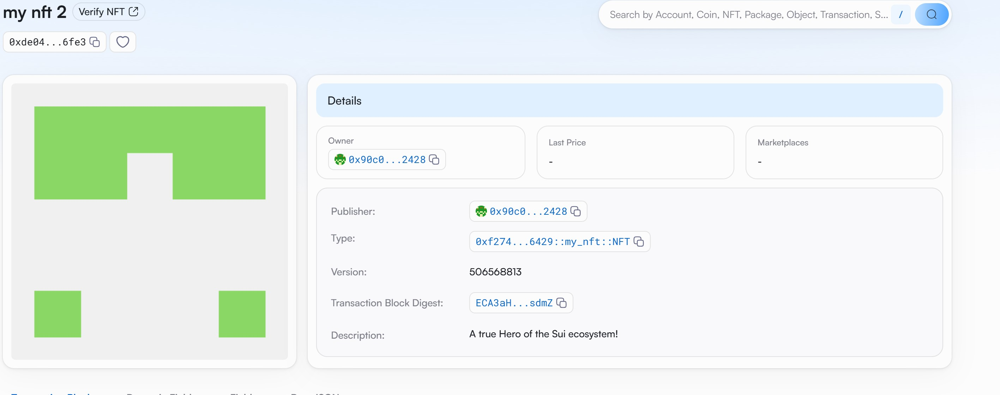

## 基本信息
- Sui钱包地址: `0x4759d707eacfbecdb14a87055e07fb24915c4e876fb34397ccde96840af5772f`
> 首次参与需要完成第一个任务注册好钱包地址才被合并，并且后续学习奖励会打入这个地址
- github: `liverbirdkte`

## 个人简介
- 工作经验: 10年
- 技术栈: `Python` `C++` `Rust`
> 重要提示 请认真写自己的简介
- 多年服务器端，云，开源软件开发经验，对Move特别感兴趣，想通过Move入门区块链
- 联系方式: tg: `xxx`

## 任务

##   01 hello move
- [x] Sui cli version: sui-client 1.44.1-homebrew
- [x] Sui钱包截图: 
- [x] package id: 0x2c73bed35b658022a059f32bb01435b141e57b08aa1b40d96510cac01b804b8f
- [x] package id 在 scan上的查看截图:

##   02 move coin
- [x] My Coin package id : 0x66f2e0ccf81da4bdf48f6e65728b04ab5b2356571d0a524e3c830e28ffc4e527
- [x] Faucet package id : 0x38a2d92949af1f543a8f0713cac4a69a192b4823c80c789a051da481adaf3620
- [x] 转账 `My Coin` hash: 2GpwM8xrg6dfKQZn5wwYuEVThxfVPoNvUdig49JQnaDf
- [x] `Faucet Coin` address1 mint hash: EDQikJKhjBBvsogj5zNRYN1PD1WT1ed9daGPAxEQUity
- [x] `Faucet Coin` address2 mint hash: HKw9Buw27CcNY3f1BiUomW86Z9J3VSH5sVLYnNAhasth

##   03 move NFT
- [x] nft package id : 0xf274c38fe3dbcca636eb43cf46cbd605f4ccd559df0b63c979db147073386429
- [x] nft object id : 0xde04eae07229d4f60feb7ff918b5a7b01a609d3a1c23fc2959b61ae049a16fe3
- [x] 转账 nft  hash: J7PJ1YWehhGeJDbUb5Me9MaPks4S5jFPgTEeCFywrDoH
- [x] scan上的NFT截图:

##   04 Move Game
- [] game package id :
- [] deposit Coin hash:
- [] withdraw `Coin` hash:
- [] play game hash:

##   05 Move Swap
- [] swap package id :
- [] call swap CoinA-> CoinB  hash :
- [] call swap CoinB-> CoinA  hash :

##   06 Dapp-kit SDK PTB
- [] save hash :

##   07 Move CTF Check In
- [] CLI call 截图 : 
- [] flag hash :

##   08 Move CTF Lets Move
- [] proof :
- [] flag hash :

