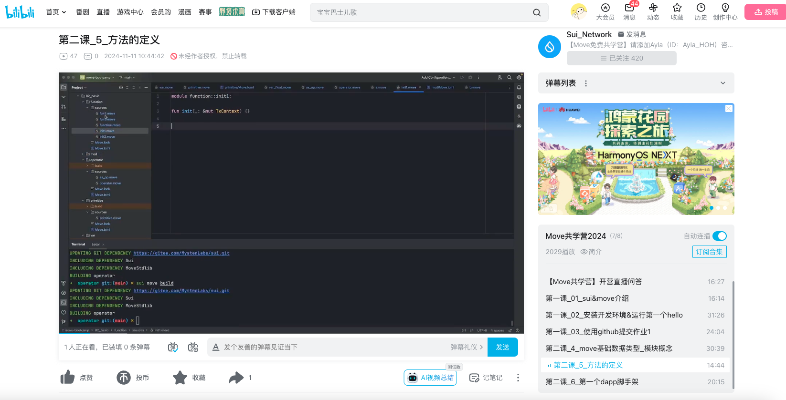

# 这个模板是2024年11月份的共学营才需要的

## b站，推特关注

- [x] b站，推特关注截图: 

## 为共学营宣传（在朋友圈或者群聊中转发海报/文章）

- [x] 宣传截图:
- [x] X转发水分子推文:

## 每周课程学习

- [x] 第一周:
- [x] 第二周:
- [x] 第三周:
- [] 第四周:

## 参加直播答疑

- [x] 第一周:参与直播并进行文字和语音互动
- [x] 第二周:参与直播并进行文字和语音互动
- [x] 第三周:参与直播并进行文字和语音互动
- [x] 第四周:参与直播并进行文字和语音互动

## 群里分享学习笔记

- [x] 基础学习（一）Windows DOS 命令 - 学习笔记【[学习笔记链接](https://github.com/move-cn/letsmove/tree/main/mover/lizhecome/notes/00_01_windows_dos_commands.md)】
- [x] 基础学习（二）速学150个Linux常用命令 - 学习笔记【[学习笔记链接](https://github.com/move-cn/letsmove/tree/main/mover/lizhecome/notes/00_02_150_linux_commands.md)】
- [x] 基础学习（三）VS Code 零基础学习笔记【[学习笔记链接](https://github.com/move-cn/letsmove/tree/main/mover/lizhecome/notes/00_03_vscode_learning.md)】
- [x] 基础学习（四）Git 入门到精通全套教程 - 学习笔记【[学习笔记链接](https://github.com/move-cn/letsmove/tree/main/mover/lizhecome/notes/00_04_git_github_learning.md)】
- [x] （一）初识Move：区块链智能合约语言概览 【[代码库链接](https://github.com/move-cn/letsmove/tree/main/mover/lizhecome/notes/01_new_to_move.md)】
- [x] （二）Move开发环境搭建与工具介绍【[学习笔记链接](https://github.com/move-cn/letsmove/tree/main/mover/lizhecome/notes/02_move_dev_env.md)】
- [x] （三）使用Move在Sui上发行Coin快速上手【[学习笔记链接](https://github.com/move-cn/letsmove/tree/main/mover/lizhecome/notes/03_move_mint_coin.md)】
- [x] （四）使用Move在Sui上发行第一个NFT【[学习笔记链接](https://github.com/move-cn/letsmove/tree/main/mover/lizhecome/notes/04_move_first_nft.md)】
- [x] （五）使用Move语言开发第一个链上游戏【[学习笔记链接](https://github.com/move-cn/letsmove/tree/main/mover/lizhecome/notes/05_move_game.md)】
- [x] （六）Move实现简单的代币swap功能【[学习笔记链接](https://github.com/move-cn/letsmove/tree/main/mover/lizhecome/notes/06_move_swap.md)】
- [x] （七）Move语言基础数据类型【[学习笔记链接](https://github.com/move-cn/letsmove/tree/main/mover/lizhecome/notes/07_move_base_types.md)】
- [x] （八）Move语言的函数【[学习笔记链接](https://github.com/move-cn/letsmove/tree/main/mover/lizhecome/notes/08_move_function.md)】
- [x] （九）Move语言中的能力（Ability）【[学习笔记链接](https://github.com/move-cn/letsmove/tree/main/mover/lizhecome/notes/09_move_ability.md)】
- [x] （十）让Move语言的单元测试跑起来！【[学习笔记链接](https://github.com/move-cn/letsmove/tree/main/mover/lizhecome/notes/10_move_unit_test.md)】
- [x] （十一）Move泛型：从入门到“我真的会了”【[学习笔记链接](https://github.com/move-cn/letsmove/tree/main/mover/lizhecome/notes/11_move_generics.md)】
- [x] （十二）Move 语言学习笔记：妙趣横生的 “对象转移” 探秘【[学习笔记链接](https://github.com/move-cn/letsmove/tree/main/mover/lizhecome/notes/12_move_transfer_to_object.md)】
- [x] （十三）深入浅出Move语言的动态字段 (Dynamic Fields)：从基础到实践【[学习笔记链接](https://github.com/move-cn/letsmove/tree/main/mover/lizhecome/notes/13_move_dynamic_field.md)】
- [x] （十四）深入理解 Move 的 Table 和 Bag：动态数据存储【[学习笔记链接](https://github.com/move-cn/letsmove/tree/main/mover/lizhecome/notes/14_move_table_bag.md)】
- [x] （十五）探索Move语言的奇妙世界：深入理解Wrapped Objects【[学习笔记链接](https://github.com/move-cn/letsmove/tree/main/mover/lizhecome/notes/15_move_wrapped_objects.md)】

## 对外输出学习笔记

- [x] 基础学习（一）Windows DOS 命令 - 学习笔记【[学习笔记链接](https://zhuanlan.zhihu.com/p/8711813251)】
- [x] 基础学习（二）速学150个Linux常用命令 - 学习笔记【[学习笔记链接](https://zhuanlan.zhihu.com/p/8712060263)】
- [x] 基础学习（三）VS Code 零基础学习笔记【[学习笔记链接](https://zhuanlan.zhihu.com/p/8712206795)】
- [x] 基础学习（四）Git 入门到精通全套教程 - 学习笔记【[学习笔记链接](https://zhuanlan.zhihu.com/p/8712285850)】
- [x] （一）初识Move：区块链智能合约语言概览【[学习笔记链接](https://learnblockchain.cn/article/9790)】
- [x] （二）Move开发环境搭建与工具介绍【[学习笔记链接](https://learnblockchain.cn/article/9807)】
- [x] （三）使用Move在Sui上发行Coin快速上手【[学习笔记链接](https://learnblockchain.cn/article/9838)】
- [x] （四）使用Move在Sui上发行第一个NFT【[学习笔记链接](https://learnblockchain.cn/article/9849)】
- [x] （五）使用Move语言开发第一个链上游戏【[学习笔记链接](https://learnblockchain.cn/article/9869)】
- [x] （六）Move实现简单的代币swap功能【[学习笔记链接](https://learnblockchain.cn/article/9908)】
- [x] （七）Move语言基础数据类型【[学习笔记链接](https://learnblockchain.cn/article/9935)】
- [x] （八）Move语言的函数【[学习笔记链接](https://learnblockchain.cn/article/9942)】
- [x] （九）Move语言中的能力（Ability）【[学习笔记链接](https://learnblockchain.cn/article/9982)】
- [x] （十）让Move语言的单元测试跑起来！【[学习笔记链接](https://learnblockchain.cn/article/10011)】
- [x] （十一）Move泛型：从入门到“我真的会了”【[学习笔记链接](https://learnblockchain.cn/article/10019)】
- [x] （十二）Move 语言学习笔记：妙趣横生的 “对象转移” 探秘【[学习笔记链接](https://learnblockchain.cn/article/10054)】
- [x] （十三）深入浅出Move语言的动态字段 (Dynamic Fields)：从基础到实践【[学习笔记链接](https://learnblockchain.cn/article/10056)】
- [x] （十四）深入理解 Move 的 Table 和 Bag：动态数据存储【[学习笔记链接](https://learnblockchain.cn/article/10055)】
- [x] （十五）探索Move语言的奇妙世界：深入理解Wrapped Objects【[学习笔记链接](https://learnblockchain.cn/article/10058)】

## 在HOH社区公众号发布自己的技术文章

- [] 第一篇笔记【公众号文章链接】
- [] 第二篇笔记【公众号文章链接】
- [] 第三篇笔记【公众号文章链接】
- [] 第四篇笔记【公众号文章链接】

## 直播分享学习技巧/工具推荐

- [] 会议截图:

## 提交项目

- [] 项目提交

