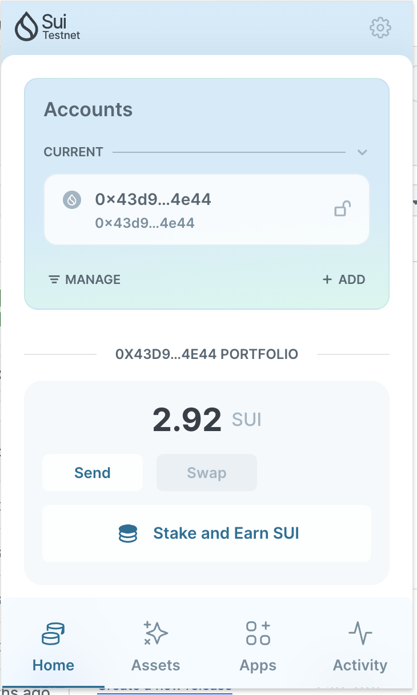
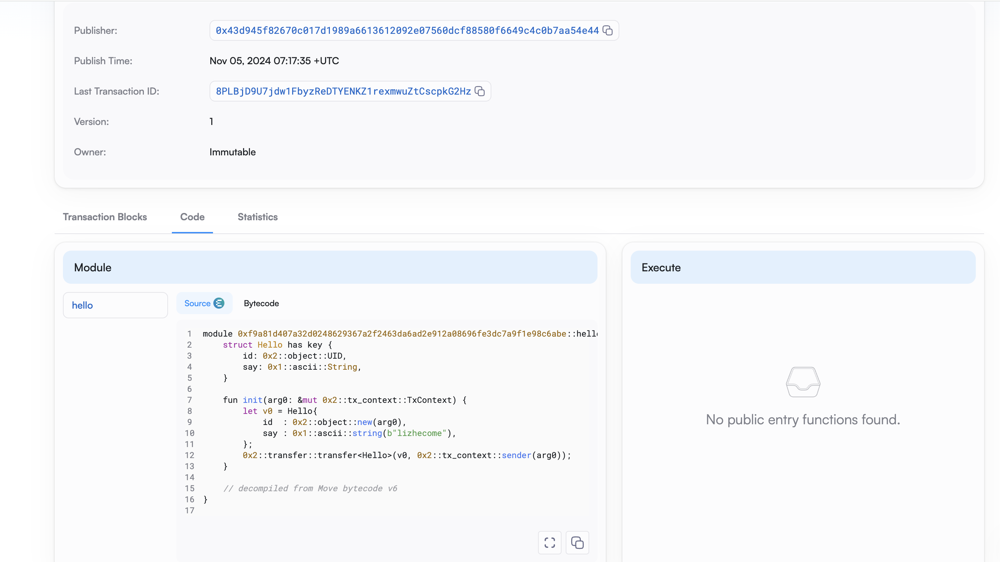
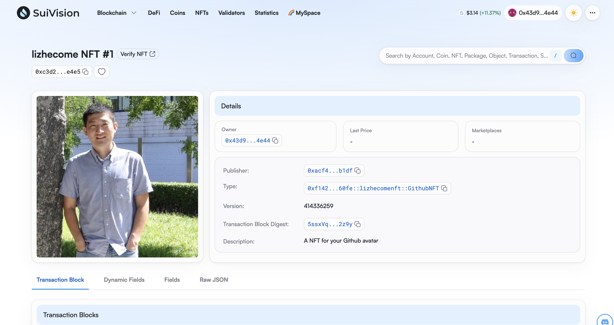
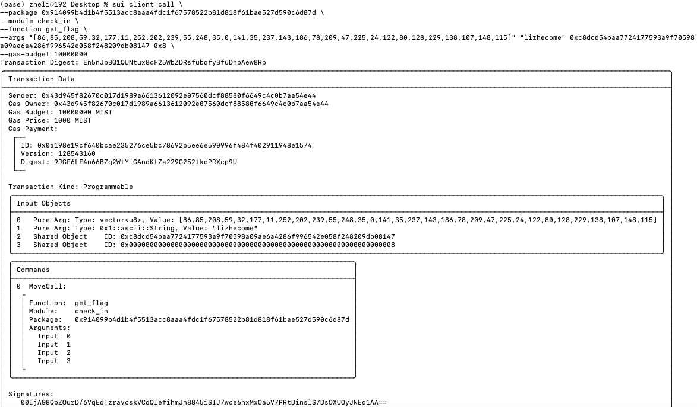
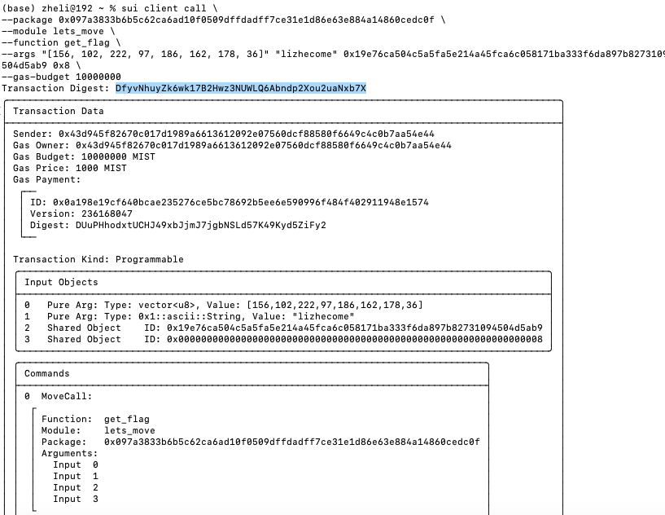

## 基本信息
- Sui钱包地址: `0x43d945f82670c017d1989a6613612092e07560dcf88580f6649c4c0b7aa54e44`
> 首次参与需要完成第一个任务注册好钱包地址才被合并，并且后续学习奖励会打入这个地址
- github: `lizhecome`

## 个人简介
- 工作经验: 16年
- 技术栈: `C#` `java` `objective-c` `golang` `vue` `react` `Rust` `C++` 
- 有十余年开发经验，从有代码编写到团队管理经验
- 再接触web3之前主要从事投行数字化领域，有AI相关经验
- 运营《投行大白》公众号，用文字、视频的方式介绍投行技术，并开发了一系列投行领域软件产品
- 有管理运营和产品团队的经验，移动互联网时代，主导开发和运营天津电视台官方手机客户端
- 多年web2开发和管理经验，对Move特别感兴趣，想通过Move入门区块链
- 联系方式: tg: `lizhecome` 

## 任务

##   01 hello move  
- [x] Sui cli version: 1.37.1-homebrew
- [x] Sui钱包截图: 
- [x] package id: 0xf9a81d407a32d0248629367a2f2463da6ad2e912a08696fe3dc7a9f1e98c6abe
- [x] package id 在 scan上的查看截图:

##   02 move coin
- [x] My Coin package id : 0xe0ac81bc9b10c46dcfbc9ca64b2991af7337e7e68cee092ee2018aa81f97945e
- [x] Faucet package id : 0x047cce79a523db24fa3f74f090f867484ab72a312cdba9afe6782f3b20cc273f
- [x] 转账 `My Coin` hash: 57gFfM4FKFa4ye2NC76RAUSPGqRaZTZevgNvQ3M6bXKV
- [x] `Faucet Coin` address1 mint hash: DTYmy1ms5B12X2py6x5CwLBZp1MAkxtKxz4jbuq3xxC5
- [x] `Faucet Coin` address2 mint hash: yiGCAgLXJiHyTFUYjuQVuwLEh148ZboxjmNR9dietWJ

##   03 move NFT
- [x] nft package id :0xf142474d26c9a8bd9b9ceab940207b02bf185b11014268312131b1db65ac60fe
- [x] nft object id : 0xc3d220ca3ac94dd206ca632fbe6e3070934a7ec1de0ee8efc0c47434cc03e4e5
- [x] 转账 nft hash: BmRgWvB8v8iZF36RoYSC4qgHLoQ7PvhVgBVHcAPHjtSd
- [x] scan上的NFT截图:

##   04 Move Game
- [x] game package id : 0xceaf4e513bac4163386879f63ef3084022e74e328eba82448f364dba8ebd66a7
- [x] deposit Coin hash:5apak2BcVe53DTp3igFCfcbZi8TKKtevvknrsPJK6hTh
- [x] withdraw `Coin` hash: FzMjpqMmUGn28jgCXiYMzFmAKJ2KNajcCNr1ag2y1wmf
- [x] play game hash:3dkDKXBvRZ9pgyAMRvAL5vSm2uXe8sLbSrz2PgBsyiwe

##   05 Move Swap
- [x] swap package id : 0x220e1fb6821f2851bf8557104251b47036527f1ac35ad757db1d9a503388cf14
- [x] call swap CoinA-> CoinB  hash : ED2zkQed7ZChNWtVq2CYMb3GNBaTKWfMTEA4ZjE4KPRc
- [x] call swap CoinB-> CoinA  hash : HujYQgQuHp81bJ5FfHhG1KnDMVq9x6VcZay9Pa7MvDsp

##   06 Dapp-kit SDK PTB
- [x] save hash : 3BUnnzzjgi7nzZ1q53nLgAhWYWzdYb7Ststp6GciPtE5

##   07 Move CTF Check In
- [x] CLI call 截图 : 
- [x] flag hash :En5nJpBQ1QUNtux8cF25WbZDRsfubqfyBfuDhpAew8Rp

##   08 Move CTF Lets Move
- [x] proof :[156, 102, 222, 97, 186, 162, 178, 36]
证明方法见mover/lizhecome/code/task8/get_proof.py，以及move项目gen_proof
 CLI call 截图 : 
- [x] flag hash : DfyvNhuyZk6wk17B2Hwz3NUWLQ6Abndp2Xou2uaNxb7X
