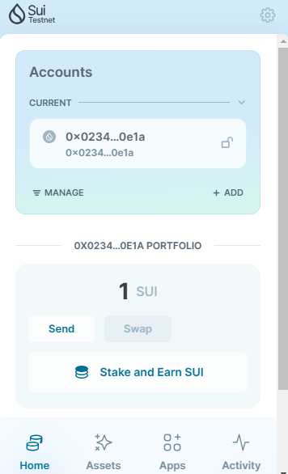
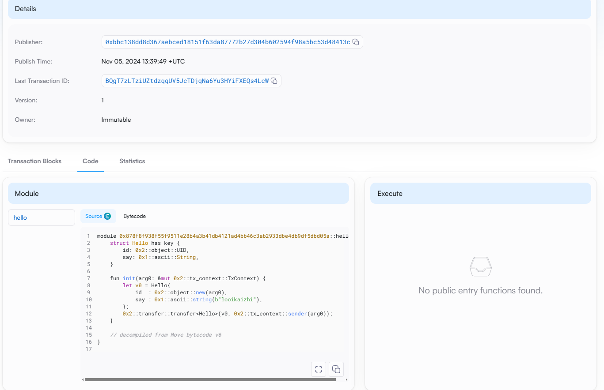
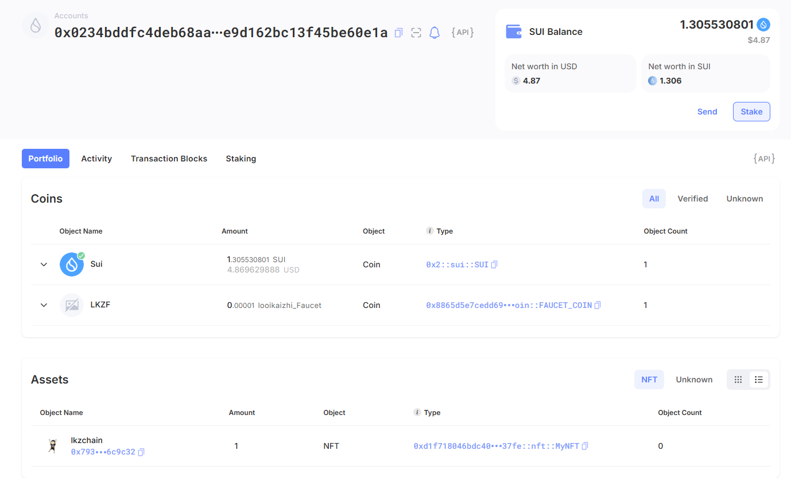

## 基本信息
- Sui钱包地址: `0x0234bddfc4deb68aaddd61b79a5857c1b0a29268a3b2e9d162bc13f45be60e1a`
> 首次参与需要完成第一个任务注册好钱包地址才被合并，并且后续学习奖励会打入这个地址
- github: `looikaizhi`

## 个人简介
- 学历: 北京理工大学 研一（在读）
- 技术栈: `Python` `Solidity` `JavaScript`
> 重要提示 请认真写自己的简介
- 2023年12月开始正式接触Web3项目，会参与一些项目的空投
- 在今年8月有开始写一些文章，可是开课后比较忙，更新频率较低（ https://medium.com/@looikaizhi0305 ）
- 联系方式: tg: `@potato_4392013` twitter: `@LKZchain`

## 任务

##   01 hello move  
- [x] Sui cli version: `sui 1.36.2-3ada97c109cc`
- [x] Sui钱包截图: 
- [x] package id: `0x878f8f938f55f9511e28b4a3b41db4121ad4bb46c3ab2933dbe4db9df5dbd05a`
- [x] package id 在 scan上的查看截图:

##   02 move coin
- [x] My Coin package id :`0x8865d5e7cedd69aa766fb758b2436b54439546e6e6956050e2c146dc228738ff`
- [x] Faucet package id : `0x8865d5e7cedd69aa766fb758b2436b54439546e6e6956050e2c146dc228738ff`
- [x] 转账 `My Coin` hash: `D5ZUpJuwDsqfHTLvobQGk7fXkn5EpK1FRTZVAZsNrb7K`
- [x] `Faucet Coin` address1 mint hash: `CDDRtDmFi7VCBdAm8zratdqtyMEVanDkBkuFefjPxKss`
- [x] `Faucet Coin` address2 mint hash: `DC2LTw5eyyFDL6LABuoSYBnJTgKRgiJbY2Udw3YMvnLk`

##   03 move NFT
- [x] nft package id : `0xd1f718046bdc4071742938fb13b2976eec402bd793db9aaf0ea6c0e2221637fe`
- [x] nft object id : `0x9cc8f7c63407ae66b63b7c0cdfa3ce35dfd785030a5d9208bf8b601032125cf0`
- [x] 转账 nft  hash: `9wYjDBRCofpAsgmsqp9Uc8AWM8wsRGeWHUJEJ3eshYX5`
- [x] scan上的NFT截图:

##   04 Move Game
- [] game package id :
- [] deposit Coin hash:
- [] withdraw `Coin` hash:
- [] play game hash:

##   05 Move Swap
- [] swap package id :
- [] call swap CoinA-> CoinB  hash :
- [] call swap CoinB-> CoinA  hash :

##   06 Dapp-kit SDK PTB
- [] save hash :

##   07 Move CTF Check In
- [] CLI call 截图 : 
- [] flag hash :

##   08 Move CTF Lets Move
- [] proof : 
- [] flag hash :
