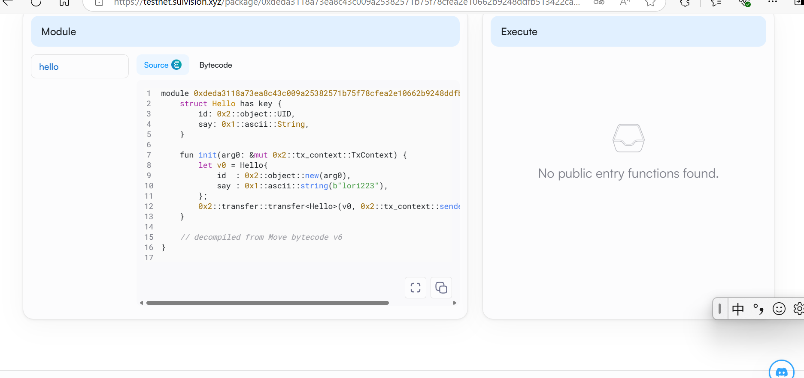

## 基本信息
- Sui钱包地址: `0x2647216f353fcb955ccc97a3d3c1f2d26e1c6b21bb3a30521dfd11cbfc82af8c`
> 首次参与需要完成第一个任务注册好钱包地址才被合并，并且后续学习奖励会打入这个地址
- github: `lori223`

## 个人简介
- 工作经验: 1年
- 技术栈: `c` `java`
> 重要提示 请认真写自己的简介
- 目前还是在校大学生，接触web3一年多，来学习move
- 联系方式: tg: `xxx` 

## 任务

##   01 hello move  
- [x] Sui cli version: sui 1.37.1-7839b9501066
- [x] Sui钱包截图: 
- [x] package id: 0xdeda3118a73ea8c43c009a25382571b75f78cfea2e10662b9248ddfb513422ca
- [x] package id 在 scan上的查看截图:

##   02 move coin
- [] My Coin package id : 
- [] Faucet package id : 
- [] 转账 `My Coin` hash:
- [] `Faucet Coin` address1 mint hash:
- [] `Faucet Coin` address2 mint hash:

##   03 move NFT
- [] nft package id :
- [] nft object id : 
- [] 转账 nft  hash:
- [] scan上的NFT截图:

##   04 Move Game
- [] game package id :
- [] deposit Coin hash:
- [] withdraw `Coin` hash:
- [] play game hash:

##   05 Move Swap
- [] swap package id :
- [] call swap CoinA-> CoinB  hash :
- [] call swap CoinB-> CoinA  hash :

##   06 Dapp-kit SDK PTB
- [] save hash :

##   07 Move CTF Check In
- [] CLI call 截图 : 
- [] flag hash :

##   08 Move CTF Lets Move
- [] proof : 
- [] flag hash :
