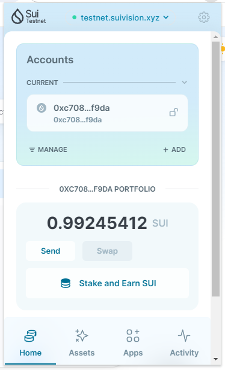
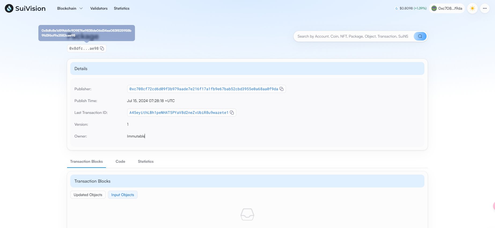

## 基本信息
- Sui钱包地址: `0xc708cf72cd6d09f3b979aade7e216f17a1fb9e67bab52cbd3955e0a68aa0f9da`
> 首次参与需要完成第一个任务注册好钱包地址才被合并，并且后续学习奖励会打入这个地址
- github: `lujiankang95`

## 个人简介
- 工作经验: 6年
- 技术栈: `Java` `Python`
> 重要提示 请认真写自己的简介
- 多年web2开发经验，对Move特别感兴趣，想通过Move入门区块链
- 联系方式: tg: `@lujk_1995` 

## 任务

##   01 hello move  
- [] Sui cli version:sui-client 1.28.3-3781a7e6b56c
- [] Sui钱包截图: 
- [] package id:0x8dfc8e1d59bb5c909876a9838de06d34ea083f825958b9fd3f6cf9a2582cae98 
- [] package id 在 scan上的查看截图:

##   02 move coin
- [] My Coin package id : 
- [] Faucet package id : 
- [] 转账 `My Coin` hash:
- [] `Faucet Coin` address1 mint hash:
- [] `Faucet Coin` address2 mint hash:

##   03 move NFT
- [] nft package id :
- [] nft object id : 
- [] 转账 nft  hash:
- [] scan上的NFT截图:

##   04 Move Game
- [] game package id :
- [] deposit Coin hash:
- [] withdraw `Coin` hash:
- [] play game hash:

##   05 Move Swap
- [] swap package id :
- [] call swap CoinA-> CoinB  hash :
- [] call swap CoinB-> CoinA  hash :

##   06 Dapp-kit SDK PTB
- [] save hash :

##   07 Move CTF Check In
- [] CLI call 截图 : 
- [] flag hash :

##   08 Move CTF Lets Move
- [] proof : 
- [] flag hash :
