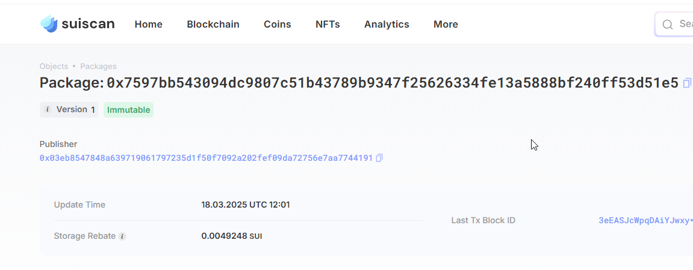
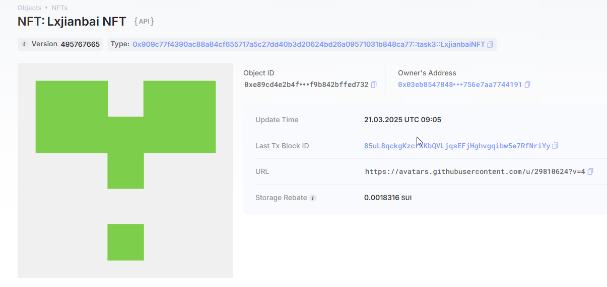
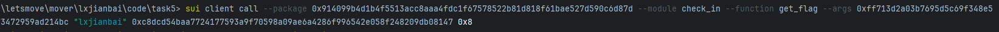

## 基本信息
- Sui钱包地址: `0x03eb8547848a639719061797235d1f50f7092a202fef09da72756e7aa7744191`
> 首次参与需要完成第一个任务注册好钱包地址才被合并，并且后续学习奖励会打入这个地址
- github: `lxjianbai`

## 个人简介
- 工作经验: x年
- 技术栈: `Go`
> 重要提示 请认真写自己的简介
- 多年web2开发经验，对Move特别感兴趣，想通过Move入门区块链
- 联系方式: `583502241@qq.com` 

## 任务

##   01 hello move  
- [x] Sui cli version: 1.45.0-3ef5cc5b5c90
- [x] package id: 0x7597bb543094dc9807c51b43789b9347f25626334fe13a5888bf240ff53d51e5
- [x] package id 在 scan上的查看截图:

##   02 move coin
- [x] My Coin package id : 0xd7bbedd2bb65de04bf49525b9380212306f3627ae9afe8dbcf5c19babe8cba2b
- [x] Faucet package id : 0xd7bbedd2bb65de04bf49525b9380212306f3627ae9afe8dbcf5c19babe8cba2b
- [x] 转账 `My Coin` hash:8gkiVD6uw6NUkzWTv8Kjx9ffzru8uWLE5VWFx7z9jX8t
- [x] `Faucet Coin` address1 mint hash:AzouRjuQGQqCZSx4rxWRwctrFm9XbHeMFzCb7dAbzp8h
- [x] `Faucet Coin` address2 mint hash:BdhVVpDSYTWYoSLfG1EVQxjrKoKjhhSFZHUMBgj8iJNM

##   03 move NFT
- [x] nft package id :0x909c77f4390ac88a84cf655717a5c27dd40b3d20624bd26a09571031b848ca77
- [x] nft object id : 0xe89cd4e2b4fd4fbf5eab943be128e257b36a889a6947dbad5ff9b842bffed732
- [x] 转账 nft  hash:2WyRQzujAC8iLChApSjwcaJyMPyryAHZDx5G8GbFihEb
- [x] scan上的NFT截图:

##   04 Move Game
- [x] game package id :0x39cf787242bf017003fdcaf9302bc90b9e8df653ee18130bb6413b35f6907ca5
- [x] deposit Coin hash:4sYjvwNxH5F7LrT1L6CXoqCX4pGY9WQjLF2N7C8YHGVx
- [x] withdraw `Coin` hash:9mxmPEuztaEZS8XVprxAUxXPPL76Z7wAmvRifXzLNbdo
- [x] play game hash:H2bAkV5KhDpqVtUgTraQWzzSQG91pdUDdb2zX7GqgxLd

##   05 Move Swap
- [x] swap package id :0x0ba404281b53da681f473ceb6b228dbec9b268e54e9b593cb04fa6ed9ba16646
- [x] call swap CoinA-> CoinB  hash :2ycMDz6oBisJjbHj3xB7dR18X6oNzbh8cM88L86nNycT
- [x] call swap CoinB-> CoinA  hash :aSWrbMRJKJtzDgj3aDEvGHaL3X9mnqEEgxRancxDvEA

##   06 Dapp-kit SDK PTB
- [x] save hash :B5UAgCndbhNUyupNr3GZNmMY8nugzNtWise3357ibyhE

##   07 Move CTF Check In
- [x] CLI call 截图 : 
- [x] flag hash :beVgMVbNdsKc4qVyUsjNuKkmEiHNDcy8K1zkt7yhnLT

##   08 Move CTF Lets Move
- [x] proof : 0x04afd20000000000
- [x] flag hash :Gu52mR91HfQgT1pKSDbWJybbSHJwVdXCZ8NJyd7Xiodk

