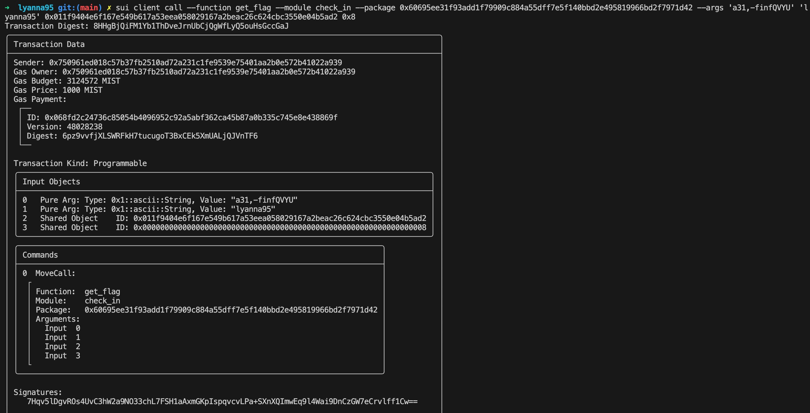

## 基本信息
- Sui钱包地址: `0x750961ed018c57b37fb2510ad72a231c1fe9539e75401aa2b0e572b41022a939`
> 首次参与需要完成第一个任务注册好钱包地址才被合并，并且后续学习奖励会打入这个地址
- github: `lyanna95`

## 个人简介
- 工作经验: 三年 C++ 工作经验
- 技术栈: C++ Java Python Golang
- 对信息安全感兴趣，参加过多次 CTF 比赛
- 联系方式: qq: `2689257460` 

## 任务

##   01 hello move  
- [x] package id: 0xb16bc7340c5949c730eeccf66c2b131e9238299dcfeed895561cfaaa5de08c41

##   02 move coin
- [x] My Coin package id : 0xa0caee361a5d6a2b2f6c26d787721da0c90de408ee894702776d43419258f7d7
- [x] Faucet package id : 0xa0caee361a5d6a2b2f6c26d787721da0c90de408ee894702776d43419258f7d7
- [x] 转账 `My Coin` hash : JDBp7Rw3WKQwB5RnLz3vR3TrRYUxdA7981B4iycNPz55

##   03 move NFT
- [x] nft package id : 0x3d0b6d2feadcae05c7f368fc66d67fd386832391272f048a1a7656bd4363b3f4
- [x] nft object id : 0x7b5aff840bae5ca11a8445766291ad7aba0952841a046468a92fa0da956bf162
- [x] 转账 nft  hash: 78CH1YEJsdEqTSqdSqCqaMSMhZYdCAwieKcMBsfSUWfL

##   04 Move Game
- [x] game package id : 0x5eaf7d170bf170de6a43ad16249b6e7a6211dae96c72cf350e8ac984c49d55e2
- [x] call game hash: m3KD1sgWHi3gH1CL1fSQuR1k3s9DL6iWKSCo3UkCYXN

##   05 Move Swap
- [ ] swap package id :
- [ ] call swap hash:

##   06 SDK PTB
- [ ] save hash :

##   07 Move CTF Check In
- [x] CLI call 截图: 
- [x] flag hash: 8HHgBjQiFM1Yb1ThDveJrnUbCjQgWfLyQ5ouHsGccGaJ

##   08 Move CTF Lets Move
- [X] Proof : `IsCp`
- [x] Transaction block: `CnYJSFjaJj5VNs16FH9nR8hi4XsPBPcXTr7goUdojLJg`