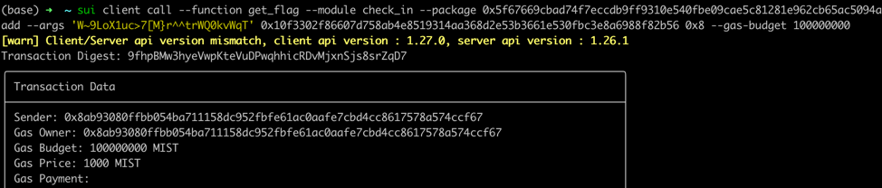
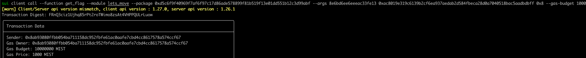

## 基本信息
- Sui钱包地址: `0x8ab93080ffbb054ba711158dc952fbfe61ac0aafe7cbd4cc8617578a574ccf67`
> 首次参与需要完成第一个任务注册好钱包地址才被合并，并且后续学习奖励会打入这个地址
- github: `lz1998`

## 个人简介
- 工作经验: 3年
- 技术栈: `Rust` `Golang`
- 多年web2开发经验，对Move特别感兴趣，想通过Move入门区块链
- 联系方式: tg: `lz1998` 

## 任务

##   01 hello move  
- [x] package id: 0x88ca0c451410eafb4213bf6d76882f728b147a2e337323fd02ebdd40e5679932

##   02 move coin
- [x] My Coin package id : 0xa931c2f9959e4ba8bc4140e146d8be52aa5496377851708621f2e9cd24ef5ed7
- [x] Faucet package id : 0x6b453420fcf3917c53f2f94375f9047dd2d15889f5ff02acb0ff1d465ca8b348
- [x] 转账 `My Coin` hash: 2nAFy7huKeX1R6DGJQwzvTrEJ5V8iYjdf69V5H9Hrfyn

##   03 move NFT
- [x] nft package id : 0xed8c17ffc0aaf31662efdd8adcc8f80d4175bdebede1515319a3ab330ffed533
- [x] nft object id : 0x2b624e0e19325eb2b071d175a8578ce59a475b8b6b28640c64bbd757fec3bd42
- [x] 转账 nft  hash: 6aBxY5548EXg7fVMvfQXyjfQce1QuXqkkasVo3MT1uJh

##   04 Move Game
- [x] game package id : 0x33ad0b7ab58947bdff38575d4c4fd54a8a5b5fb8a344b0cbe6f4c8c5d8a0a8e7
- [x] call game hash: Fh1hjxaDcDzccfA7WwGHjYbzbuUM2DZEdPvEKG7EtJsj

##   05 Move Swap
- [] swap package id :
- [] call swap hash:

##   06 SDK PTB
- [] save hash :

##   07 Move CTF Check In
- [x] CLI call 截图: 
- [x] flag hash: 9fhpBMw3hyeVwpKteVuDPwqhhicRDvMjxnSjs8srZqD7

##   08 Move CTF Lets Move
- [x] CLI call 截图: 
- [x] Transaction block: `FRnQ3ciz1Ujhq85rPt2roTWimo8zsAt4VHPPQULrLuow`