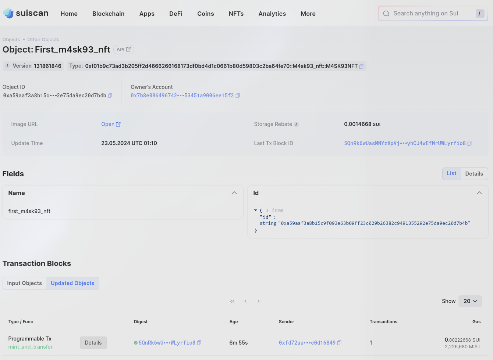

## 基本信息
- Sui钱包地址: `0xe13769b8c84f7c4011d001c1d9e5c471e8d5fb612cb44b76fcfbf0eebaa08ced`
> 首次参与需要完成第一个任务注册好钱包地址才被合并，并且后续学习奖励会打入这个地址
- github: `m4sk93`

## 个人简介
- 工作经验: 1年
- 技术栈: `Rust`
> 重要提示 请认真写自己的简介
- 对Move特别感兴趣，想通过Move入门区块链
- 联系方式: X: `@m4sk93` 

## 任务

##   01 hello move  
- [x] Sui cli version: `sui 1.25.0-homebrew`
- [x] Sui钱包截图: 
- [x] package id: `0x3737f9b6b90b74f087b1db32ec2beaceb7688e55b9dba8bb6889038bb208e2d5`
- [x] package id 在 scan上的查看截图:

##   02 move coin
先在testnet试了试，再上mainnet
testnet:
- [x] My Coin package id : 0x2a056973b19d7ac2a202acdb7ec1d952a51dde475a9ee579ba6b2d594bf1dea6
- [x] Faucet package id : 0x8194063d47171bcbdd6e7ddce605aa8a6bd8b482315ca236a909695d9e5a9fe2
- [x] 转账 `My Coin` hash:3uKRwEbbGj5AuUisDqha35gusZ1MyCck8PKTtHrNA8vr
- [x] `Faucet Coin` address1 mint hash:BaQsvwpMjfTpSdhvgBknXsYRZisqdv7NR41cQZDochGR
- [x] `Faucet Coin` address2 mint hash:9GKp6FTBCycMBFwVUoLSsVpv2qksVvVuepqot3frweTM
mainnet:
- [x] My Coin package id : 0x38974bd3a9dad0e8274024b49642e2f0fa94fc4889219791e3742c8730528fd0
- [x] Faucet package id : 0xe799e4d1324db8877c827cb4ca78dc065a8f9ef70fbe705e4c8c37250e195982
- [x] 转账 `My Coin` hash:F5D9JKhJhwzhrX8eJnHzXaEWZbgagsHQV7jX2ZzmLnpJ
- [x] `Faucet Coin` address1 mint hash:3KJ5Jomef8aceVn4st1Ys73ftpFu8N2A5b5rn2fWRSnx
- [x] `Faucet Coin` address2 mint hash:4jEyagvRg5NNZh61zKbzryEqTPdhSWbpXay96GY5S1BK


##   03 move NFT
- [x] nft package id :0xf01b9c73ad3b205ff2d4666266168173df0bd4d1c0661b80d59803c2ba64fe70
- [x] nft object id :0xa59aaf3a8b15c9f093e63b09ff23c029b26382c9491355292e75da9ec20d7b4b 
- [x] 转账 nft  hash:5QnRk6wUasMNYzXpVjHyMiBmtyhCJ4wEfMrUWLyrfio8
- [x] scan上的NFT截图:

##   04 Move Game
- [x] game package id :0xa8dee2dce7c9fb78b88f05c0b4137bc26ac55e4e906779071416721c47622b4c
- [x] deposit Coin hash:EAnoReMHHyvVzKpL3HSw5gPXLL2ccx4S6wfm5ohYYb9Q
- [x] withdraw `Coin` hash:CuyiX9MzjxPxBLW94BX6BSEA2DanDVfJXWgzZ1iF8nqf
- [x] play game hash:6Yi8KkWs4eWZCdcKAcDi6msNHDna8GH9BS36dNjx4zEq

##   05 Move Swap
- [x] swap package id :0xdf519760886ddb5b03c7db25f0acb0204d24d27c9d06946f78f50384014ac7aa
- [x] call swap CoinA-> CoinB  hash :9atm2zXNF2PEwfq5jUMvQLM3VwmGx4XuzQdvLdRLZmRS
- [x] call swap CoinB-> CoinA  hash :7hGAPDFroEq2d81Haw7yGn2kXQ2YxkotCjkNHZJRe6oy

##   06 Dapp-kit SDK PTB
- [X] save hash :7Mt6Cu9xSEWRxCdPsczZEbi6NBCYYa2JnBN21pz3Nifh

##   07 Move CTF Check In
- [X] CLI call (忘记截图了):
```
#!/bin/bash

PackageID=0x60695ee31f93add1f79909c884a55dff7e5f140bbd2e495819966bd2f7971d42
FlagStr_Object=0x011f9404e6f167e549b617a53eea058029167a2beac26c624cbc3550e04b5ad2

github_id="m4sk93"
string="N21X"
rand="0x8"

sui client call --package $PackageID \
                --module check_in \
                --function get_flag \
                --args $string $github_id $FlagStr_Object $rand
```
- [X] flag hash : BNKqqwLPDiA1th71C1qp8nAMzdYFC8WhkXaBjoNyZhWD

##   08 Move CTF Lets Move
- [X] proof : [0xe7,0xc6,0,0,0,0,0,0]
- [x] flag hash : 7uCNDToLAkLm7Ks1bUJirqNRjNrZ2vCbwyYEvFUHGuB9
