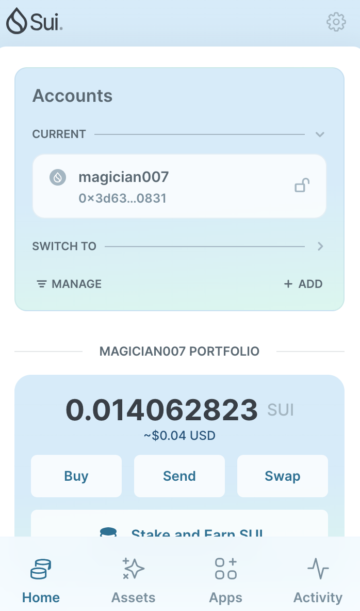
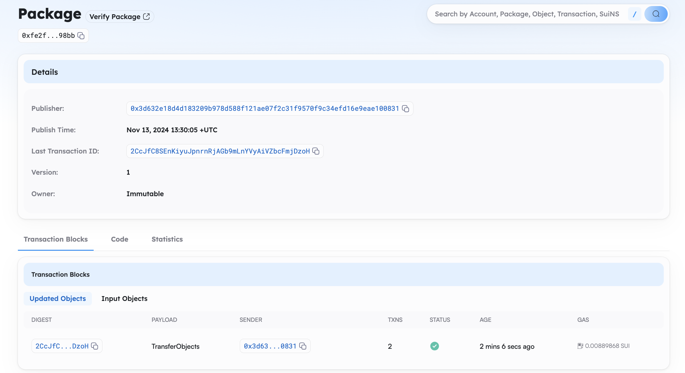

## 基本信息
- Sui钱包地址: `0x3d632e18d4d183209b978d588f121ae07f2c31f9570f9c34efd16e9eae100831`
- github: `magician007`

## 个人简介
- 工作经验: 4年
- 技术栈: `python` `Go`
- AI从业者，对Move特别感兴趣，想通过Move入门区块链
- 联系方式: tg: `James Zhu` 

## 任务

##   01 hello move  
- [✓] Sui cli version: sui 1.37.3-b8eb8920aeca
- [✓] Sui钱包截图: 
- [✓] package id: 0xfe2fd89bba2ba3e9f766c8877876381d7385fb4ee6326ac58233b47b9f0098bb
- [✓] package id 在 scan上的查看截图:

##   02 move coin
- [] My Coin package id : 
- [] Faucet package id : 
- [] 转账 `My Coin` hash:
- [] `Faucet Coin` address1 mint hash:
- [] `Faucet Coin` address2 mint hash:

##   03 move NFT
- [] nft package id :
- [] nft object id : 
- [] 转账 nft  hash:
- [] scan上的NFT截图:

##   04 Move Game
- [] game package id :
- [] deposit Coin hash:
- [] withdraw `Coin` hash:
- [] play game hash:

##   05 Move Swap
- [] swap package id :
- [] call swap CoinA-> CoinB  hash :
- [] call swap CoinB-> CoinA  hash :

##   06 Dapp-kit SDK PTB
- [] save hash :

##   07 Move CTF Check In
- [] CLI call 截图 : 
- [] flag hash :

##   08 Move CTF Lets Move
- [] proof : 
- [] flag hash :
