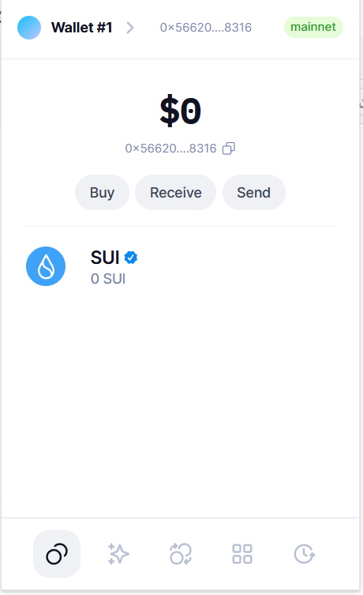
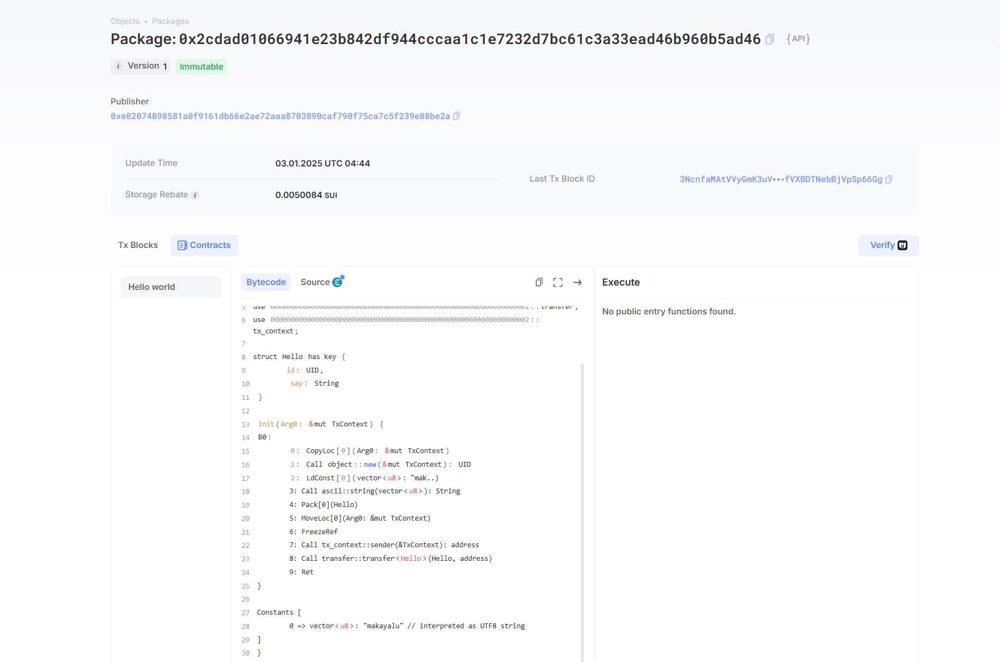

## 基本信息
- Sui钱包地址: `0x566208181aa8b4773788b2a6ad63a12335665d317ae007e816088a83f3338316`
> 首次参与需要完成第一个任务注册好钱包地址才被合并，并且后续学习奖励会打入这个地址
- github: `makayalu`

## 个人简介
- 工作经验: 在读研究生
- 技术栈: `Java `、`python`
> 重要提示 请认真写自己的简介
- 研究生为区块链安全方向，目前在move项目组学习。

- 联系方式: tg: `@makabaga111` 

  								WeChat： g31050417

## 任务

##   01 hello move  
- [] Sui cli version:   sui 1.40.0-01e3e6a5de65

- [] Sui钱包截图: 

- [] package id:  0xfa8153d85afb05753c156eaf0641886ae7c4bf5ac99a6f2616bacc9d064bb420

- [] package id 在 scan上的查看截图:

  

##   02 move coin
- [] My Coin package id : 0x9b7ed7b716888322943f0dd9bb8ae1142e748acae0bc735d7b15de5bb4ea9db9
- [] Faucet package id : 0xebc046b19b26bec98a9292f07fe0f9780300bececcbac0aaac35a957d773a278
- [] 转账 `My Coin` hash: 6JLUhyaGrNnZpNyrZGTMSfie7S8NWEtLfDXhTBhufVWG
- [] `Faucet Coin` address1 mint hash:FkeM5gpB3RBSCTGdYwxTdVGd9uiwspuFcmUGDH4DDjZ7
- [] `Faucet Coin` address2 mint hash:FCu55nHmqF4hzi4axXEacyxmERg1eZJGjQfdZcUhXkiF

##   03 move NFT
- [] nft package id :
- [] nft object id : 
- [] 转账 nft  hash:
- [] scan上的NFT截图:

##   04 Move Game
- [] game package id :
- [] deposit Coin hash:
- [] withdraw `Coin` hash:
- [] play game hash:

##   05 Move Swap
- [] swap package id :
- [] call swap CoinA-> CoinB  hash :
- [] call swap CoinB-> CoinA  hash :

##   06 Dapp-kit SDK PTB
- [] save hash :

##   07 Move CTF Check In
- [] CLI call 截图 : 
- [] flag hash :

##   08 Move CTF Lets Move
- [] proof : 
- [] flag hash :

