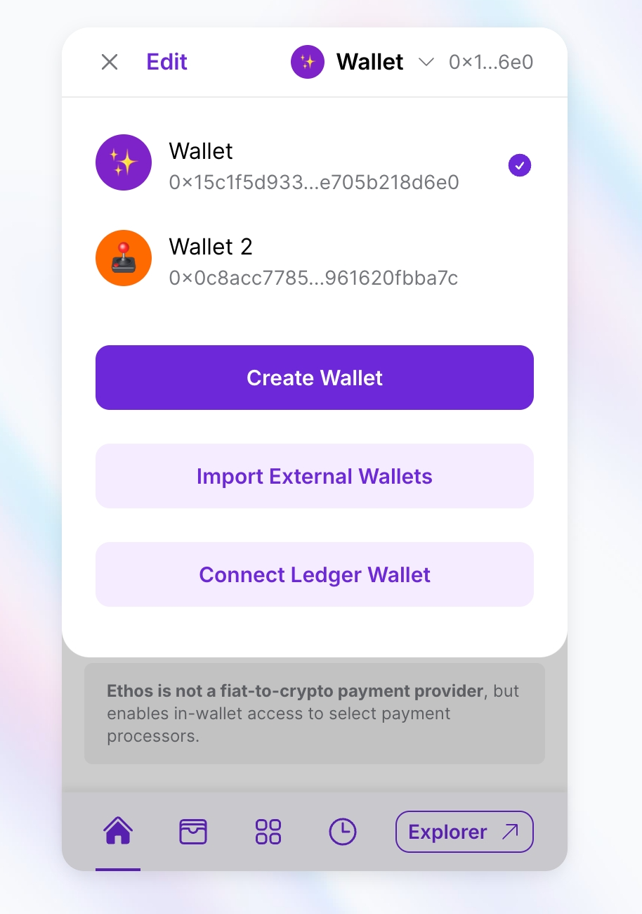
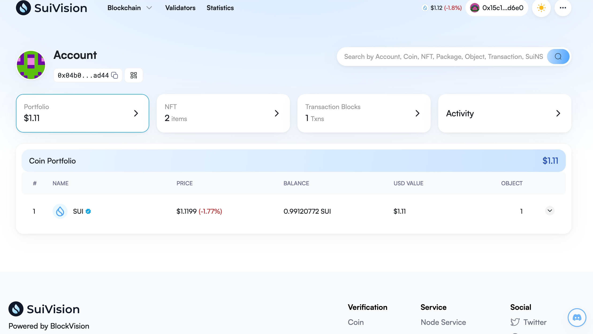

## 基本信息
- Sui钱包地址: 
`0x15c1f5d933039c05b783804b8f5986af66bfa0b3dd14cef7becae705b218d6e0`
> 首次参与需要完成第一个任务注册好钱包地址才被合并，并且后续学习奖励会打入这个地址
- github: `mameikagou`

## 个人简介
- 工作经验: 无
- 技术栈: `前端常用技术栈: Typescript, Vue, React`
> 重要提示 请认真写自己的简介
- 成都某校区块链专业学生
- 擅长前端开发, 想从前端转web3
- 联系方式: tg: `@Oxmrlone`

## 任务

##   01 hello move  
- [x] Sui cli version: `sui 1.26.1-homebrew`
- [x] Sui钱包截图: 
- [x] package id:` 0xf0e6ded55ba252e800774a86f1f66aeb97309fc5e97137a055737235e1ec6102`
- [x] package id 在 scan上的查看截图: