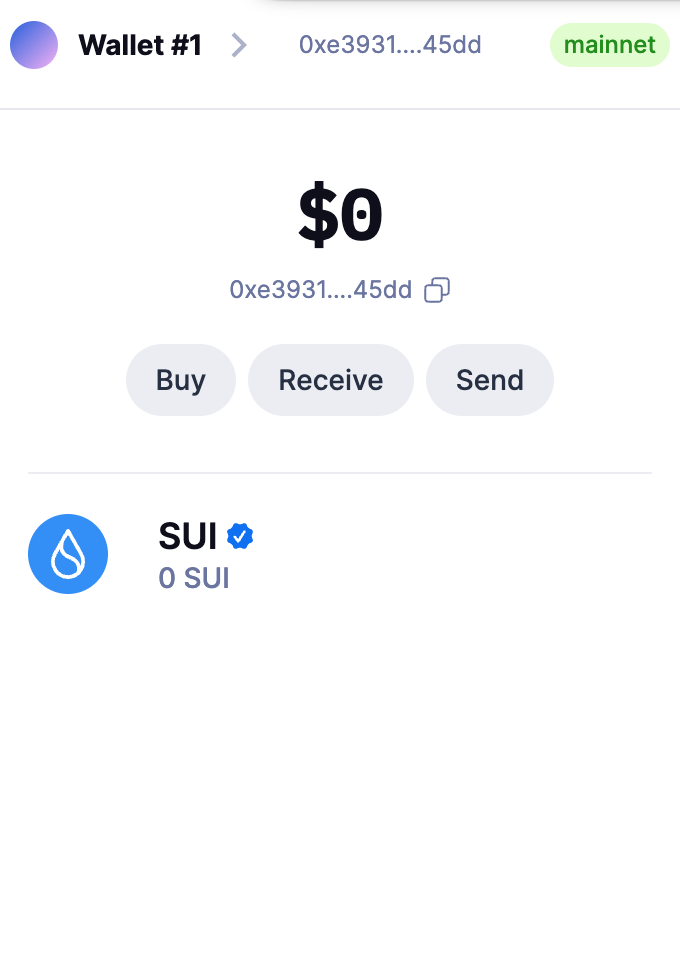
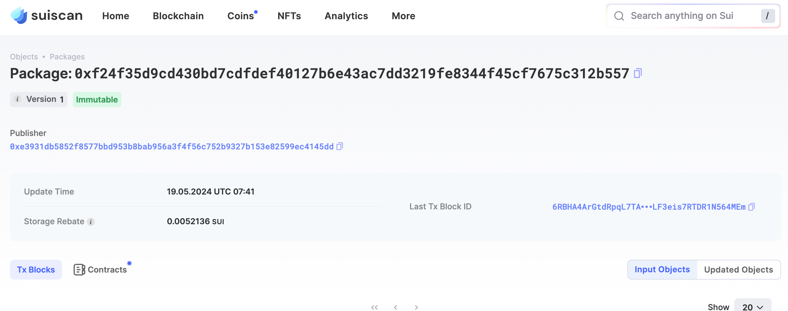
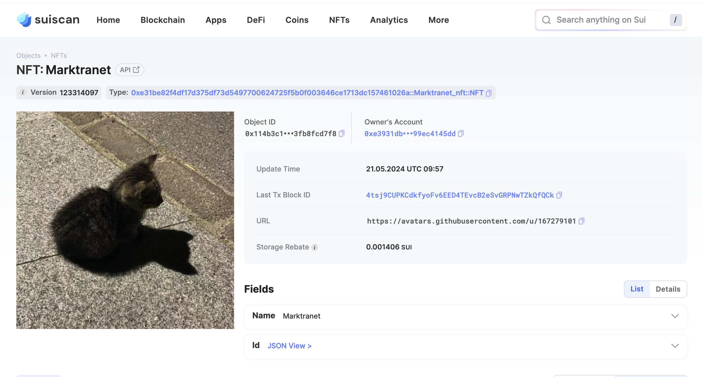

## 基本信息
- Sui钱包地址: `0xe3931db5852f8577bbd953b8bab956a3f4f56c752b9327b153e82599ec4145dd`
> 首次参与需要完成第一个任务注册好钱包地址才被合并，并且后续学习奖励会打入这个地址
- github: `marktranet`

## 个人简介
- 工作经验: 1年
- 技术栈: `Javascript`
> 重要提示 请认真写自己的简介
- 对Move感兴趣，想通过Move入门Sui
- 联系方式: tg: `analgesistArticle` 

## 任务

##   01 hello move  
- [x] Sui cli version: 1.25.0-b10ea7331e1c
- [x] Sui钱包截图: 
- [x] package id:  0xf24f35d9cd430bd7cdfdef40127b6e43ac7dd3219fe8344f45cf7675c312b557
- [x] package id 在 scan上的查看截图:

##   02 move coin
- [x] My Coin package id :  0xf24f35d9cd430bd7cdfdef40127b6e43ac7dd3219fe8344f45cf7675c312b557  
- [x] Faucet package id :  0x70d4e4cc6c8cc6c49d5cd4aeb5d68b0c3b74b1a670a8bbab0d8d963e63c8e1e8    
- [x] 转账 `My Coin` hash: AH8KL6ZgQjTS9HW2bNT8HrkyanVBtgV8BCKZFjz2SaHE
- [x] `Faucet Coin` address1 mint hash:  8fRrvpqqWNYAMbw5Tek9EEUxQZ71p2cSsoJFHBqyvEGZ
- [x] `Faucet Coin` address2 mint hash: CASz66X5zgMc7SNLFmGT23z4r3kowWympk6hNoY8whFt

##   03 move NFT
- [x] nft package id : 0xe31be82f4df17d375df73d5497700624725f5b0f003646ce1713dc157461026a 
- [x] nft object id :  0x114b3c14f511bc430a118719772e0051d57a2ca0aac2a44ad3387c3fb8fcd7f8 
- [x] 转账 nft  hash:  4989X3yyT5GSCmXJzfKdsBFoPNtHSat269iNHLLmUkQi           
- [x] scan上的NFT截图:

##   04 Move Game
- [x] game package id : 0x1ac6f5b29768a209175a1cb907c631ca69eebfb686faeb16abaf37756df650dc
- [x] deposit Coin hash:  9v1j2uasn4XjcFG1xr5KYdyHWFqp38vVcsXiv6doANut
- [x] withdraw `Coin` hash: 6Fw11QGtWhCzY8tMmUTKmhwSQ37jb1DutYRPFSHD8sCC
- [x] play game hash:  2SJcC3ZAwswEHhM3PYfSVWiRWq8SrhDorP82u4VYYp4w

##   05 Move Swap
- [x] swap package id : 0xe6011502ddf03f8a8e0f7213429aa35b76cb2055f05fc0aac52d4489b65dd2f6 
- [x] call swap CoinA-> CoinB  hash :  Dpt1EtvKeqp42S9smiSYX1LggSCo9anhqZHB2CSseqX
- [x] call swap CoinB-> CoinA  hash :  8Utbjf3799HacS1S4kYkj5kfthvvwT87FLFtmNFRRQW2

##   06 Dapp-kit SDK PTB
- [x] save hash :  B43X8Doju26jw35fs56C1dVhAho4S7CD8XfrU8Knnzi7
