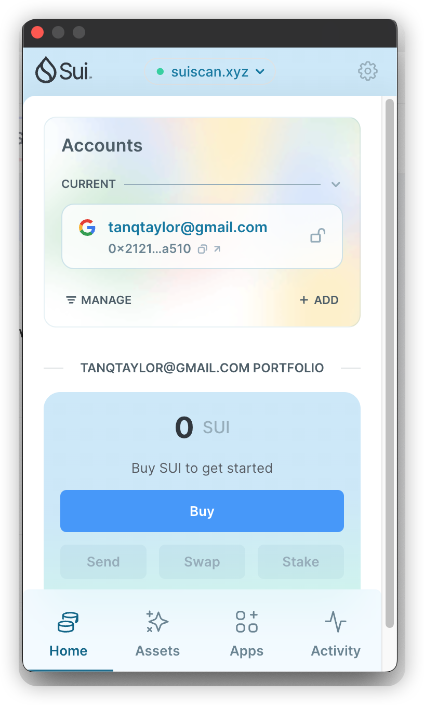
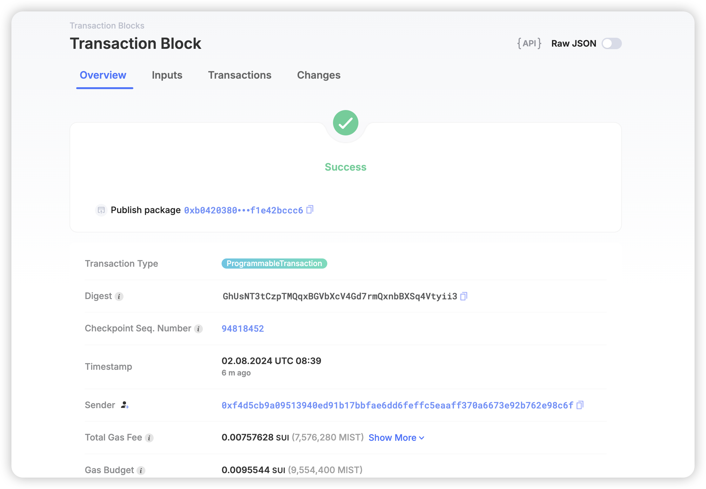

## 基本信息

- Sui钱包地址: `0x2121ebf274db54fecf0d242f22246f311b2d759cfdac09d2ca961e06672ca510`
  > 首次参与需要完成第一个任务注册好钱包地址才被合并，并且后续学习奖励会打入这个地址
- github: `matyle`

## 个人简介

- 工作经验: 3年
- 技术栈: `Golang` `Python` `Rust` `Solidity`
  > 重要提示 请认真写自己的简介
- web2开发经验，对Move特别感兴趣，想通过Move入门区块链, 未来找到对应的 web3 远程工作
- 联系方式: tg: `@lucky_ytam`

## 任务

## 01 hello move

- [x] Sui cli version: sui 1.29.2-homebrew
- [x] Sui钱包截图: 
- [x] package id: 0xb04203801c7b66c5b1920458bf89d14352ae2740729fbc9d629a83f1e42bccc6
- [x] package id 在 scan上的查看截图:

## 02 move coin

- [] My Coin package id : 0xd83f1fed1d098477b715f74a1a403a7ff948f6c32f826fe61b05af5d02d0e28a
- [] Faucet package id : 0x45e8e65d05c41e386f42158704044a8ba57206743cc7bf25f4654cca8194b80c
- [] 转账 `My Coin` hash: EqYqyoL2QDaK6c6jUKBbP3krGw4p2XVubcFDpH6q7NAu
- [] `Faucet Coin` address1 mint hash: 4njdptcyya32wZ8r8A77uRJ5T9H9foBZ76QDYEZnm64E
- [] `Faucet Coin` address2 mint hash: 7Ej4HzDJuTSvgeg4bTsdL6HBgJ2uKXTtyUambSifwrfj

## 03 move NFT

- [] nft package id :
- [] nft object id :
- [] 转账 nft hash:
- [] scan上的NFT截图:

## 04 Move Game

- [] game package id :
- [] deposit Coin hash:
- [] withdraw `Coin` hash:
- [] play game hash:

## 05 Move Swap

- [] swap package id :
- [] call swap CoinA-> CoinB hash :
- [] call swap CoinB-> CoinA hash :

## 06 Dapp-kit SDK PTB

- [] save hash :

## 07 Move CTF Check In

- [] CLI call 截图 : 
- [] flag hash :

## 08 Move CTF Lets Move

- [] proof :
- [] flag hash :
