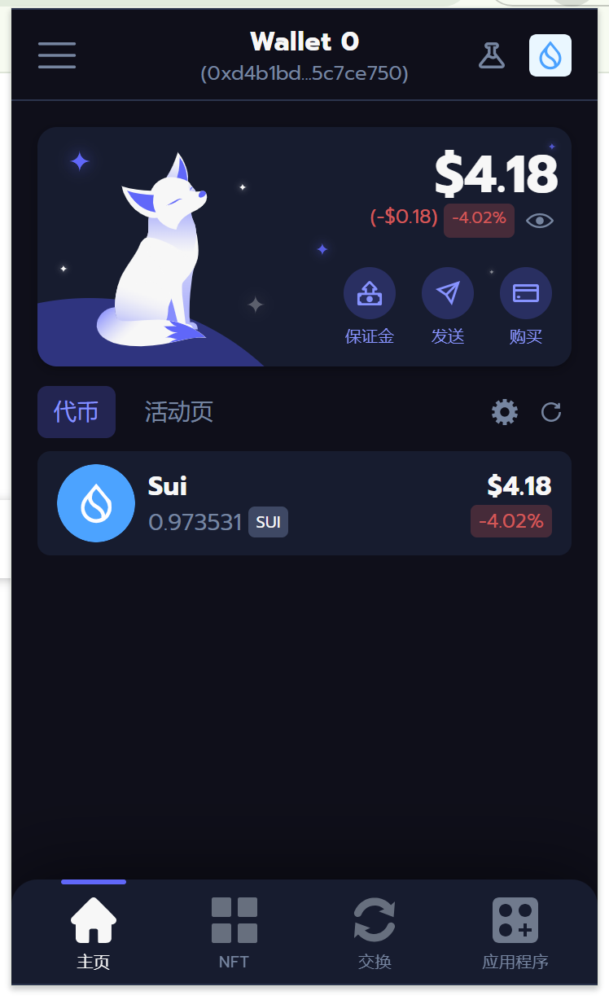
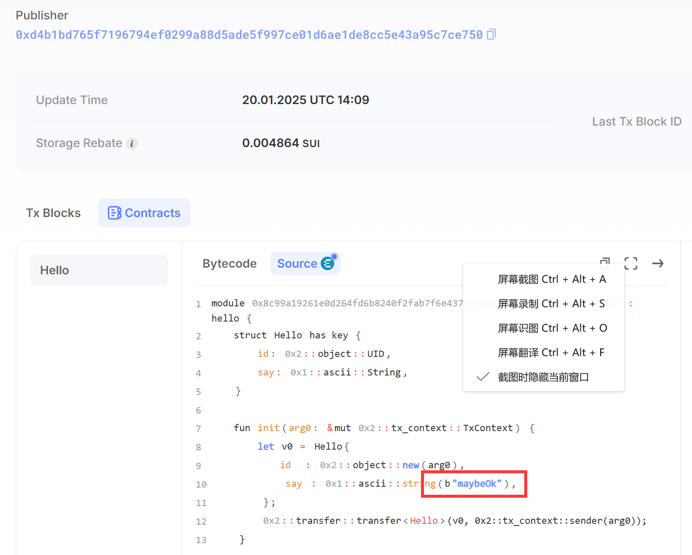
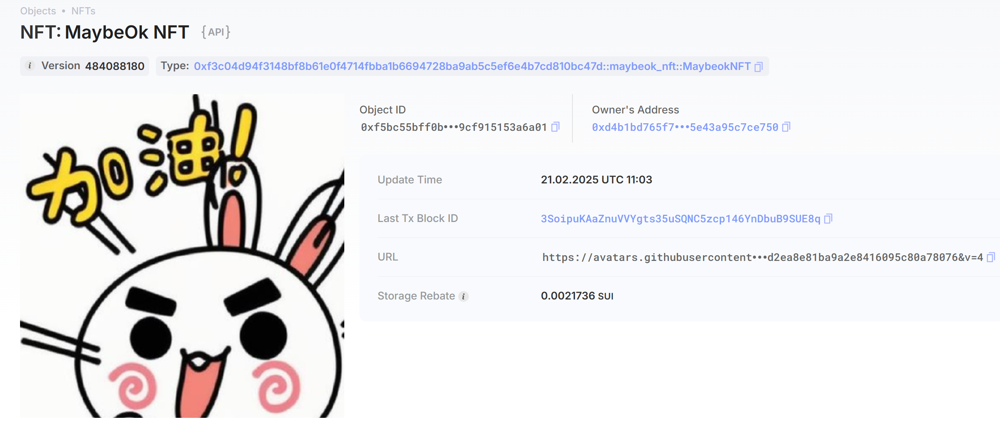

## 基本信息
- Sui钱包地址: `0x8e6336d878c34fc805c79058c44e38b5c233f351e74bb1f2dcb9127fc65e3274`
> 首次参与需要完成第一个任务注册好钱包地址才被合并，并且后续学习奖励会打入这个地址
- github: `maybeOk`

## 个人简介
- 工作经验: 1年
- 技术栈: 很久以前做过`java`
> 重要提示 请认真写自己的简介
- 多年web2开发经验，对Move特别感兴趣，想通过Move入门区块链
- 联系方式: QQ：'81985309@qq.com' 

## 任务

##   01 hello move  
- [√] Sui cli version:  sui 1.40.2-536fff746c95
- [√] Sui钱包截图: 
- [√] Sui钱包截图: 
- [√] package id: 0x926b3221a45aed97a3efc17a9fc822093f6e59f252a30a924a02f303328f5d76
- [√] package id 在 scan上的查看截图:

##   02 move coin
- [√] My Coin package id : 0xdef8639533ad1a890a120734600b74b5df773abb15ba84acfde6c84981310e28
- [√] Faucet package id : 0xdef8639533ad1a890a120734600b74b5df773abb15ba84acfde6c84981310e28
- [√] 转账 `My Coin` hash:5V93duB8cUbPzkcmQgF37E3iTjpn4gYf8QCfJ5RYqc3D
- [√] `Faucet Coin` address1 mint hash:8xatnKiLKPi5XorpMWQanoG6UUGNqYsM7zQBfmDf7z3z
- [√] `Faucet Coin` address2 mint hash:2CFKNCJPBiJ8HrVeZXKMRuNhv84MCMsWhtNWGk1eH84r

##   03 move NFT
- [√] nft package id :0xf3c04d94f3148bf8b61e0f4714fbba1b6694728ba9ab5c5ef6e4b7cd810bc47d
- [√] nft object id : 0xf5bc55bff0b3941e7f198d50137734819101a5b27d32fa3c9a9cf915153a6a01
- [√] 转账 nft  hash:3SoipuKAaZnuVVYgts35uSQNC5zcp146YnDbuB9SUE8q
- [√] scan上的NFT截图:

##   04 Move Game
- [] game package id :
- [] deposit Coin hash:
- [] withdraw `Coin` hash:
- [] play game hash:

##   05 Move Swap
- [] swap package id :
- [] call swap CoinA-> CoinB  hash :
- [] call swap CoinB-> CoinA  hash :

##   06 Dapp-kit SDK PTB
- [] save hash :

##   07 Move CTF Check In
- [] CLI call 截图 : 
- [] flag hash :

##   08 Move CTF Lets Move
- [] proof : 
- [] flag hash :

