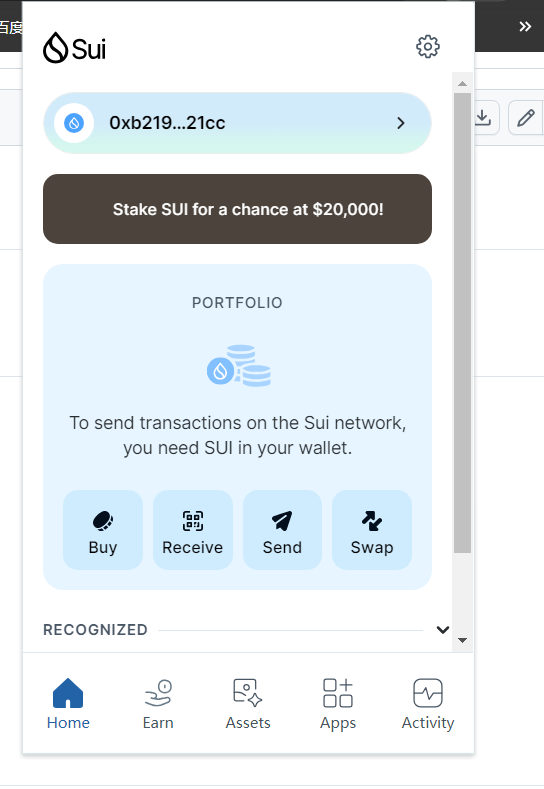
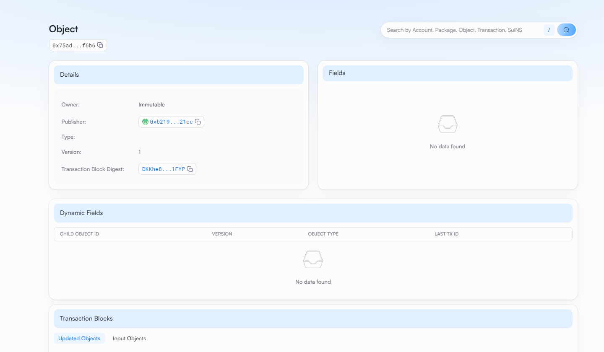

## 基本信息
- Sui钱包地址: `0xb219b855b824d6a49570928981a252d1ec849bb550d0212ca0f633dd89a321cc`
> 首次参与需要完成第一个任务注册好钱包地址才被合并，并且后续学习奖励会打入这个地址
- github: `minghuichou`

## 个人简介
- 工作经验: 在读研究生
- 技术栈: `Vue` `C++` `Python`
> 重要提示 请认真写自己的简介
- 有前端开发实习经验,了解小程序开发,对Move特别感兴趣,想通过Move入门区块链
- 联系方式: email: `minghuiz03@163.com` 

## 任务

##   01 hello move  
- [x] Sui cli version:1.43.1-2f52a7283e5f
- [x] Sui钱包截图: 
- [x] package id: 0x75ade509fb79cf09363072b29c7ae74d062e97100afcb19f9173dae18a10f6b6
- [x] package id 在 scan上的查看截图:

##   02 move coin
- [] My Coin package id : 
- [] Faucet package id : 
- [] 转账 `My Coin` hash:
- [] `Faucet Coin` address1 mint hash:
- [] `Faucet Coin` address2 mint hash:

##   03 move NFT
- [] nft package id :
- [] nft object id : 
- [] 转账 nft  hash:
- [] scan上的NFT截图:

##   04 Move Game
- [] game package id :
- [] deposit Coin hash:
- [] withdraw `Coin` hash:
- [] play game hash:

##   05 Move Swap
- [] swap package id :
- [] call swap CoinA-> CoinB  hash :
- [] call swap CoinB-> CoinA  hash :

##   06 Dapp-kit SDK PTB
- [] save hash :

##   07 Move CTF Check In
- [] CLI call 截图 : 
- [] flag hash :

##   08 Move CTF Lets Move
- [] proof : 
- [] flag hash :

