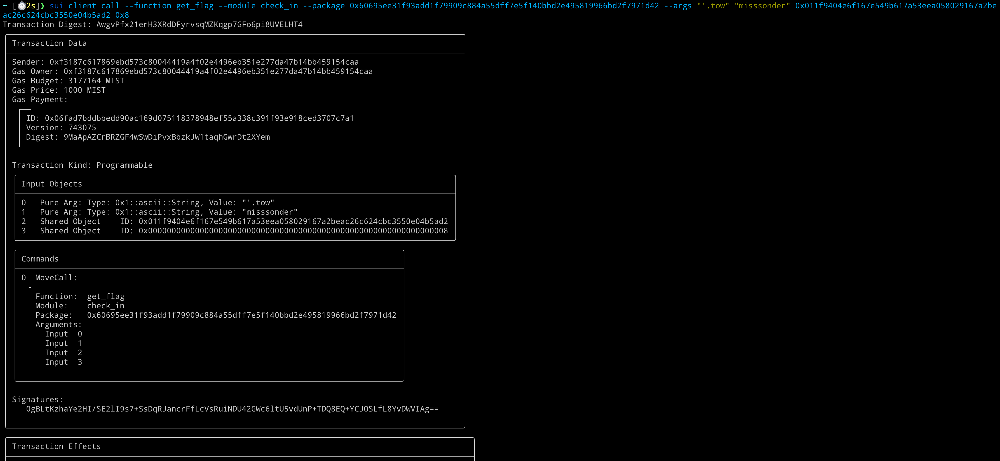

## 基本信息
- Sui钱包地址: `0xf3187c617869ebd573c80044419a4f02e4496eb351e277da47b14bb459154caa`
> 首次参与需要完成第一个任务注册好钱包地址才被合并，并且后续学习奖励会打入这个地址
- github: `misssonder`

## 个人简介
- 工作经验: 3年
- 技术栈: `Rust` `Golang`
- 对sui感兴趣，喜欢合约开发

## 任务

##   01 hello move  
- [x] package id: 0x523de44d74d8b9d08a1e09fd608d28c80004f4dbff2305288d6a7e87f4fe78cf

##   02 move coin
- [ ] My Coin package id : 
- [ ] Faucet package id : 
- [ ] 转账 `My Coin` hash: 

##   03 move NFT
- [x] nft package id : 0x2ad2d835fb86002b1bfd4f97412494f735723b2c3bec2bce7348e360237d375e 
- [x] nft object id : 0xef8e16f13146d14ec59685630045144d5544a5e7512aedfc3e297167ae865c36
- [x] 转账 nft  hash: E1daTGZUPZ1NuCL4gtoM76A2husppzKxctyJzMe1Mtwq

##   04 Move Game
- [ ] game package id :
- [ ] call game hash:

##   05 Move Swap
- [ ] swap package id :
- [ ] call swap hash:

##   06 SDK PTB
- [ ] save hash :

##   07 Move CTF Check In
- [x] CLI call 截图: 
- [x] flag hash: AwgvPfx21erH3XRdDFyrvsqMZKqgp7GFo6pi8UVELHT4

##   08 Move CTF Lets Move
- [ ] CLI call 截图: 
- [ ] Transaction block: ``