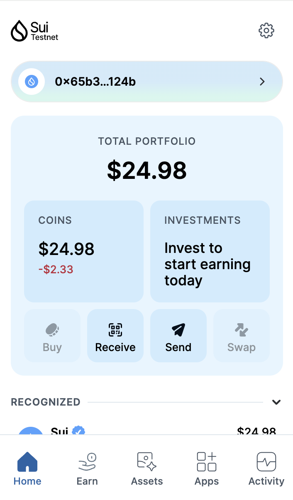
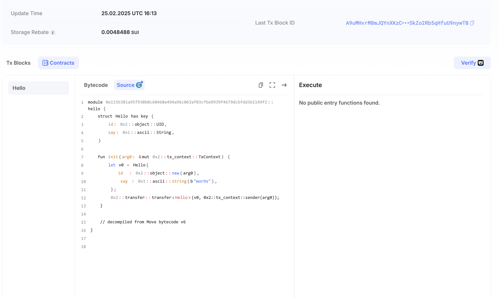

## 基本信息
- Sui钱包地址: `0x65b39ae92f6753c1d145c56250b66fe7a81418e4fb1a4d07e4e7aa1af527124b`
> 首次参与需要完成第一个任务注册好钱包地址才被合并，并且后续学习奖励会打入这个地址
- github: `mor9x`

## 个人简介
- 工作经验: 5年
- 技术栈: `Rust` `Go`
> 重要提示 请认真写自己的简介
- 四年 IM/云原生 方向后端经验,一年区块链经验(sol，eth 链上交互以及合约)
- 联系方式: tg: `https://t.me/MoriNxN `

## 任务

##   01 hello move  
- [x] Sui cli version: 1.43.1
- [x] Sui钱包截图: 
- [x] package id: 0x115b381a95f930b0c60468e494a96c063af03cfbe9939f4679dcbfdd361149f2
- [x] package id 在 scan上的查看截图:

##   02 move coin
- [] My Coin package id : 
- [] Faucet package id : 
- [] 转账 `My Coin` hash:
- [] `Faucet Coin` address1 mint hash:
- [] `Faucet Coin` address2 mint hash:

##   03 move NFT
- [] nft package id :
- [] nft object id : 
- [] 转账 nft  hash:
- [] scan上的NFT截图:

##   04 Move Game
- [] game package id :
- [] deposit Coin hash:
- [] withdraw `Coin` hash:
- [] play game hash:

##   05 Move Swap
- [] swap package id :
- [] call swap CoinA-> CoinB  hash :
- [] call swap CoinB-> CoinA  hash :

##   06 Dapp-kit SDK PTB
- [] save hash :

##   07 Move CTF Check In
- [] CLI call 截图 : 
- [] flag hash :

##   08 Move CTF Lets Move
- [] proof : 
- [] flag hash :

