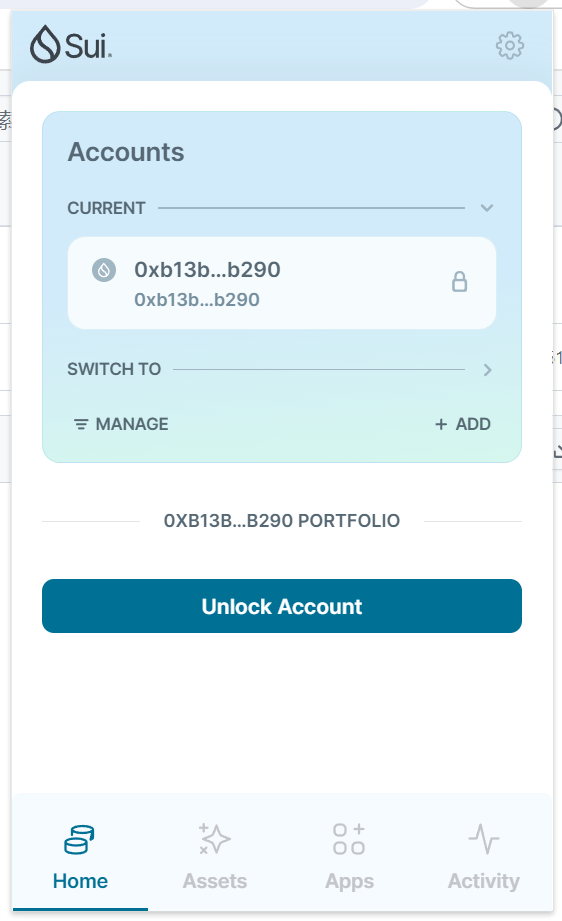
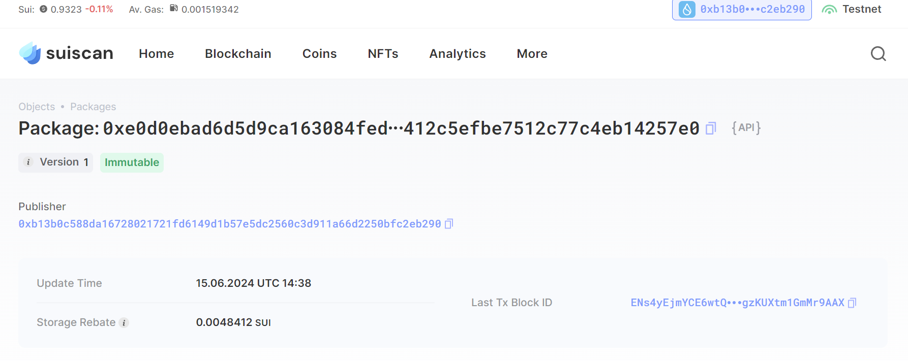

## 基本信息
- Sui钱包地址: `0xb13b0c588da16728021721fd6149d1b57e5dc2560c3d911a66d2250bfc2eb290`
> 首次参与需要完成第一个任务注册好钱包地址才被合并，并且后续学习奖励会打入这个地址
- github: `自己的githubid`

## 个人简介
- 工作经验: 0年
- 技术栈: 无
> 重要提示 请认真写自己的简介
- 无开发经验，对区块链特别感兴趣，想通过Move入门区块链
- 联系方式: tg: `mozartbb` 

## 任务

##   01 hello move  
- [] Sui cli version:sui 1.27.0-e5f080922d56-dirty
- [] Sui钱包截图: 
- [] package id: 0xe0d0ebad6d5d9ca163084fed303a0d1c97675412c5efbe7512c77c4eb14257e0
- [] package id 在 scan上的查看截图:

##   02 move coin
- [] My Coin package id : 
- [] Faucet package id : 
- [] 转账 `My Coin` hash:
- [] `Faucet Coin` address1 mint hash:
- [] `Faucet Coin` address2 mint hash:

##   03 move NFT
- [] nft package id :
- [] nft object id : 
- [] 转账 nft  hash:
- [] scan上的NFT截图:

##   04 Move Game
- [] game package id :
- [] deposit Coin hash:
- [] withdraw `Coin` hash:
- [] play game hash:

##   05 Move Swap
- [] swap package id :
- [] call swap CoinA-> CoinB  hash :
- [] call swap CoinB-> CoinA  hash :

##   06 Dapp-kit SDK PTB
- [] save hash :

##   07 Move CTF Check In
- [] CLI call 截图 : 
- [] flag hash :

##   08 Move CTF Lets Move
- [] proof : 
- [] flag hash :
