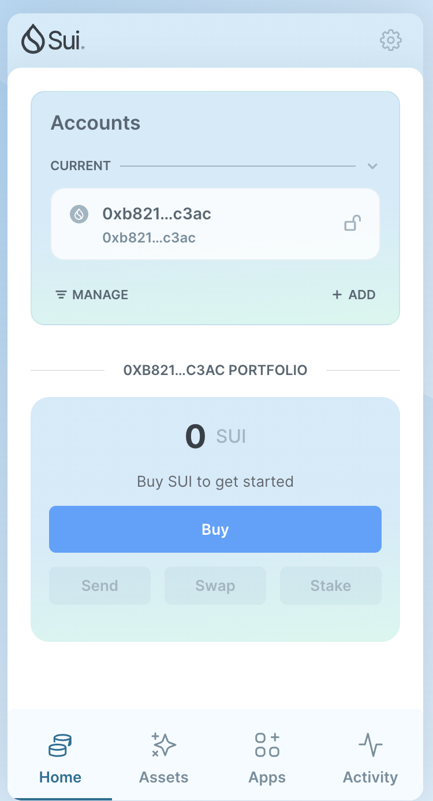
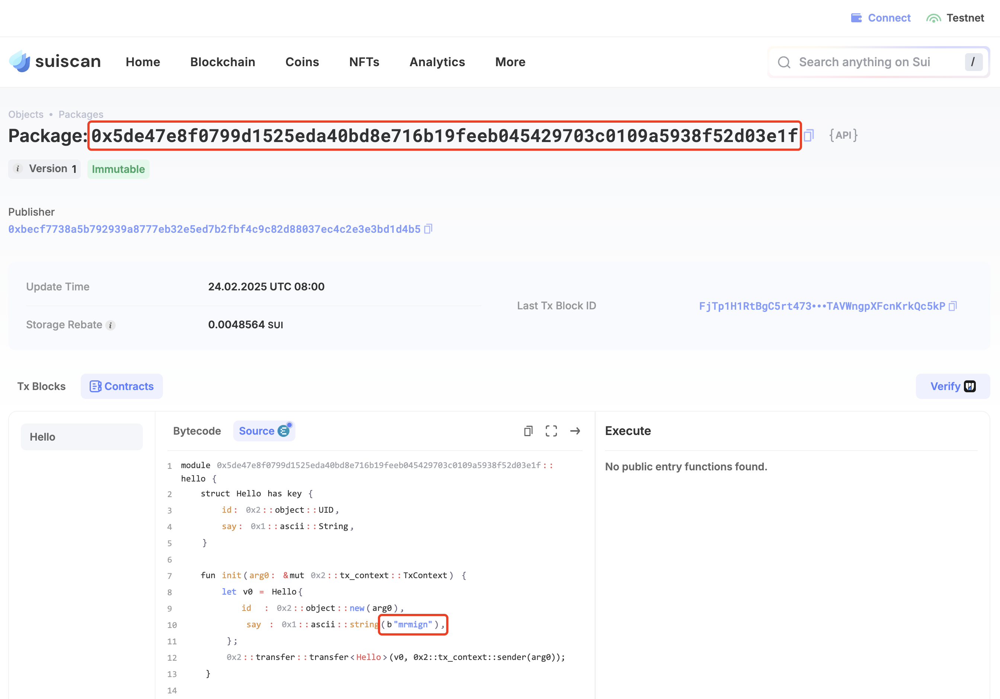
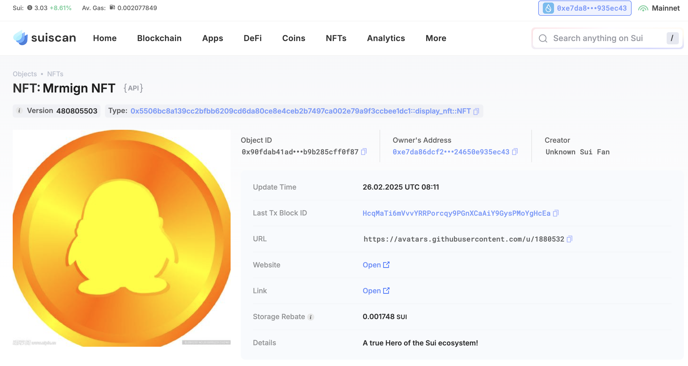
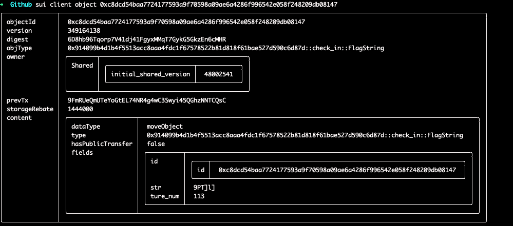
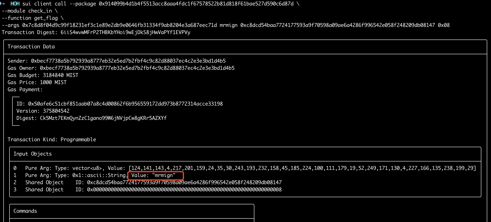

## 基本信息
- Sui钱包地址: `0xb8218fef65515484b5cb7bb34707f9ba5366646ae34c5191725c86762a6bc3ac`
> 首次参与需要完成第一个任务注册好钱包地址才被合并，并且后续学习奖励会打入这个地址
- github: `mrmign`

## 个人简介
- 工作经验: 9年
- 技术栈: `Rust`,`Golang`, `iOS`
> 重要提示 请认真写自己的简介
- 多年客户端、后台开发经验，对Move特别感兴趣，想通过Move入门区块链开发
- 联系方式: tg: `metasp4ce` 

## 任务

##   01 hello move  
- [x] Sui cli version: sui 1.42.1-homebrew
- [x] Sui钱包截图: 
- [x] package id: `0x5de47e8f0799d1525eda40bd8e716b19feeb045429703c0109a5938f52d03e1f`
- [x] package id 在 scan上的查看截图:

##   02 move coin
- [x] My Coin package id : `0xba74e7bdc1d7b7663844417a6ae4ecbffb909c834aac8c16f88db6f6aaed408e`
- [x] Faucet package id : `0xb719adc514601326081489f46e57db8e384da20525e629bf2ac877aec3749adf`
- [x] 转账 `My Coin` hash: `8a4TqSDKQ4K1K7nvkQVYnRdZkmEm6rvfbCj1qEhqfsJm`
- [x] `Faucet Coin` address1 mint hash: `GsX4hck953dfVrubg3x4VtqQ4Q5UWyUW32i2BVVt3iB7`
- [x] `Faucet Coin` address2 mint hash: `2ak7vJD9Ljt19KREPH466HxEnBHWa5D2ChFnNTa3oZsR`

##   03 move NFT
- [x] nft package id : `0x5506bc8a139cc2bfbb6209cd6da80ce8e4ceb2b7497ca002e79a9f3ccbee1dc1`
- [x] nft object id : `0x90fdab41ad10beb60d3a69d581487ab68a6ce4663d7c2e52794b9b285cff0f87`
- [x] 转账 nft  hash: `9KgGZ5DfPuqgcHJjmt5X9xnKwtHawvq8b6tdsUwQigDx`
- [x] scan上的NFT截图:

##   04 Move Game
- [x] game package id : `0xda4654534bba66b1e080ab5c75b4bb1b4225c9a004321167d0174c1dcd450380`
- [x] deposit Coin hash: `3v8uDEJrcTR7Y2zFzqvCabmYTZhNKM32yhBxnnKrFgGr` 
- [x] withdraw `Coin` hash: `2EutW8wz6w1dLEhYpcHBuDWfU5pAAEcyp9zpTL8eHyjN`
- [x] play game hash: `4SCiX66HfMdG3f1JqtHaiobu3jGseqtJCfci6HS2SEh9`

##   05 Move Swap
- [x] swap package id : `0xa07aee6c9fcece8f36819ca102e2b4a1ad067aea1cfb0fe9c96a49e2333781b0`
- [x] call swap CoinA-> CoinB  hash : `Ctn3sdo623EFrWLvsYhSvkoppsLp9gCioKr8937555Fy`
- [x] call swap CoinB-> CoinA  hash : `63NHSyQYNrXxQd4Gg9G9TvnHhkY4jddicCDW7XR4kBhz`

##   06 Dapp-kit SDK PTB
- [x] save hash : `G7fjksDsxfHFEWuDdxtTWj376oTZUJGbrBmsstw7LHdu`

##   07 Move CTF Check In
- [x] flag str: 
- [x] CLI call 截图 : 
- [x] flag hash : `6iiS4wvwMFrP2THBKbYHoi9wEjDkS8jHwVaPYf1EVPVy`

##   08 Move CTF Lets Move
- [x] proof : [119, 24, 89, 4]
- [x] flag hash : `9dMWXRk6J1SNDyeVa8gsDVHFiVG1uW5rBRQ95j4znnVE`
