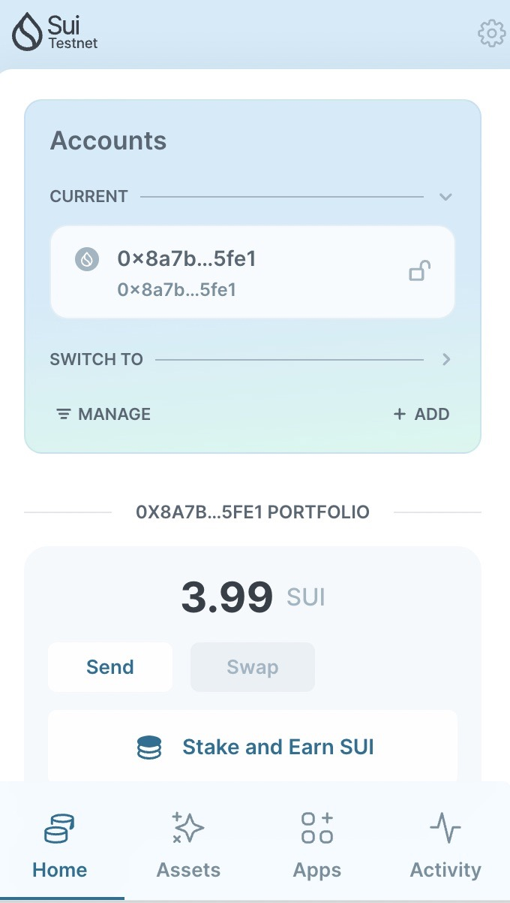
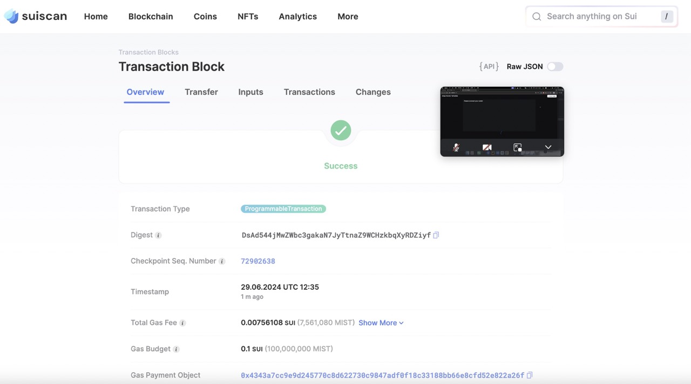

## 基本信息
- Sui钱包地址: `0x8a7bfb8d9dab117b532affcc30c35be3bb2ee44d76b84633c65e5790d73a5fe1`
> 首次参与需要完成第一个任务注册好钱包地址才被合并，并且后续学习奖励会打入这个地址
- github: `n-WN`

## 个人简介
- 工作经验: 5 年
- 技术栈: `Rust` `C++` `Python` `Golang` `Typescript` `Vue` `React` `Nodejs` `Docker` `K8s` `Ethereum` `ZK`
> 重要提示 请认真写自己的简介
- 熟悉常见编程语言, 爱好 ZK, 尝试通过 Move 学习区块链技术, 希望能够在这里学到更多的东西

## 任务

##   01 hello move  
- [x] Sui cli version: sui 1.27.2-homebrew
- [x] Sui钱包截图: 
- [x] package id: 0x252cc738a16f3ad050b00c4661205b9acd75c65467edb05230a03b2c1d61e329
- [x] package id 在 scan上的查看截图:

##   02 move coin
- [] My Coin package id : 
- [] Faucet package id : 
- [] 转账 `My Coin` hash:
- [] `Faucet Coin` address1 mint hash:
- [] `Faucet Coin` address2 mint hash:

##   03 move NFT
- [] nft package id :
- [] nft object id : 
- [] 转账 nft  hash:
- [] scan上的NFT截图:

##   04 Move Game
- [] game package id :
- [] deposit Coin hash:
- [] withdraw `Coin` hash:
- [] play game hash:

##   05 Move Swap
- [] swap package id :
- [] call swap CoinA-> CoinB  hash :
- [] call swap CoinB-> CoinA  hash :

##   06 Dapp-kit SDK PTB
- [] save hash :

##   07 Move CTF Check In
- [] CLI call 截图 : 
- [] flag hash :

##   08 Move CTF Lets Move
- [] proof : 
- [] flag hash :
