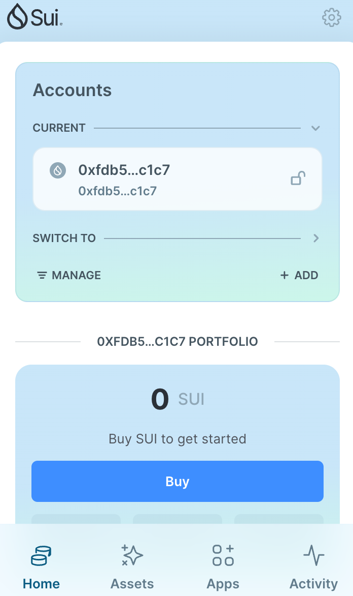
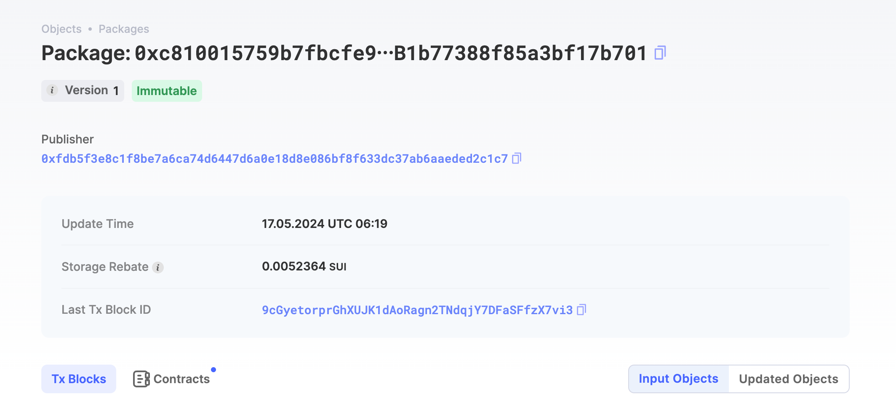
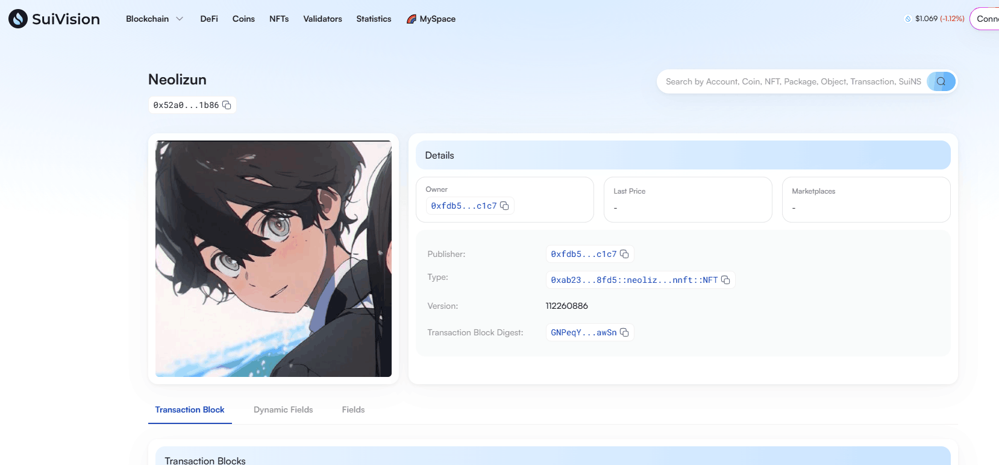

## 基本信息
- Sui钱包地址: `0xfdb5f3e8c1f8be7a6ca74d6447d6a0e18d8e086bf8f633dc37ab6aaeded2c1c7`
> 首次参与需要完成第一个任务注册好钱包地址才被合并，并且后续学习奖励会打入这个地址
- github: `neolizun`

## 个人简介
- 工作经验: 2年
- 技术栈: `Java`
> 重要提示 请认真写自己的简介
- Java开发经验丰富，对Move感兴趣，想通过Move入门区块链
- 联系方式: tg: `bolizun` 

## 任务

##   01 hello move  
- [x] Sui cli version: sui-client 1.25.0-b10ea7331e1c
- [x] Sui钱包截图: 
- [x] package id:  0xc810015759b7fbcfe93d4e6fa6d4519ca63fe4b253ab1b77388f85a3bf17b701
- [x] package id 在 scan上的查看截图:

##   02 move coin
- [x] My Coin package id :  0x4ea70917adcec10c6acec58799ebea931a2d7e25f7300c4778668cad5202a5b0 
- [x] Faucet package id : 0x4ea70917adcec10c6acec58799ebea931a2d7e25f7300c4778668cad5202a5b0 
- [x] 转账 `My Coin` hash: FKbqBxVNAzkQ3D5x6yN8h4CDdkG6vKdozb891P44mRTs
- [x] `Faucet Coin` address1 mint hash: B7by79ebAmT8kmXyFRwtbZcsLipnrnGcghcUaD4rPkw9
- [x] `Faucet Coin` address2 mint hash: 876svMXDb2CnjnEAQfzZp2cEjJZSZaWJLP1og4LB9CE8

##   03 move NFT
- [x] nft package id : 0xab234c647d7854bf75b2a19ced647cf585c857f6923fff6cce3557f4c7528fd5 
- [x] nft object id :  0x52a09c6e5a139f0ec10564ae173923620bd74cccb974d077908e2e7f747f1b86
- [x] 转账 nft  hash: FZzCHsbpjgajfbwmnTJPQpTUzbe3nHZTm1h69uuKGtMz
- [x] scan上的NFT截图: 

##   04 Move Game
- [x] game package id :  0xbf0ff4492a39a77bc922751e6c3d5dea42ef3ad696014abc5fc8ec531091a97e
- [x] deposit Coin hash: yHZoMVBK6Aqn1qJdZ7LeCZAGJLKN515Fpwj817smBD2
- [x] withdraw `Coin` hash: 6NDsHZnkVqnVvbgkX6gnv2NeeqkGVKLVuJyzH6ZVN9T3
- [x] play game hash:  B9wds4hxiCTCfUUrmUcEmh6TTsj5hduMwPBhmKYeGpch

##   05 Move Swap
- [x] swap package id : 0x28b386eefeecfe70ad0b839c96c5af36050173139b57aeba827617a13f15ebc4 
- [x] call swap CoinA-> CoinB  hash : 3z8BrHA7rdrFmy6cVWRX3LKiJQNUWvpREgXERfk1ty2N
- [x] call swap CoinB-> CoinA  hash : 32m8qYAnA71Mfx18cd2ZcDUacfrUbJeg8MUbssnycBwP

##   06 SDK PTB
- [x] save hash : MnHL4SqtK2khbPCLBtboiPXMp2fftxabcxuz8kvcAAG
