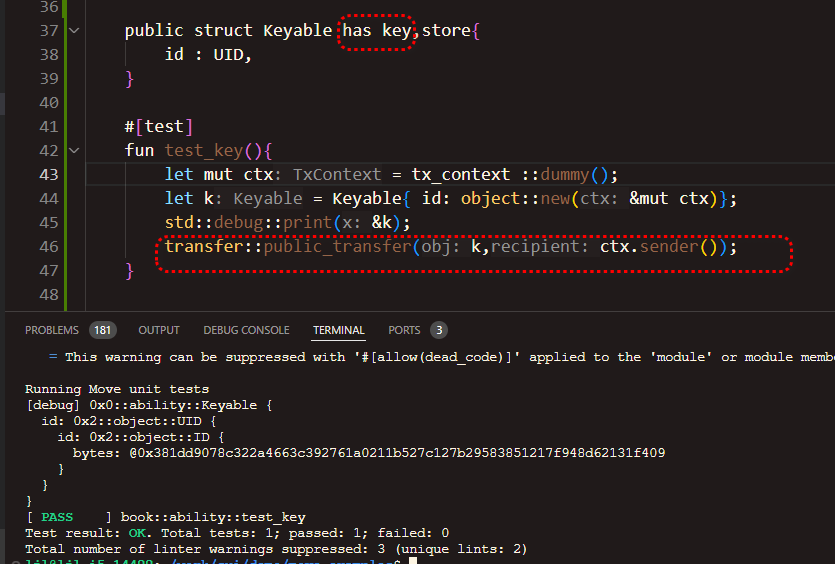

2024 -11-11  第一周Move 课程答疑问题

### 1 github 下载问题,编译时不能访问github路径


* 对策:

修改Move.toml 中的github成gitee

```
[dependencies]
#Sui = { git = "https://github.com/MystenLabs/sui.git", subdir = "crates/sui-framework/packages/sui-framework", rev = "framework/testnet" }
Sui = { git = "https://gitee.com/MystenLabs/sui.git", subdir = "crates/sui-framework/packages/sui-framework", rev = "framework/testnet" }
```


 ### 2  git pull pull不下来，报错过早文件结束


#### 2.1 如果是 github下载问题,更换是gitee

```
[dependencies]
#Sui = { git = "https://github.com/MystenLabs/sui.git", subdir = "crates/sui-framework/packages/sui-framework", rev = "framework/testnet" }
Sui = { git = "https://gitee.com/MystenLabs/sui.git", subdir = "crates/sui-framework/packages/sui-framework", rev = "framework/testnet" }
```

#### 2.2  gitee下载存在问题  

* 对策:  

  * windows: 使用git bash  执行以下命令,将代码下载到本地

  * 采用 ssh 下载

    如

    ```bash
     git clone git@gitee.com:mystenLabs/sui.git
    ```

    

* 方法一 :代码可以使用百度网盘下载

  提取码task

  ```
  https://pan.baidu.com/s/1LQwwlPz6Q2DVAod-DhD1UA
  ```

  

  

  解压到本地路径

  * linux如下命令

```bash
mkdir ~/sui-local
cd ~/sui-local
git clone git@gitee.com:mystenLabs/sui.git
git checkout framework/testnet
git pull
```


#### 2.3 修改 Move.toml ,sui框架依赖本地代码

* 确定 用户的主目录

  ```bash {.line-numbers}
  ljl@ljl-i5-14400:~/work/sui/demo/table_example$ cd ~
  ljl@ljl-i5-14400:~$ pwd
  /home/ljl
  ```

  

* 例子中的/home/ljl 是我的主目录,你可以更换成你下载的sui 代码路径

```toml
[dependencies]
#Sui = { git = "https://gitee.com/MystenLabs/sui.git", subdir = "crates/sui-framework/packages/sui-framework", rev = "framework/testnet" }
Sui = {local="/home/ljl/sui-local/sui/crates/sui-framework/packages/sui-framework" }

```


### 问题3. 每次编译都提示, fail to resolve dependencies 问题


#### 3.1 原因

github网络访问比较困难

#### 3.2 对策

* 方法1 修改工程

```bash {.line-numbers}
#Move.toml
[dependencies]
Sui = { git = "https://gitee.com/MystenLabs/sui.git", subdir = "crates/sui-framework/packages/sui-framework", rev = "framework/testnet" }
```

* 方法2  

  ```bash {.line-numbers}
  sui move --skip-fetch-latest-git-deps  build
  ```

  

  可以写一个suib的脚本, 后续执行 suib即可

  ```bash {.line-numbers}
  ljl@ljl-i5-14400:~/work/sui/demo/bb$ cat /usr/bin/suib
  sui move build --skip-fetch-latest-git-deps
  
  ```

  

### 4 publish 失败的原因, 不能找到 clien/server api version mismatch


这个是因为sui client的版本比较老,testnet已经是1.37.1

* 方法一

应该是安装的sui 二进制文件版本比较老,需要从服务器下载更新的sui 二进制文件  

 https://github.com/MystenLabs/sui/releases/tag/testnet-v1.37.1

也有可能是 gitee上的代码比较老, 需要更换Move.toml中dependencies 的以来路径

* 方法二 

```bash

sui client publish --skip-dependency-verification

```


###  5. publish问题:没有找到Move.toml (unable to find package manifest)


```bash

D:\work\sui>sui client publish
Unable to find package manifest at '\\?\D:\work\sui/Move.toml' or in its parents
```


#### 5.1 原因  

这是因为当前路径没有找到Move.toml 文件, 因为没有cd 到项目代码中.

如下图,  sui move new 新建项目目录之后,需要cd 到项目目录里面


参见上图中步骤,第三部需要cd 创建的项目的目录, sui move build 会在当前目录查找Move.toml

### 6. pubish 失败,没有gas

#### 6.1 publish失败,gas不足	

```
D:\work\sui\task1>sui client balance
No coins found for this address.

D:\work\sui\task1>sui client faucet
Request successful. It can take up to 1 minute to get the coin. Run sui client gas to check your gas coins.

D:\work\sui\task1>sui client balance
╭────────────────────────────────────────╮
│ Balance of coins owned by this address │
├────────────────────────────────────────┤
│ ╭─────────────────────────────────╮    │
│ │ coin  balance (raw)  balance    │    │
│ ├─────────────────────────────────┤    │
│ │ Sui   1000000000     1.00 SUI   │    │
│ ╰─────────────────────────────────╯    │
╰────────────────────────────────────────╯
```


###  7. 提示 需要 --gas-budget  

```bash
Could not automatically determine the gas budget. Please supply one using the --gas-budget flag.
```


#### 对策:提供 gas-budget 参数


```bash
sui client publish --gas-budget 40000000
```


### 8 .提问预编译的下载包如何使用

### 8.1  下载sui  编译包

目前的sui 预编译下载包,在

https://github.com/MystenLabs/sui/releases

根据不同操作系统,下载对应的包, 下载之后,需要解压文件

### 8.2 环境变量设置

##### 8.2.1 windows 的解压和path变量设置

windows 使用 7-zip能解压到比如 d:\app\sui 文件目录


需要在windows设置path 


#####  8.2.2 linux的解压和path 变量设置

###### 8.2.2.1 linux 下载文件后解压

下载文件到 ~/ 目录 ,下面的代码将 tgz 文件解压到sui 目录, 如果你需要

```bash

ljl@ljl-i5-14400:~$ ls *.tgz
sui-testnet-v1.36.2-ubuntu-x86_64.tgz  sui-testnet-v1.37.1-ubuntu-x86_64.tgz
ljl@ljl-i5-14400:~$ mkdir sui
ljl@ljl-i5-14400:~$ cd sui
ljl@ljl-i5-14400:~/sui$ tar xzf ../sui-testnet-v1.37.1-ubuntu-x86_64.tgz
ljl@ljl-i5-14400:~/sui$ ls
move-analyzer  sui-bridge      sui-data-ingestion  sui-faucet       sui-node            sui-tool
sui            sui-bridge-cli  sui-debug           sui-graphql-rpc  sui-test-validator
ljl@ljl-i5-14400:~/sui$ pwd
/home/ljl/sui
```

* 注意$ 之前的是命令行提示

* 最后的pwd看到的目录和你本人用户主目录有关.

  ###### 8.2.2.2 设置 path

- 可以修改/etc/profile 或 ~/.bashrc 文件的尾部,增加一行

- 注意你将/home/ljl/sui 修改成你的sui 解压的路径

```
export PATH=$PATH:/home/ljl/sui
```

- 执行 source  ~/.bashrc


##### 8.2.3  mac环境变量设置

###### mac 的安装类似linux, 最后路径设置需要配置在 /etc/profile


#

### 9 otw 有什么用

* 问题: 见证者对象有什么作用，我在好几个地方看到，只知道怎么用，不知道为什么要这么写

otw 在coin发币的时候用得很多,  因为otw对象智能由package构造,   

而参与增加货币相关的方法,都是由一个<T> 参数,这个类型参数是一个OTW参数.   使用OTW 类型做泛型的对象,

只在OTW 模块初始化的时候才能创建,以后都无法创建. One time witness 

注意

```ts {.line-numbers}
struct Balance<T>{}
struct Supply<T>{}
struct Coin<T>{}
struct TreasureCap<T>{}
/// unique instance of CoinMetadata<T> that stores the metadata for this coin type.
public struct CoinMetadata<phantom T> has key, store {
   ...
}


   
module pkg::hk{
    public struct HK has drop {},
    
    init(hk:&mut HK, ctx:mut TxContext){
        let (cap,meta) = coin::create_currency(hk,&mut ctx);
    }
}
```


创建的货币沾染了一个T, 这个T  是一个OTW  struct, 无法创建,无法在外部使用


* supply对象提供了增长货币余额balance的方法,  

* balance可以转换成coin. 
* sui::balance::create_supply 是最关键的创建货币的方法
* sui::balance::create_supply 需要一个otw对象做参数.

 create_supply 需要一个otw对象.  创建货币 需要Balance,创建Balance 需要Supply, 创建Supply 需要一个otw对象hk

```c++
module sui::balance;
public fun balance::create_supply<T: drop>(_: T): Supply<T> {
    Supply { value: 0 }
}


public fun increase_supply<T>(self: &mut Supply<T>, value: u64): Balance<T> {
    assert!(value < (18446744073709551615u64 - self.value), EOverflow);
    self.value = self.value + value;
    Balance { value }
}

```


sui::balance 这个Supply 和Balance 都需要一个OTW类

```
public struct Supply<phantom T> has store {
    value: u64,
}

/// Storable balance - an inner struct of a Coin type.
/// Can be used to store coins which don't need the key ability.
public struct Balance<phantom T> has store {
    value: u64,
}
```

sui::coin 也有一个type arg 需要一个OTW 类

```
/// A coin of type `T` worth `value`. Transferable and storable
public struct Coin<phantom T> has key, store {
    id: UID,
    balance: Balance<T>,
}
```

 我们创建货币之后,查看到的TreasuryCap,持有一个Supply对象,因此持有了增长货币的能力.


货币创建,如下图中的HK 不能手工创建,后面创建的货币,都使用HK 类型参数

```ts {.line-numbers}
module coin_owner::hk {
    use sui::coin::create_currency;
    use sui::tx_context::{TxContext, sender};

    public struct HK has drop {}

    fun init(hk: HK, ctx: &mut TxContext) {
        let (treasury_cap, coin_metadata) =
            create_currency(
            hk,
            8,
            b"HK",
            b"HK  made in hongkong",
            b"HK  made in hongkong",
            option::none(),
            ctx);
        transfer::public_freeze_object(coin_metadata);
        let my_address = sender(ctx);
        transfer::public_transfer(treasury_cap, my_address)
    }
}
```

货币创建方法 coin::create_currency, 里面需要第一个参数 witness是 One time witness


以下推论:

1. 定义货币的package publish之后,获得对象id ,成为pkg_id

2. publish的时候,临时创建了一个 pkg_id::hk::HK struct的对象

3. coin::create_currency  创建出来了 

   
   `Supply<pkg_id::hk::HK> ` 对象
   这个对象能生成 `Balance<pkg_id::hk::HK>` 对象
   能生成 `Coin<pkg_id::hk::HK>`
   

 4 .只有持有`Supply<pkg_id::hk::HK>` 对象才能发币, 以后无法手工创建`Supply<pkg_id::hk::HK>` 对象,因为

`public fun balance::create_supply<T: drop>(_: T): Supply<T>`  需要一个pkg_id::hk::HK 类型的对象做输入参数, package发布之后,无法通过编程创建.

5. TreasuryCap 只是Supply 对象的一种链上存储形式. 

6. coin::create_currency 需要一个otw 对象, 这个方法才提供了CoinMetadata,才能当做真正的货币.

   ```ts  {.line-numbers}
   public fun create_currency<T: drop>(
       witness: T,
       decimals: u8,
       symbol: vector<u8>,
       name: vector<u8>,
       description: vector<u8>,
       icon_url: Option<Url>,
       ctx: &mut TxContext,
   ): (TreasuryCap<T>, CoinMetadata<T>) {
       // Make sure there's only one instance of the type T
       assert!(sui::types::is_one_time_witness(&witness), EBadWitness);
   
       (
           TreasuryCap {
               id: object::new(ctx),
               total_supply: balance::create_supply(witness),
           },
           CoinMetadata {
               id: object::new(ctx),
               decimals,
               name: string::utf8(name),
               symbol: ascii::string(symbol),
               description: string::utf8(description),
               icon_url,
           },
       )
   }
   
   ```

7. 虽然也可以用balance::createSupply创建其他类型的balance 和coin,但是会当做其他对象看待.

   下文中不使用otw创建的Supply,可以用来创建balance和coin.

   不同用户都可以调用这个mint_to 方法. 创建出来的coin 不能视为代币,使用 sui client balance   不能看到.  因为没有对应的CoinMetadata

   ``` ts {.line-numbers}
   
   module strange_coin::jp;
   use sui::balance::{Supply,Balance};
   public struct Other has drop{}
   public struct SupplyHold has key,store{
       id : UID,
       supply :Supply<Other>,
   }
   public entry fun mint_to(amount :u64,to:address,ctx : &mut TxContext){
       let other = Other{};
       let mut supply = sui::balance::create_supply(other);
       let balance = supply.increase_supply(amount);
       let coin = sui::coin::from_balance(balance, ctx);
       let hold = SupplyHold{
           id : object::new(ctx),
           supply,
       };
       transfer::public_transfer(hold,tx_context::sender(ctx));
       transfer::public_transfer(coin,to);
   }
   ```

   

### 10. move table 对象的链上查看问题

- 问题查看

move 中 Table 是通过 dynamic field 实现的，在浏览器中似乎没有办法查到 table 中所有的数据，table 对应的那个 object id 在sui浏览器中也无法访问。只是浏览器不支持，还是说不能实现在链下查到 table 里所有的数据。

* 答复,可以看到动态字段

  #### 10.1  直接保存的table对象

  * 相关代码
  
  ```ts {.line-numbers}
  module table_example::table_example;
  use sui::table::{Self,Table};
  use std::string::String;
  
  fun init(ctx : &mut TxContext){
      let mut tb =  table::new<String,u32>(ctx);
      tb.add(b"abc".to_string(),1);
      tb.add(b"def".to_string(),2);
      transfer::public_transfer(tb,tx_context::sender(ctx));
  }
  ```
  
  

  - 查看publish上去的对象
  
    ```bash
    sui client publish --skip-fetch-latest-git-deps  
    ```
  
    相关log
  
    ```bash
    ╭──────────────────────────────────────────────────────────────────────────────────────────────────╮
    │ Object Changes                                                                                   │
    ├──────────────────────────────────────────────────────────────────────────────────────────────────┤
    │ Created Objects:                                                                                 │
    │  ┌──                                                                                             │
    │  │ ObjectID: 0x007c0c0b8d4139290a27523bd2645833853bfa12b6278573083abf9a8a6f8f5c                  │
    │  │ Sender: 0x540105a7d2f5f54a812c630f2996f1790ed0e60d1f9a870ce397f03e4cec9b38                    │
    │  │ Owner: Object ID: ( 0x2e05841c8910b5450efc2744ad379a2986c73cd451fcac469833d0083ccacf9c )      │
    │  │ ObjectType: 0x2::dynamic_field::Field<0x1::string::String, u32>                               │
    │  │ Version: 206232477                                                                            │
    │  │ Digest: 3NMXpcaGLVMa81CPJmR6Da7pKB9xdksv3qTcQzwT3Bxb                                          │
    │  └──                                                                                             │
    │  ┌──                                                                                             │
    │  │ ObjectID: 0x2e05841c8910b5450efc2744ad379a2986c73cd451fcac469833d0083ccacf9c                  │
    │  │ Sender: 0x540105a7d2f5f54a812c630f2996f1790ed0e60d1f9a870ce397f03e4cec9b38                    │
    │  │ Owner: Account Address ( 0x540105a7d2f5f54a812c630f2996f1790ed0e60d1f9a870ce397f03e4cec9b38 ) │
    │  │ ObjectType: 0x2::table::Table<0x1::string::String, u32>                                       │
    │  │ Version: 206232477                                                                            │
    │  │ Digest: Ei39HsytUhDxrxWPX5uYohJ7CsSWbysxqvbTCEVKhZEf                                          │
    │  └──                                                  
    ```
  
    

  - suiscan浏览

    
  
    ```
    https://suiscan.xyz/testnet/object/0x2e05841c8910b5450efc2744ad379a2986c73cd451fcac469833d0083ccacf9c
    ```
  
    


* 相关字段

```ts {.line-numbers}
/// Adds a key-value pair to the table `table: &mut Table<K, V>`
/// Aborts with `sui::dynamic_field::EFieldAlreadyExists` if the table already has an entry with
/// that key `k: K`.
public fun add<K: copy + drop + store, V: store>(table: &mut Table<K, V>, k: K, v: V) {
    field::add(&mut table.id, k, v);
    table.size = table.size + 1;
}

```


dynamic field,  通过table address 和 属性名,一起计算字段.

```ts {.line-numbers}
public fun add<Name: copy + drop + store, Value: store>(
    // we use &mut UID in several spots for access control
    object: &mut UID,
    name: Name,
    value: Value,
) {
    let object_addr = object.to_address();
    let hash = hash_type_and_key(object_addr, name);
    assert!(!has_child_object(object_addr, hash), EFieldAlreadyExists);
    let field = Field {
        id: object::new_uid_from_hash(hash),
        name,
        value,
    };
    add_child_object(object_addr, field)
}
```

####  table对象作为字段在 suivision 可以查看

[Sui Object](https://testnet.suivision.xyz/object/0x0a6a64b85ce448afa134c0634487bdc7bb6d4f5a621237dc92e3f1671a2467fd)

```
https://testnet.suivision.xyz/object/0x0a6a64b85ce448afa134c0634487bdc7bb6d4f5a621237dc92e3f1671a2467fd
```

```c
public struct MyStore  has key ,store{
    id:UID,
    total_balance : Balance<SUI>,
    received: Table<address,u64> ,
} 

```


相关对象定义:

```ts  {.line-numbers}
public struct MyStore  has key ,store{
    id:UID,
    total_balance : Balance<SUI>,
    received: Table<address,u64> ,
} 

```
但是相关动态字段的确看不到


### 11 sui  钱包地址和client地址

钱包地址与 sui 客户端地址的关系

* 两个不同得地址，可以认为你有两个钱包，每个钱包有不同得密码， 一般大家采用帮助记忆的12个单词来记忆

* 可以做钱包A中的coin  转移 到钱包B

  ```bash  {.line-numbers}
  
  #客户端钱包的地址，
  export    C_ADDR="`sui client active-address`"
  echo $C_ADDR
  
  # 浏览器钱包的地址，可以修改成你的钱包地址
  export W_ADDR=0xafe36044ef56d22494bfe6231e78dd128f097693f2d974761ee4d649e61f5fa2
  echo $W_ADDR
  
  # 可以查到C_ADDR 的coin
  sui client gas $C_ADDR
  
  ljl@ljl-i5-14400:~$ sui client gas $C_ADDR
  ╭────────────────────────────────────────────────────────────────────┬────────────────────┬──────────────────╮
  │ gasCoinId                                                          │ mistBalance (MIST) │ suiBalance (SUI) │
  ├────────────────────────────────────────────────────────────────────┼────────────────────┼──────────────────┤
  │ 0xa957fcfae2a624189f4ee5e24d07be6f2e492668c8a8a3a810bb684c7ae25300 │ 3667910060         │ 3.66             │
  │ 0xb2fbb77f3168b61d21ac6c005086a1747ce451df29ade1be057c4eefcd17493b │ 1000000000         │ 1.00             │
  │ 0xda2e7328acd44f9167e306f18debf134f4200f9339241d904bc2bdd18266b00d │ 1000000000         │ 1.00             │
  ╰────────────────────────────────────────────────────────────────────┴────────────────────┴──────────────────╯
  
  sui client balance $W_ADDR
  # 根据输出的gasCoinId 发送给W_ADDR
  export COIN=0xda2e7328acd44f9167e306f18debf134f4200f9339241d904bc2bdd18266b00d
  
  sui client transfer --to $W_ADDR --object-id $COIN
  
  # 查看钱包中的coin
  
  sui client gas $W_ADDR
  ╭────────────────────────────────────────────────────────────────────┬────────────────────┬──────────────────╮
  │ gasCoinId                                                          │ mistBalance (MIST) │ suiBalance (SUI) │
  ├────────────────────────────────────────────────────────────────────┼────────────────────┼──────────────────┤
  │ 0x2cbbd85ae56bb9d95746797283a6ef045fdad20d76bfe5690097f6467f96693a │ 997666048          │ 0.99             │
  │ 0x761035a215b60f6d3c08dff837b85a67f1e2620ba63a0904785924d37095c201 │ 922766720          │ 0.92             │
  │ 0xda2e7328acd44f9167e306f18debf134f4200f9339241d904bc2bdd18266b00d │ 1000000000         │ 1.00             │
  
  
  sui client balance $W_ADDR
  ```

  

  

### 我们每次做publish或move-call，都需要区块链网络计算和存储，这些计算和存储需要消耗gas值。


### 12 查看当前支持的网络

```bash
 sui client envs
╭─────────┬─────────────────────────────────────┬────────╮
│ alias   │ url                                 │ active │
├─────────┼─────────────────────────────────────┼────────┤
│ testnet │ https://fullnode.testnet.sui.io:443 │ *      │
│ devnet  │ https://fullnode.devnet.sui.io:443  │        │
│ local   │ http://127.0.0.1:9000               │        │
│ mainnet │ https://fullnode.mainnet.sui.io:443 │        │
╰─────────┴─────────────────────────────────────┴────────╯
```


配置网络devnet

```bash
sui client new-env --alias devnet --rpc https://fullnode.devnet.sui.io:443
```


如果没有devnet

```

sui client switch --env  devnet
```


### 11 自动publish到了devnet上面，不知道怎么回事，scan上面在devnet上能搜到id，但是source code显示不出

```
#  查看当前的环境
sui client envs
╭─────────┬─────────────────────────────────────┬────────╮
│ alias   │ url                                 │ active │
├─────────┼─────────────────────────────────────┼────────┤
│ testnet │ https://fullnode.testnet.sui.io:443 │        │
│ devnet  │ https://fullnode.devnet.sui.io:443  │ *      │
│ local   │ http://127.0.0.1:9000               │        │
│ mainnet │ https://fullnode.mainnet.sui.io:443 │        │
╰─────────┴─────────────────────────────────────┴────────╯
# 带星号的是当前的环境
sui client active-env
# 切换环境到testnet
 sui client switch --env  testnet
Active environment switched to [testnet]
```


### 13  ability

* 问题: move的基础语法不熟悉，比如::是什么意思，drop、key这些都是什么含义等等，感觉可以边helloworld边讲解一下语法，每个词对应的意思，为什么需要这些

参看 move-book.com ,可以使用浏览器翻译查看

#### 

对象的4中能力(abliity)

这四种能力是：

- `copy`

  - 允许复制具有此功能的类型的值。

- `drop`
  - 允许跳出作用域自动删除

- `store`

  - 允许具有此功能的类型的值存在于 链上中的值中。  存在sui 网络上的对象的字段
  - 对于 Sui，控制对象内部可以存储哪些[数据。](https://move-book.com/reference/abilities/object.html) 还控制哪些类型可以在其定义模块之外传

- `key`
  - 允许类型用作存储的 “key”。表面上，这意味着该值可以是 存储中的顶级价值;换句话说，它不需要包含在另一个值中，以 在仓库里。

  - 对于 Sui，用于表示[对象](https://move-book.com/reference/abilities/object.html)。

13.1 对象的几种存储状态:

##### 13.1.1 销毁:

* 离开作用域自动销毁,具有drop能力

  ```ts {.line-numbers}
    
    public struct IgnoreMe has drop{
        a:u32,
        b:u32
    }

    #[test]
    fun test_ignore(){
        let im = IgnoreMe{a:3,b:4};
        print(&im);
    }
  ```

  上文定义的IgnoreMe 对象im 具有自动析构的能力`has drop`,在离开函数的作用域时候自动析构.

  

* 编码主动析构

 ```ts {.line-numbers}
   public struct NoDrop{ value :u64 }

    #[test]
    fun test_nodrop(){
        let no_drop = NoDrop{ value :34};
        print(&no_drop);
        
        let NoDrop{ value: _ } = no_drop;
    }
 ```

这个例子 NoDrop类型没有drop能力,对象离开作用域,需要析构,或者将对象的所有权转移.

- 第8行是析构对象的代码

##### 13.1.2 转移:

#### 

 ```ts  {.line-numbers}
     fun useNoDrop(o : NoDrop ) : NoDrop{
         std::debug::print(&o);
         o
     }
 
     #[test]
     fun testUseNoDrop(){
         let o = NoDrop{value :4};
         let d = useNoDrop(o);
         NoDrop{value:_} = d;
     }
 ```

- 第1行函数UseNoDrop获得了对象o
- 第3行,函数将N哦Drop对象o 返回出去,将所有权转移出去.
- 第10 行,显示代码析构这个NoDrop对象


##### 13.1.3  key:独立存储在链上:
对象独立存储在链上,必须具有key能力 `has key`


```ts  {.line-numbers}
    public struct Keyable has key{
        id : UID,
    }

    #[test]
    fun test_key(){
        let mut ctx = tx_context ::dummy();
        let k = Keyable{ id: object::new(&mut ctx)};
        std::debug::print(&k);
        transfer::transfer(k,ctx.sender());
    }
```
这个例子中Keyable是具有key能力的,可以通过transfer传递到sui网络上存储, 指定owner地址.

##### 13.1.4  对象作为 共享对象存储在链上,需要具有key能力


##### 13.1.4 对象作为一个对象的一部分存储,需要具有store能力
```ts {.line-numbers}
    use std::string::String;
    public struct Grandson has store{
        name : String,
    }
    public struct Child has store{
        name : String,
        child : Grandson,
    }
    public struct Parent has key{
        id: UID,
        child: Child,
    }
    #[test]
    fun  test_store_child(){
        let mut ctx = tx_context::dummy();
        let foo = Parent {
            id : object::new(&mut ctx),
            child: Child {
                name : b"one child".to_string(),
                child: Grandson{
                    name : b"a grandson".to_string(),

                },
            }
        };
        std::debug::print(&foo);
        transfer::freeze_object(foo);
    }
```

- Parent是独立存储,具有key能力

- Child 都是作为独立存储对象Parent的字段
- Grandson 作为Child的字段存储在链上,
- Child 和Grandson 都具有store能力


原文链接：https://blog.csdn.net/ifadai/article/details/136046263
[类型技能 - Move 参考](https://move-book.com/reference/abilities.html)

#### 13.2 [四种能力](https://move-book.com/reference/abilities.html#the-four-abilities)

这四种能力是：

- `copy`

  - 允许复制具有此功能的类型的值。

- `drop`

  - 允许跳出作用域自动删除

- `store`

  - 允许具有此功能的类型的值存在于 链上中的值中。  存在sui 网络上的对象的字段
  - 对于 Sui，控制对象内部可以存储哪些[数据。](https://move-book.com/reference/abilities/object.html) 还控制哪些类型可以在其定义模块之外传

- `key`

  - 允许类型用作存储的 “key”。表面上，这意味着该值可以是 存储中的顶级价值;换句话说，它不需要包含在另一个值中，以 在仓库里。

  - 对于 Sui，用于表示[对象](https://move-book.com/reference/abilities/object.html)。

    

    

#### 13.2.1 如果有copy能力,赋值就是拷贝成一个新对象


* 上图中27行,c对象被拷贝到d,c和d指向的不是同一个对象, 

*  28 行修改了d,但是c没有被修改
* 32行和33行中,c和d取值不同.

#### 13.2 如果没有copy 能力,赋值就是移动对象


#### 13.3 如果没有ability,就必须在module内提供方法去析构它

```

```


* 定义闪电贷的出借方,在borrow的时候获得Coin和 Loan对象,  
* 在repay的时候才能销毁Loan对象, 如果借出放不调用repay,无法销毁Loan对象,交易会回滚.
* replay的时候需要校验传入的coin 要多于borrow的coin, 多出来的部分作为回报.
  * 下面是 贷方代码的例子

```c++ {.line-numbers}
module book::loan;
//hot potato pattern
public struct Loan{
    feedback: u64, //还钱数
}

public struct Coin has key,store{
	id:UID,
	amount:u64
}

//借出钱
public fun borrow(amount:u64,ctx:&mut TxContext) :(Coin,Loan){
	let feedback = amount * 103 /100;
	let c = Coin{ id: object::new(ctx),amount};
	(c, Loan{feedback}) 
}

const ErrNotEnoughFeedback:u64 = 43;
const OWNER_ADDR :address = @0xafe36044ef56d22494bfe6231e78dd128f097693f2d974761ee4d649e61f5fa2;//todo

public fun repay(coin: Coin,loan:Loan){
	assert!(coin.amount >= loan.feedback,ErrNotEnoughFeedback);
	transfer::public_transfer(coin,OWNER_ADDR);
	Loan{ feedback:_} = loan;
}

``` {.line-numbers}

下面是借方模块的代码,使用测试代码演示

```c++
#[test_only]
module book::test_loan;
use book::loan::Coin;

////todo 贷款后赚钱的业务逻辑,这里没有实现
fun earn_money(coin : Coin ) :Coin{
    coin
}


#[test]
#[expected_failure(abort_code=book::loan::ErrNotEnoughFeedback)]
fun borrow_test(){
	let mut ctx = tx_context::dummy();
	let (coin,loan) = book::loan::borrow(233,&mut ctx);
	let new_money = earn_money(coin);
	book::loan::repay(new_money,loan);
	//todo 赚钱了，可以把feedback-amount 的钱，存入自己钱包
}

```


#### 13.5 key ability

目前其他模块存到链上的对象,都需要key+store能力

transfer::public_transfer

transfer::public_freeze_object 

transfer::public_share_object





#### store

可以作为存在链上对象的一个字段.


### 11 切割coin

下例 从当前的余额中分割出来 0.05 个sui , 然后传给当前地址

```bash  {.line-numbers}
export C_ADDR=`sui client  active-address`

sui client ptb \
--split-coins gas [1000] \
--assign coin \
--transfer-objects [coin] @$C_ADDR \
--gas-budget 50000000
```


## 相关问题

| 2024年11月10日 11:49 | adadadadadadad                                               | 吾妻天依美如画 |
| -------------------- | ------------------------------------------------------------ | -------------- |
| 2024年11月10日 11:52 | 完全按照视频中操作，却与视频中得到的结果不一样，可能是版本和系统不一样吧，但自己又不会调试 | 恸             |
| 2024年11月10日 11:57 | 小白提问预编译的下载包如何使用                               | krypton        |
| 2024年11月10日 12:00 | 见证者对象有什么作用，我在好几个地方看到，只知道怎么用，不知道为什么要这么写 | 柠栀gardenia   |
| 2024年11月10日 14:02 | move 中 Table 是通过 dynamic field 实现的，在浏览器中似乎没有办法查到 table 中所有的数据，table 对应的那个 object id 在sui浏览器中也无法访问。只是浏览器不支持，还是说不能实现在链下查到 table 里所有的数据。 | Allen          |
| 2024年11月10日 16:17 | 钱包地址与 sui 客户端地址的关系                              | 罗基           |
| 2024年11月10日 21:05 | git pull pull不下来，报错过早文件结束                        | 啊吧啊吧       |
| 2024年11月11日 12:41 | 自动publish到了devnet上面，不知道怎么回事，scan上面在devnet上能搜到id，但是source code显示不出 | 洗头就是爽     |
| 2024年11月11日 14:15 | move的基础语法不熟悉，比如::是什么意思，drop、key这些都是什么含义等等，感觉可以边helloworld边讲解一下语法，每个词对应的意思，为什么需要这些 | 周雨阳         |


