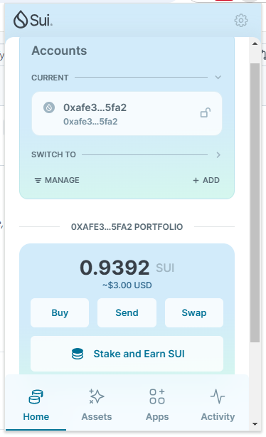
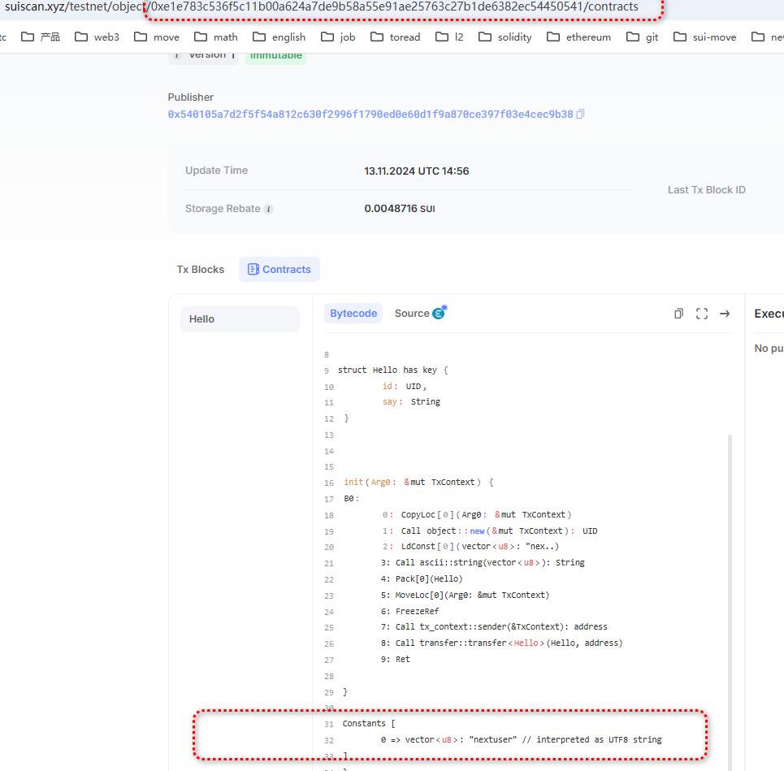
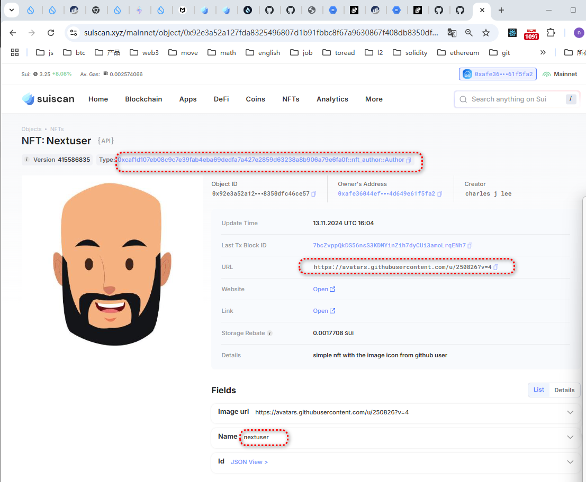
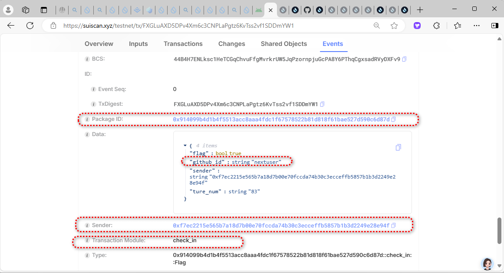
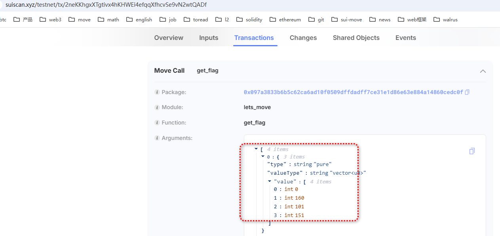
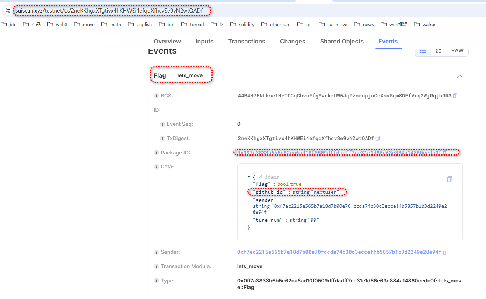

## 基本信息

- Sui钱包地址: `0xafe36044ef56d22494bfe6231e78dd128f097693f2d974761ee4d649e61f5fa2`
> 首次参与需要完成第一个任务注册好钱包地址才被合并，并且后续学习奖励会打入这个地址
- github: `nextuser`

## 个人简介
- 工作经验: 20年
- 技术栈: `Rust` `C++` `java` `javascript` 
> 重要提示 请认真写自己的简介
- 5年web2开发经验,10年c/c++开发经验，对Move特别感兴趣，想通过Move入门区块链
- 熟悉以太坊相关区块链技术 solidity
- 联系方式: tg: `lose_weight`  wechat: `growfat`

## 任务

##   01 hello move  
- [] Sui cli version: 1.37.1-7839b9501066

- [] Sui钱包截图:  

- [] package id: 0xe1e783c536f5c11b00a624a7de9b58a55e91ae25763c27b1de6382ec54450541[] 

- package id 在 scan上的查看截图:

  

  
##   02 move coin
- [] My Coin package id :0xb6b7cc1b7b4e7183ba42341c22f10c56b86d70e14a02d4f321769c687b2dabd2
- [] Faucet package id : 0x5004eab7e42fd66ad3b7475632ae3070e9a4015f8f8976009e7e8637592e9d76
- [] 转账 `My Coin` hash:DQMWZ4nEYZ4Cc6MN8HXkRWmajTJTh9Psf9euSDCTSUJt
- [] `Faucet Coin` address1 mint hash:6wFAe3HwXUHzwfcVLK63KBXmv3vnr1XykRWN37gMUd4M
- [] `Faucet Coin` address2 mint hash:4S49DwS3ZkXKcQ7aTr4USyL9sowe9324CyM4riU7FcxB

##   03 move NFT

- [] nft package id :0xcaf1d107eb08c9c7e39fab4eba69dedfa7a427e2859d63238a8b906a79e6fa0f

- [] nft object id : 0x92e3a52a127fda8325496807d1b91fbbc8f67a9630867f408db8350dfc46ce57

- [] 转账 nft  hash: 6PtC65GCdxrkRUJCZ6sfTxvxVZ7bBd3R79YfCiDB8s8M

- [] scan上的NFT截图: 

##   04 Move Game
- [] game package id :0x80f3da6457c89720ca6de5474d2d130b5d7b2c5a443bfad3daa36299d77c4d25
- [] deposit Coin hash:3J4PHqktepgHGFj7TRk2UQ4BFXEPWPWk6iGyeWJuf9o8
- [] withdraw `Coin` hash:9FWvZVpohexsHreMbMaLUmB73feei3iEykEUYZ9a9tKP
- [] play game hash:21iVdmFaie9SxQczY8cQZiCuWFDtTeo9tEY8sFb3dVHy

##   05 Move Swap
- [] swap package id :[0x5bd161ea8e0a9dd1e0119315998943cde43650ba0cd8f67e81e39e8288bb1de5](https://suiscan.xyz/mainnet/tx/EjiDEsuJuMSW2vcQnX8M3bkkrH22r7F29SaA2UFdUE2G)
- [] call swap CoinA-> CoinB  hash :[74BaVRcHiYtg36thXzBqDwdPwfkSp5jArm6xoSkfgDSd](https://suiscan.xyz/mainnet/tx/74BaVRcHiYtg36thXzBqDwdPwfkSp5jArm6xoSkfgDSd)
- [] call swap CoinB-> CoinA  hash :[EjiDEsuJuMSW2vcQnX8M3bkkrH22r7F29SaA2UFdUE2G](https://suiscan.xyz/mainnet/tx/EjiDEsuJuMSW2vcQnX8M3bkkrH22r7F29SaA2UFdUE2G)

##   06 Dapp-kit SDK PTB
- [] save hash :C4hwCmnSsgy3fCLwGJCZ4zQEoHeP6hsTRAwNMmyVPZWj

##   07 Move CTF Check In

- [] CLI call 截图 : 
- [] flag hash :C4hwCmnSsgy3fCLwGJCZ4zQEoHeP6hsTRAwNMmyVPZWj
- [] github-id:nextuser

##   08 Move CTF Lets Move

- [] proof :    [0,160,101,151]

- 

- 
- [] flag hash :2neKKhgxXTgtivx4hKHWEi4efqqXfhcvSe9vN2wtQADf

