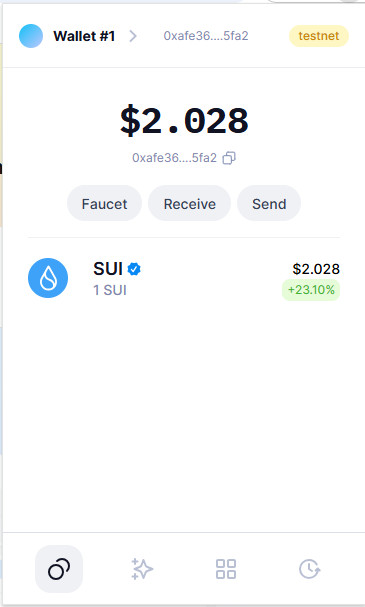
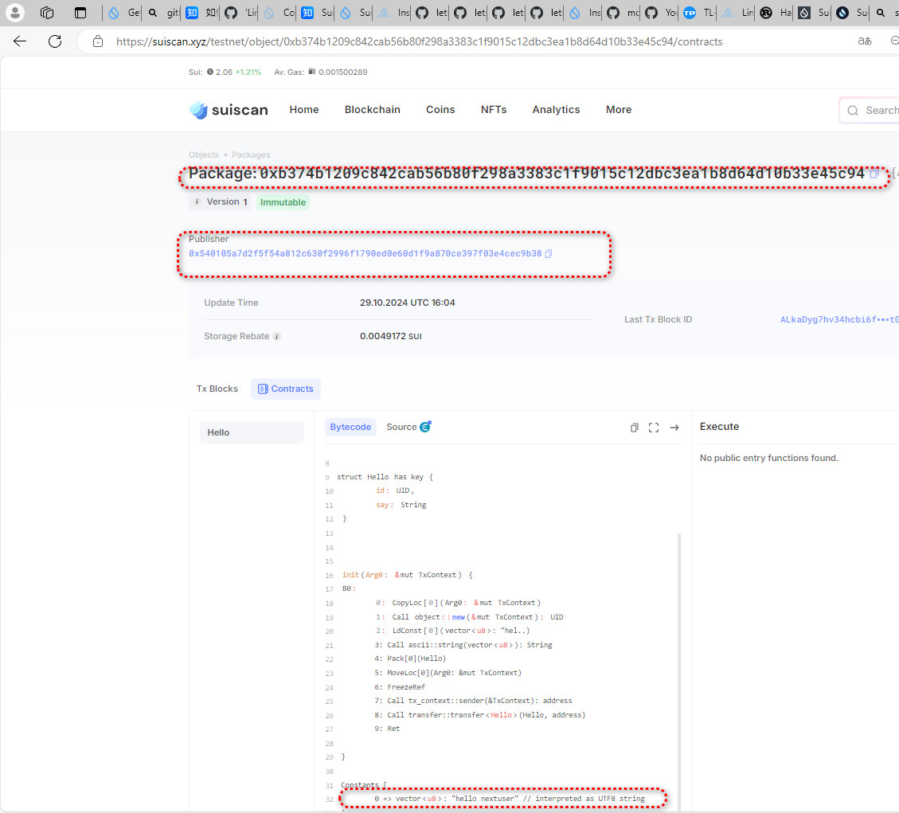

## 基本信息
- Sui钱包地址: `0xafe36044ef56d22494bfe6231e78dd128f097693f2d974761ee4d649e61f5fa2`
> 首次参与需要完成第一个任务注册好钱包地址才被合并，并且后续学习奖励会打入这个地址
- github: `nextuser`

## 个人简介
- 工作经验: 20年
- 技术栈: `Rust` `C++` `java` `javascript` 
> 重要提示 请认真写自己的简介
- 多年web2开发经验，对Move特别感兴趣，想通过Move入门区块链
- 熟悉以太坊相关区块链技术 solidity
- 联系方式: tg: `lose_weight`  wechat: `growfat`

## 任务

##   01 hello move  
- [] Sui cli version:sui-client 1.36.2-3ada97c109cc
- [] Sui钱包截图:  
- [] package id: 0xb374b1209c842cab56b80f298a3383c1f9015c12dbc3ea1b8d64d10b33e45c94
- [] package id 在 scan上的查看截图:

##   02 move coin
- [] My Coin package id : 
- [] Faucet package id : 
- [] 转账 `My Coin` hash:
- [] `Faucet Coin` address1 mint hash:
- [] `Faucet Coin` address2 mint hash:

##   03 move NFT
- [] nft package id :
- [] nft object id : 
- [] 转账 nft  hash:
- [] scan上的NFT截图:

##   04 Move Game
- [] game package id :
- [] deposit Coin hash:
- [] withdraw `Coin` hash:
- [] play game hash:

##   05 Move Swap
- [] swap package id :
- [] call swap CoinA-> CoinB  hash :
- [] call swap CoinB-> CoinA  hash :

##   06 Dapp-kit SDK PTB
- [] save hash :

##   07 Move CTF Check In
- [] CLI call 截图 : 
- [] flag hash :

##   08 Move CTF Lets Move
- [] proof : 
- [] flag hash :
