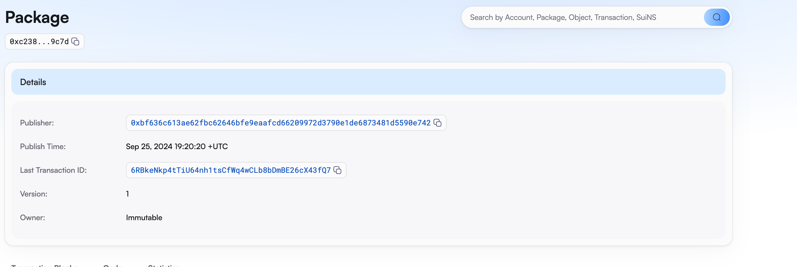
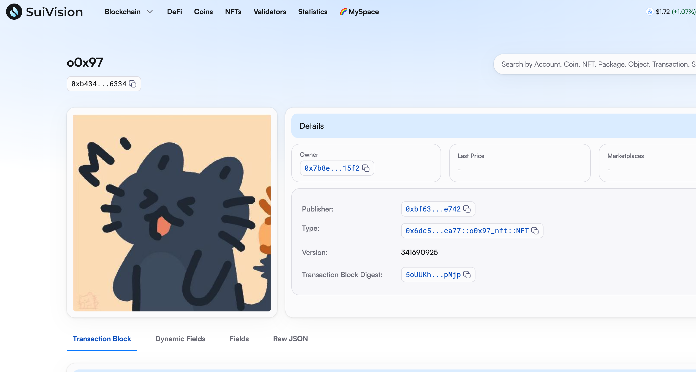

## 基本信息
- Sui钱包地址: `0xbf636c613ae62fbc62646bfe9eaafcd66209972d3790e1de6873481d5590e742`
> 首次参与需要完成第一个任务注册好钱包地址才被合并，并且后续学习奖励会打入这个地址
- github: `o0x97`

## 个人简介
- 工作经验: 1年
- 技术栈: `TypeScript JavaScript`
> 重要提示 请认真写自己的简介
- 多年web2开发经验，对Move特别感兴趣，想通过Move入门区块链
- 联系方式: tg: `zicheng97` 

## 任务

##   01 hello move  
- [x] Sui cli version: sui-client 1.33.2-c8b7f9823a7d
- [x] Sui钱包截图: 
- [x] package id: 0xc238b59e7f8a6a5eb4087947cebcd4e63dee4012f08860b5fe257c4503389c7d
- [x] package id 在 scan上的查看截图:

##   02 move coin
- [x] My Coin package id :  0x1c470dff5d32672d2844a4d51a6117efc3c2dfd2c2b98932ae9c5428097c2c4d
- [x] Faucet package id :  0x1c470dff5d32672d2844a4d51a6117efc3c2dfd2c2b98932ae9c5428097c2c4d
- [x] 转账 `My Coin` hash: FUG8SJM6YDdwEE4CK6GGwqo5tvzPqWu4xLopSPyvgdmY
- [x] `Faucet Coin` address1 mint hash: 7mhi6qpkrd928BfhcqsGLsN5Pq9UUkeTyajVtdeqCuyo
- [x] `Faucet Coin` address2 mint hash: 4daUEZmCBRpsb4nGDxGUTbdrGrA6RB5ccLvrAjEPMvnY

##   03 move NFT
- [x] nft package id : 0x6dc51e10f0ad6437170a05e0d0479a7e6f86d3206c0acd04811c25c7014fca77
- [x] nft object id : 0xb43405801957c1c03102444bffab7e8d6da1435d1cb3ab4ed7d8883603bf6334
- [x] 转账 nft  hash: 7r4zEv7FChuqbyiLGYwrzKWSJNsd9z4XUCzzg9FP4MfK
- [x] scan上的NFT截图:

##   04 Move Game
- [] game package id :
- [] deposit Coin hash:
- [] withdraw `Coin` hash:
- [] play game hash:

##   05 Move Swap
- [] swap package id :
- [] call swap CoinA-> CoinB  hash :
- [] call swap CoinB-> CoinA  hash :

##   06 Dapp-kit SDK PTB
- [] save hash :

##   07 Move CTF Check In
- [] CLI call 截图 : 
- [] flag hash :

##   08 Move CTF Lets Move
- [] proof : 
- [] flag hash :
