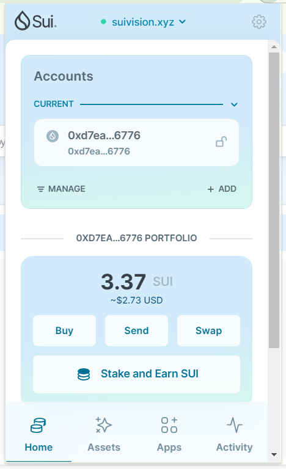

## 基本信息
- Sui钱包地址: `0xd7ea6893354b5cdc343a86fe0f0423b74294ea1c52ffb749a56b4e1591496776`
> 首次参与需要完成第一个任务注册好钱包地址才被合并，并且后续学习奖励会打入这个地址
- github: `oliverxl`

## 个人简介
- 工作经验: 20年+
- 技术栈: `Java` `JS`
> 重要提示 请认真写自己的简介
- 多年web2开发经验，对Move特别感兴趣，想通过Move入门区块链
- 联系方式: QQ: `298056679` 

## 任务

##   01 hello move  
- [x] Sui cli version: sui 1.28.0-f58faa4c5bbf-dirty
- [x] Sui钱包截图: 
- [x] package id: 0x07007b1c8529afcca60d9aa89a9bde87a5439707f5a0d9efafc4b9746feb5cef 
- [x] package id 在 scan上的查看截图:

##   02 move coin
- [x] My Coin package id : 0x06051a8551294f499805069646968f923104f3f953f1652f86c5c5da3090d58b
- [x] Faucet package id :  0x06051a8551294f499805069646968f923104f3f953f1652f86c5c5da3090d58b
- [x] 转账 `My Coin` hash:  AkKUMhfhtqjKGQHSFbJgBaVUvVfUr5tknpgMn5V7ibdZ
- [x] `Faucet Coin` address1 mint hash: 8bRAvP7g7EbRnk3U1b5yCYKDHfHvDkSmrgPYqnQyAees
- [x] `Faucet Coin` address2 mint hash: 9w1BVCvMiufdQgYDCtrLB9QppirWNZDURSiBX9pMX8yu

##   03 move NFT
- [x] nft package id : 0x5c7719d22684468e6fc5b0c72cbfe00e8a4cd01080d3ee85159ff3ec72789927
- [x] nft object id : 0xaa232a2ffbb81a1ba7cf28c3ba98b9b8587eb0dc79d4c34edc6afa09801e273b
- [x] 转账 nft  hash: FXii4z62sukUwcgCSpqiHxAoY25j3Yj7Zk3ce6Z44wJe
- [x] scan上的NFT截图:

##   04 Move Game
- [] game package id :
- [] deposit Coin hash:
- [] withdraw `Coin` hash:
- [] play game hash:

##   05 Move Swap
- [] swap package id :
- [] call swap CoinA-> CoinB  hash :
- [] call swap CoinB-> CoinA  hash :

##   06 Dapp-kit SDK PTB
- [] save hash :

##   07 Move CTF Check In
- [] CLI call 截图 : 

##   08 Move CTF Lets Move
- [] proof : 
- [] flag hash :
