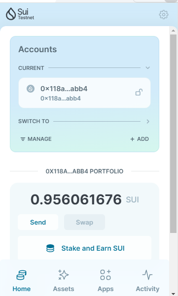
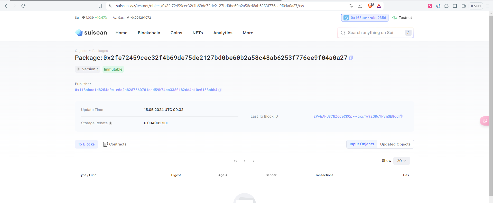
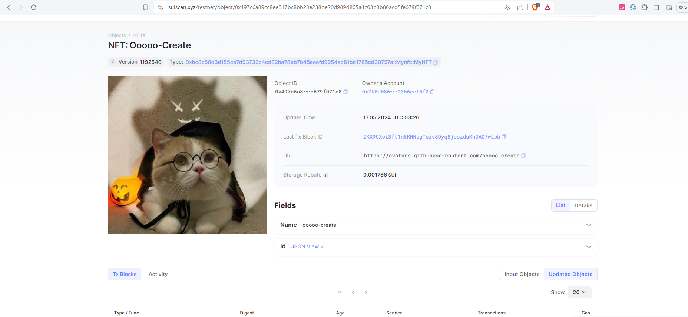
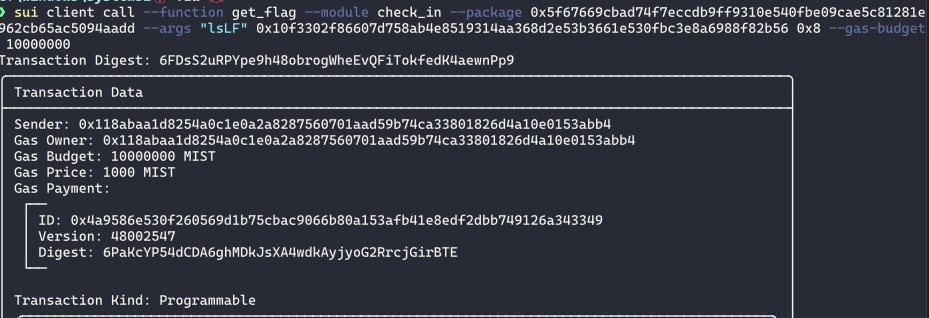

## 基本信息
- Sui钱包地址: `0x118abaa1d8254a0c1e0a2a8287560701aad59b74ca33801826d4a10e0153abb4`
> 首次参与需要完成第一个任务注册好钱包地址才被合并，并且后续学习奖励会打入这个地址
- github: `ooooo-create`

## 个人简介
- 工作经验: 0年
- 技术栈: `Python`
> 重要提示 请认真写自己的简介
- 对 Move 和区块链领域感兴趣
- 联系方式: email: `3164076421@qq.com` 

## 任务

##   01 hello move  
- [x] Sui cli version: sui 1.25.0-b10ea7331e1c-dirty
- [x] Sui钱包截图: 
- [x] package id: 0x2fe72459cec32f4b69de75de2127bd0be60b2a58c48ab6253f776ee9f04a0a27
- [x] package id 在 scan上的查看截图:

##   02 move coin
- [x] My Coin package id : 0x7247004b03f116499058575daac468d59ad6c4e84d0878628b785e16c39f5403
- [x] Faucet package id : 0x7247004b03f116499058575daac468d59ad6c4e84d0878628b785e16c39f5403
- [x] 转账 `My Coin` hash: 0x7b8e0864967427679b4e129f79dc332a885c6087ec9e187b53451a9006ee15f2
- [x] `Faucet Coin` address1 mint hash: 0x7b8e0864967427679b4e129f79dc332a885c6087ec9e187b53451a9006ee15f2
- [x] `Faucet Coin` address2 mint hash: 0x8b1ef6109200de58a41453a40399684d18390d95e14ae614a351a55a1f30a562

##   03 move NFT
- [x] nft package id : 0xbc8c58d3d155ce7d93732c4cd82ba78eb7b45aeefd9954ac81bd1765cd30757a
- [x] nft object id : 0x497c6a89cc8ee017bc8bb23e238be20d989d805a4c03b3b86acd5fe679f071c8
- [x] 转账 nft  hash: 2KX9GXoi3ft1n5KHNbgTsiv8Dyq8joszduKhDAC7wLob
- [x] scan上的NFT截图:

##   04 Move Game
- [x] game package id : 0xd8b04849cd2642cc101fbca6043c810cfaa08f2f18cc61e2e5cb79933e5508ad
- [x] deposit Coin hash: EcKoA2jMQ36oYBgDhfKDz9g9ZSUhC3BMwShy5T6SsHzL
- [x] withdraw `Coin` hash: 2GoayvqR9ryBGKUZu2a4Di3xsi7ichm36uWZ3DpFupcq
- [x] play game hash: 8gfBm7R6zEhQUt1YkT1CczbTunR1c6cMqiSMkk1T26Vz

##   05 Move Swap
- [x] swap package id : 0x3d55653d8fd98ae221bf676783466223cf344824c9238df0a0551ef11bb2f8e1
- [x] call swap CoinA-> CoinB  hash : 2nYgSTgHpJR3f2QbvvTfgr3Jmwc57n4eSMPKjFEsoWLo
- [x] call swap CoinB-> CoinA  hash : 87nzS427qa1U689sJvtxqAfm2Xcno9QpmG5kBw2rNA4W

##   06 SDK PTB
- [x] save hash : 6DRTyWPPNct7XxNNz8DwMeY3YSgBcCnpH3FfkWTZLgTu

##   07 Move CTF Check In
- [x] CLI call 截图 : 
- [x] flag hash : 6FDsS2uRPYpe9h48obrogWheEvQFiTokfedK4aewnPp9
