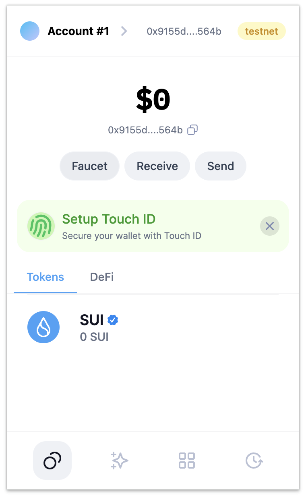

``## 基本信息

- Sui钱包地址: `0x9155d867536bd59d4a4ca7692ebc5e38a6e9bea8e2ab6d828b598656ad1e564b`

> 首次参与需要完成第一个任务注册好钱包地址才被合并，并且后续学习奖励会打入这个地址

- github: `operaxxx`

## 个人简介

- 工作经验: 5年
- 技术栈: `Java`

> 重要提示 请认真写自己的简介

- 目前是web2开发，前段时间对 web3 感兴趣，浏览了很多网站，Move 很新，对Move特别感兴趣，想通过Move入门区块链。但目前对 web3 行业了解很少。希望能通过学习能够有时间开发的机会
- 联系方式: tg: `OperaX0x` qq `522624253` wechat `asd122334`

## 任务

## 01 hello move

- [X]  Sui cli version: sui 1.43.1-homebrew
- [X]  Sui钱包截图: 
- [X]  package id: 0xa41b1495890ee362a92d4e01dc96ce2a818cc5bcd615d975b8162da969e1e4dc
- [X]  package id 在 scan上的查看截图:

## 02 move coin

- [X]  My Coin package id : 0x827512624ed69e79d9286a2147e8b4348ec9a82d358e3f794c71ebe8f15cd609
- [X]  Faucet package id : 0x98694f8486d4bcb29b3eb58ea8d97e8ff4b072e25fba4976cd46e609f3c802a4
- [X]  转账 `My Coin` hash: 7nWRMLTGnjYwaT8KfkbVcdPoq9j9wYSWYhrbFmrLcYuQ
- [X]  `Faucet Coin` address1 mint hash: 5VFaXtA6DYvTQHKT71kkmQXFPGTuxBNU2b4GwVWKwHKL
- [X]  `Faucet Coin` address2 mint hash: 9ESc1rsV1FLUese9oLMH4EcDVhXsMHscHTDULpcXu2Pf

## 03 move NFT

- [X]  nft package id : 0xc662acc153210b67336dbe28914b40410349b976a5afee6016b92fb8d53629c4
- [X]  nft object id : 0xbcc074367323de01300e9d50511e60aee3dcc6b8c1bb530644ef1753430a71a2
- [X]  转账 nft  hash: EBzX9MsrmVCxwDqNb9jY16Eqv2x9gUaFWak4Knx9Ncym
- [X]  scan上的NFT截图: 

## 04 Move Game

- [] game package id :
- [] deposit Coin hash:
- [] withdraw `Coin` hash:
- [] play game hash:

## 05 Move Swap

- [] swap package id :
- [] call swap CoinA-> CoinB  hash :
- [] call swap CoinB-> CoinA  hash :

## 06 Dapp-kit SDK PTB

- [] save hash :

## 07 Move CTF Check In

- [] CLI call 截图 : 
- [] flag hash :

## 08 Move CTF Lets Move

- [] proof :
- [] flag hash :
