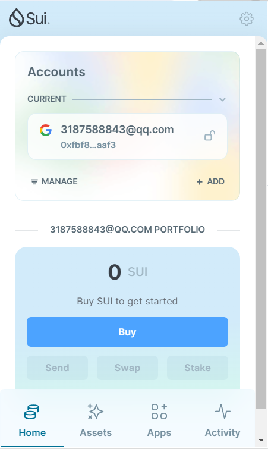
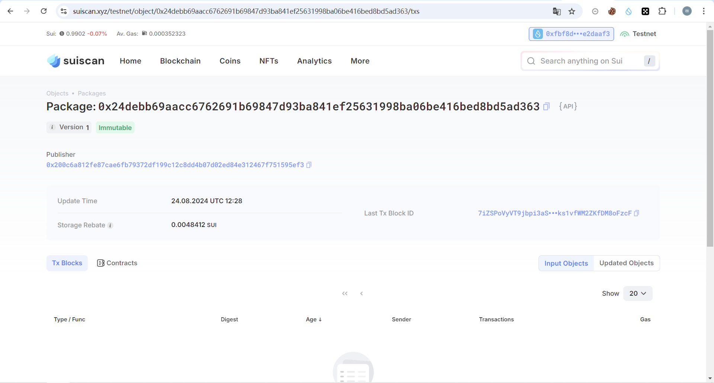

## 基本信息
- Sui钱包地址: `0xfbf8d194ee864548356404a453a37a4a7ce32d3781a078855f96b3bc6e2daaf3`
> 首次参与需要完成第一个任务注册好钱包地址才被合并，并且后续学习奖励会打入这个地址
- github: `pandastree`

## 个人简介
- 工作经验: 1年
- 技术栈: `python` ，
- 对区块链技术和sui这条链感兴趣，想学习move智能合约，最后能够部署自己的智能合约应用。
- 联系方式: tg: https://t.me/pandaLinLi

## 任务

##   01 hello move  
- [] Sui cli version:1.31.1-1bf77fe12ab9
- [] Sui钱包截图: 
- [] package id:0x24debb69aacc6762691b69847d93ba841ef25631998ba06be416bed8bd5ad363
- [] package id 在 scan上的查看截图:

##   02 move coin
- [] My Coin package id : 
- [] Faucet package id : 
- [] 转账 `My Coin` hash:

##   03 move NFT
- [] nft package id :
- [] nft object id : 
- [] 转账 nft  hash:

##   04 Move Game
- [] game package id :
- [] call game hash:

##   05 Move Swap
- [] swap package id :
- [] call swap hash:

##   06 SDK PTB
- [] save hash :