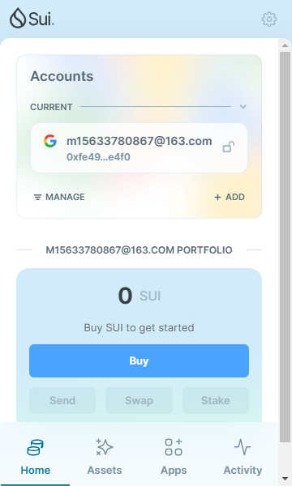
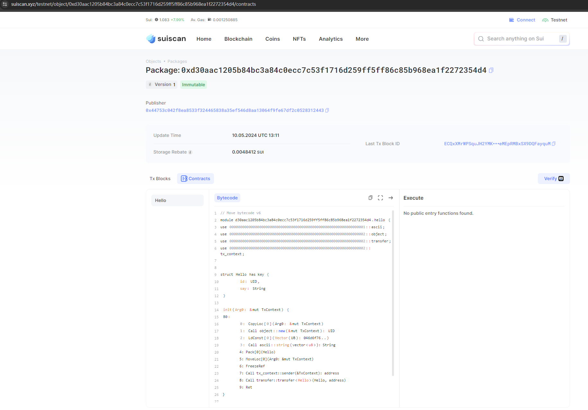

## 基本信息
- Sui钱包地址: `0xfe4982e188920c1f6a8285ce4f30c7bee2dd05de33084e3ce41acf872ec9e4f0`
> 首次参与需要完成第一个任务注册好钱包地址才被合并，并且后续学习奖励会打入这个地址
- github: `poshitou`

## 个人简介
- 工作经验: 7年
- 技术栈: `java`
> 重要提示 请认真写自己的简介
- 多年web2开发经验，对Move特别感兴趣，想通过Move入门区块链
- 联系方式: Email: `m15633780867@163.com` 

## 任务

##   01 hello move  
- [] Sui cli version: sui 1.22.0-0362997-dirty
- [] Sui钱包截图: 
- [] package id: 0xd30aac1205b84bc3a84c0ecc7c53f1716d259ff5ff86c85b968ea1f2272354d4
- [] package id 在 scan上的查看截图:

##   02 move coin
- [] My Coin package id : 
- [] Faucet package id : 
- [] 转账 `My Coin` hash:
- [] `Faucet Coin` address1 mint hash:
- [] `Faucet Coin` address2 mint hash:

##   03 move NFT
- [] nft package id :
- [] nft object id : 
- [] 转账 nft  hash:
- [] scan上的NFT截图:

##   04 Move Game
- [] game package id :
- [] deposit Coin hash:
- [] withdraw `Coin` hash:
- [] play game hash:

##   05 Move Swap
- [] swap package id :
- [] call swap CoinA-> CoinB  hash :
- [] call swap CoinB-> CoinA  hash :

##   06 SDK PTB
- [] save hash :
