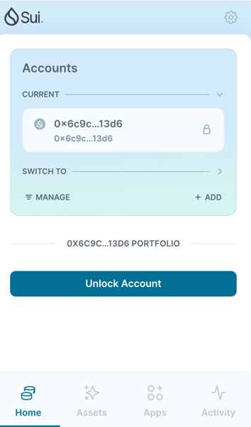

## 基本信息
- Sui钱包地址: `0x6c9cf8889683b874de4aa15a16497a6c8833f34a12dab73de2976a64371913d6`
> 首次参与需要完成第一个任务注册好钱包地址才被合并，并且后续学习奖励会打入这个地址
- github: `potato89757`

## 个人简介
- 工作经验: 0年 
- 技术栈: `无`
> 重要提示 请认真写自己的简介
- 24年2月接触web3，目前还在读金融硕士，对web3很感兴趣并且未来想往这个行业发展，也很喜欢sui。
- 联系方式: tg: `@potato89757` 

## 任务

##   01 hello move  
- [x] Sui cli version: `sui 1.37.1-homebrew`
- [x] Sui钱包截图: 
- [x] package id: `0x5ae23da22f0d6ce7edba2c8bea9bb4d2de81b5158fb4671d94dc59f6fe29fb0c`
- [x] package id 在 scan上的查看截图:

##   02 move coin
- [x] My Coin package id : `0x210e5f639f35c0a26defd553a88f6590b71f3ef6876e4096b604231a172220d1`
- [x] Faucet package id : `0x210e5f639f35c0a26defd553a88f6590b71f3ef6876e4096b604231a172220d1`
- [x] 转账 `My Coin` hash: `5EsRSVbf9p9DcxKfhoteyoCAK7Bg33fbwgK8sWFeoYtJ`
- [x] `Faucet Coin` address1 mint hash: `5ApmqP2wkfy25xP5tdm6EjkXMSS5vQ821XrcAjfZycAb`
- [x] `Faucet Coin` address2 mint hash: `6ELn4JFLpb8ycfErppPsxwpWeAa44crBjKvMhUD6Loww`

##   03 move NFT
- [x] nft package id : `0x32edf9ead5ff17e4b179d54faa7982c786773178d387df94741784b29cad11be`
- [x] nft object id : `0x85b8871e0f88153396f2c920bffdabbc0863dca908da2113b8a50d700dcb5df5`
- [x] 转账 nft  hash: `8eXqq5xoShibDNZ2e3MJPgyL7CmLQW8VARgbNcNYkhz3`
- [x] scan上的NFT截图:

##   04 Move Game
- [x] game package id : `0x227479bfb5d7dff5834c6e597dcd65a70fcbb34e504b1471ab005ebe64b6a511`
- [x] deposit Coin hash: `FV5EnnCC4VVwmC8qEtpULkUB9wsvptCWbrmDQ8S9bsc4`
- [x] withdraw `Coin` hash: `EaJLs9XHsmTuVWw4YUyN2Dxw8ueFYR1MaSkCR3JeNEt3`
- [x] play game hash: `FMqCKdy9Mr2s7m7V2rCSrgBPGb3DCNLqBYzVi63yW7Pw`

##   05 Move Swap
- [x] swap package id : `0x7f6608c410088171acc8c93cf254c40268e136d4fca838bfd64147d894c95ea7`
- [x] call swap CoinA-> CoinB  hash : `D9GbARo73Ca6P1kW1roQXQ5ZBMCy2LvCfjW5xET8sBiF`
- [x] call swap CoinB-> CoinA  hash : `EPmejD4uXDmtuuNdQhofMbi8oitnhLo5cmRpRKFZwJ99`

##   06 Dapp-kit SDK PTB
- [x] save hash : `JCiDMBvXTEfPYjuBZtvKmZThTkAzFvqjNBoKtXy7pn2B`

##   07 Move CTF Check In
- [] CLI call 截图 : 
- [] flag hash :

##   08 Move CTF Lets Move
- [] proof : 
- [] flag hash :
