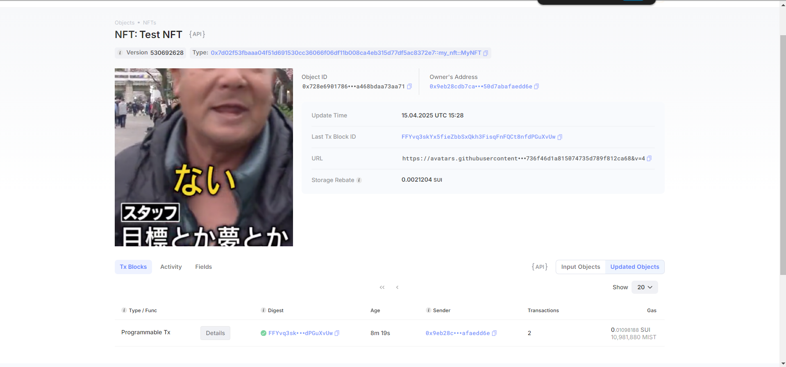

## 基本信息
- Sui钱包地址: `0x9eb28cdb7cab4a8ae396c2eb50c631a4aef3ee81f742e0742a50d7abafaedd6e`
> 首次参与需要完成第一个任务注册好钱包地址才被合并，并且后续学习奖励会打入这个地址
- github: `Procarihana`

## 个人简介
- 工作经验: 5年
- 技术栈: `JavaScript` `Java`
> 重要提示 请认真写自己的简介
- 多年web2开发经验，对Move特别感兴趣，想通过Move入门区块链
- 联系方式: github: `Procarihana` 

## 任务

##   01 hello move  
- [x] Sui cli version: `sui 1.37.1-7839b9501066`
- [x] Sui钱包截图: 
- [x] package id: `0x1c9fb9aa36a4451ed6fff2de95c982a7652e0d406979bfa7ca229c3cf890f7e7`
- [x] package id 在 scan上的查看截图:

##   02 move coin
- [x] My Coin package id : 0xfb3e9a93cf5c3eea461acc619ed4ae8cf45484cb51a10dcca4bb591191c0768e
- [x] Faucet package id : 0xfb3e9a93cf5c3eea461acc619ed4ae8cf45484cb51a10dcca4bb591191c0768e
- [x] 转账 `My Coin` hash: 3YLUsqgpUidLmWMvbAnJMXN7aCr5VeF6jQ4WGsGwz48P
- [x] `Faucet Coin` address1 mint hash: 3JApvRUyMevHDgp5o5EViZvUjJH83iSmxYS2xQaB3e6F
- [x] `Faucet Coin` address2 mint hash: AiZNt9QRXpCJ12Z2JqmuJC2kHnoB65oTdpiuLRvXD2KG

##   03 move NFT
- [x] nft package id : 0x7d02f53fbaaa04f51d691530cc36066f06df11b008ca4eb315d77df5ac8372e7
- [x] nft object id : 0x728e6901786f0bcf41926b0a9188e63a14cd26d1d6a1a093a3a468bdaa73aa71
- [x] 转账 nft  hash:  72e73nsNddd71kDzvVHKPFvHNYPNRJVMwsNkbZFajbki
- [x] scan上的NFT截图:

##   04 Move Game
- [x] game package id : 0x623488bbc4a367bf15063ffa3b1eab35dd9f050fcf8998e77e09a8f831b4a80f
- [x] deposit Coin hash: 6Jsy2P3kgGUtgAGW8zeXc85uaUvX4ZqAAC16VriikkQ
- [x] withdraw `Coin` hash: 6wRFvzB3QoCpArkQo5u5U4HwkfkQwHCz8mvEd58hcYRQ
- [x] play game hash: HMBdvJe8KaHPBY1sxxn5f6uwtxTCjPT7kSKhSdr958K8

##   05 Move Swap
- [x] swap package id : 0x526eaafb77d0a671cad1ed87e1284980ec0b1c26386168fb4e6b9ee936f581a7
- [x] call swap CoinA-> CoinB  hash : Ex9MpRiHDcgzn8bF2QUkGaQ1D8bcriRucRAM4Xj2uENb
- [x] call swap CoinB-> CoinA  hash : JCncUaaFyxNm8KaVjR2Pq7DhKP1E1KKjijCRu7rv268w

##   06 Dapp-kit SDK PTB
- [x] save hash : GVWbAZDKKBX7ghETPEcgth9Td2rnET5HzFPbWyJVaV5

##   07 Move CTF Check In
- [x] CLI call 截图 : 
- [x] flag hash : 37gRRGVviENVQiYLUVhYTyJxhjjZSoAB2QLrUC7oi12v

##   08 Move CTF Lets Move
- [x] proof : d6b9e00000000000
- [x] flag hash : 4zEGapUgWUFGUbzqF7ZtvYyStJ7inEnHkxYiVzWCzhEJ

