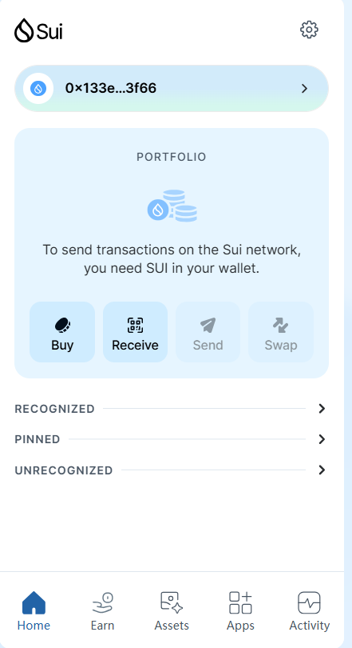
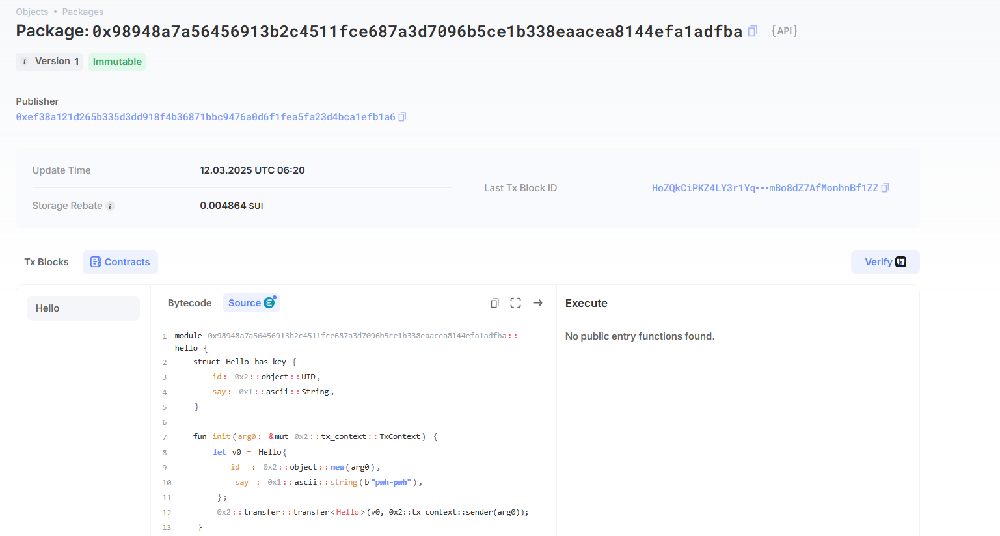
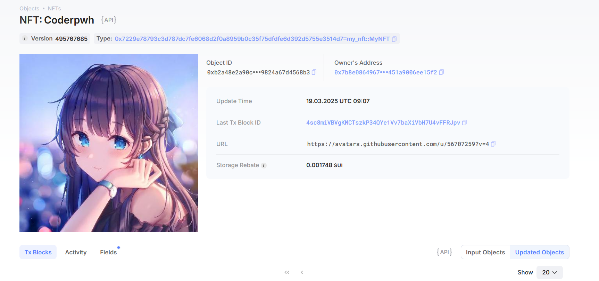

## 基本信息
- Sui钱包地址: `0x5ef482d17a7f4b6a95ce19e07132da3dd283e25347c57c1b639f35c1ed2fc26b`
> 首次参与需要完成第一个任务注册好钱包地址才被合并，并且后续学习奖励会打入这个地址
- github: `pwh-pwh`

## 个人简介
- 工作经验: 3年
- 技术栈: `Rust` `Java` `Go`
> 重要提示 请认真写自己的简介
- 多年web2开发经验，对Move特别感兴趣，想通过Move入门区块链
- 联系方式: email: `plmoknpwh@163.com` 

## 任务

##   01 hello move  
- [x] Sui cli version:sui 1.43.1-b3766e5fed72
- [x] Sui钱包截图: 
- [x] package id: 0x98948a7a56456913b2c4511fce687a3d7096b5ce1b338eaacea8144efa1adfba
- [x] package id 在 scan上的查看截图:

##   02 move coin
- [x] My Coin package id : 0xd3b0c17369305a3b69cd4ded19b873b357e3910c2c942361692ee6ef5002e476
- [x] Faucet package id : 0xb0794d0bd006a3f5dfdb60bfc100baa1a0684af59d1ea5aed93325b2b3a611fb
- [x] 转账 `My Coin` hash:2WxiTgaadS6rkDrp7MBHp5Cm4gij1BRjsyXsSX7oDeTn
- [x] `Faucet Coin` address1 mint hash:853aSp7GB7ooUnGPHyg5twcPC777nhP8jou6Km7Veo4E
- [x] `Faucet Coin` address2 mint hash:AnseKTRbY9CXFfvkcfEVuaB8eZrvK9a96NjuFpkWFDPZ

##   03 move NFT
- [x] nft package id :0x7229e78793c3d787dc7fe6068d2f0a8959b0c35f75dfdfe6d392d5755e3514d7
- [x] nft object id : 0xb2a48e2a90c263f8a0a3e8042f544c5180dfea1d9ddc6f6e8a9824a67d4568b3
- [x] 转账 nft  hash:4sc8miVBVgKMCTszkP34QYe1Vv7baXiVbH7U4vFFRJpv
- [x] scan上的NFT截图:

##   04 Move Game
- [] game package id :
- [] deposit Coin hash:
- [] withdraw `Coin` hash:
- [] play game hash:

##   05 Move Swap
- [] swap package id :
- [] call swap CoinA-> CoinB  hash :
- [] call swap CoinB-> CoinA  hash :

##   06 Dapp-kit SDK PTB
- [] save hash :

##   07 Move CTF Check In
- [] CLI call 截图 : 
- [] flag hash :

##   08 Move CTF Lets Move
- [] proof : 
- [] flag hash :

