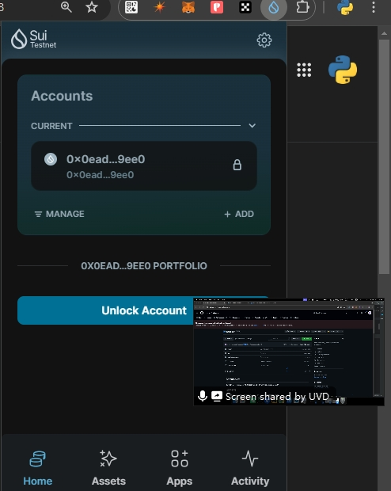
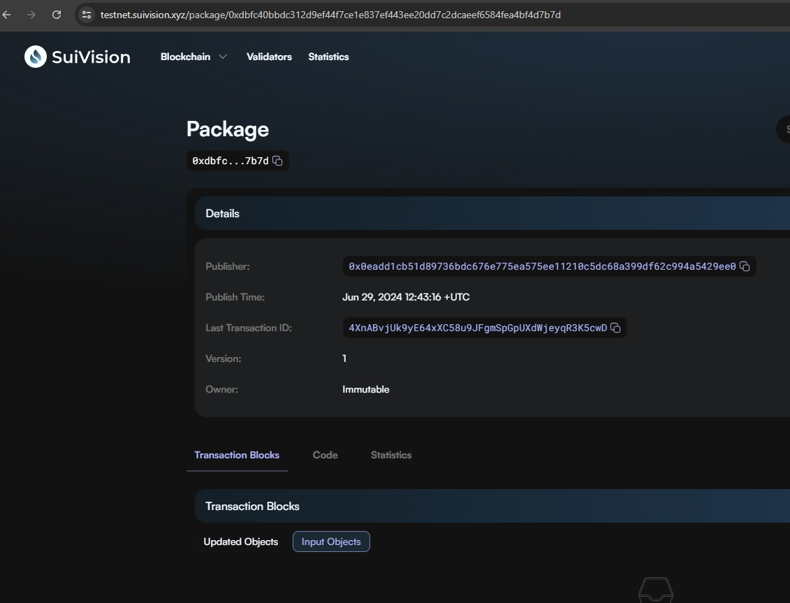

## 基本信息
- Sui钱包地址: `0x0eadd1cb51d89736bdc676e775ea575ee11210c5dc68a399df62c994a5429ee0`
> 首次参与需要完成第一个任务注册好钱包地址才被合并，并且后续学习奖励会打入这个地址
- github: `pymongo`

## 个人简介
- 工作经验: 5年
- 技术栈: `Rust` `Python`
- 曾给rust提交过PR并因此拿到过FLT空投，了解过一些cosmos/dydx grants项目，想学会修改sui源码，还想参与sui基金会grants悬赏任务
- 联系方式: email: os.popen@gmail.com

## 任务

##   01 hello move  
- [x] Sui cli version:sui 1.28.0-f58faa4c5bbf
- [x] Sui钱包截图: 
- [x] package id: 0xdbfc40bbdc312d9ef44f7ce1e837ef443ee20dd7c2dcaeef6584fea4bf4d7b7d
- [x] package id 在 scan上的查看截图:

##   02 move coin
- [] My Coin package id : 
- [] Faucet package id : 
- [] 转账 `My Coin` hash:
- [] `Faucet Coin` address1 mint hash:
- [] `Faucet Coin` address2 mint hash:

##   03 move NFT
- [] nft package id :
- [] nft object id : 
- [] 转账 nft  hash:
- [] scan上的NFT截图:

##   04 Move Game
- [] game package id :
- [] deposit Coin hash:
- [] withdraw `Coin` hash:
- [] play game hash:

##   05 Move Swap
- [] swap package id :
- [] call swap CoinA-> CoinB  hash :
- [] call swap CoinB-> CoinA  hash :

##   06 Dapp-kit SDK PTB
- [] save hash :

##   07 Move CTF Check In
- [] CLI call 截图 : 
- [] flag hash :

##   08 Move CTF Lets Move
- [] proof : 
- [] flag hash :
