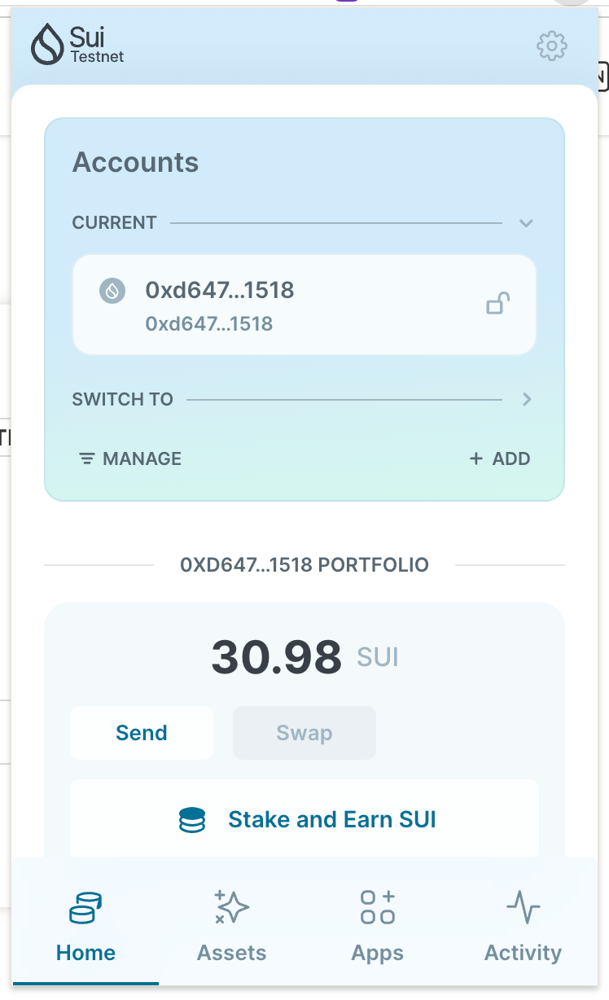
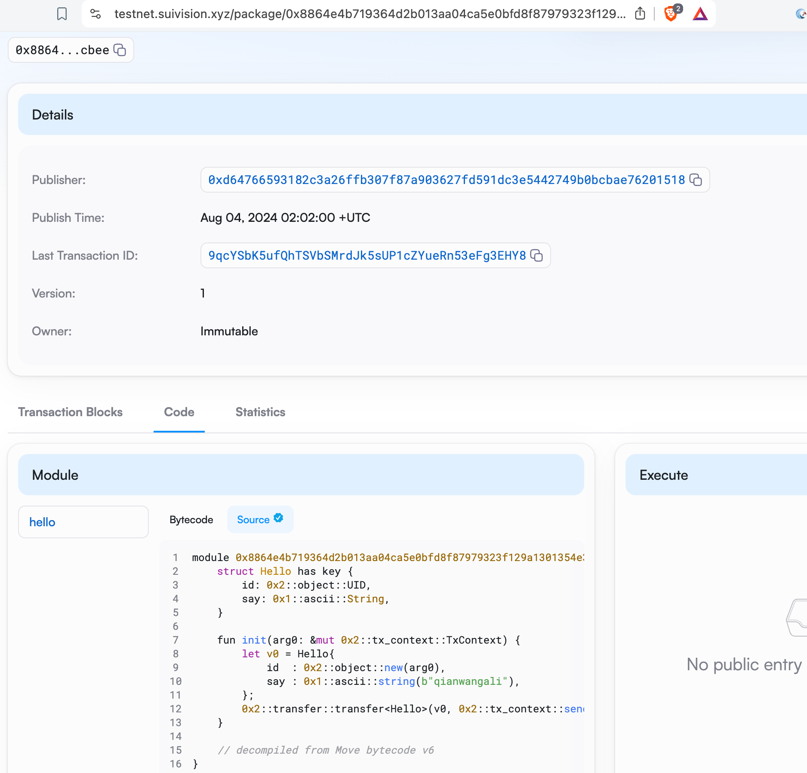
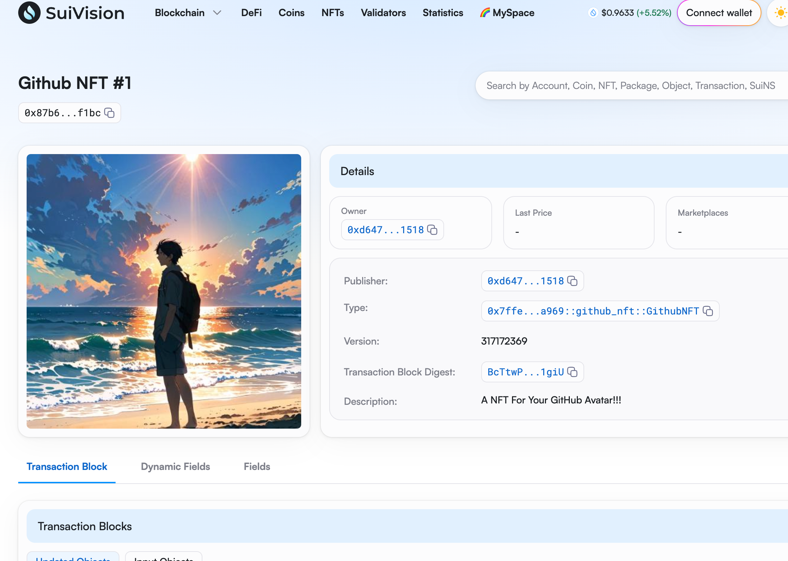

## 基本信息
- Sui钱包地址: `0xd64766593182c3a26ffb307f87a903627fd591dc3e5442749b0bcbae76201518`
> 首次参与需要完成第一个任务注册好钱包地址才被合并，并且后续学习奖励会打入这个地址
- github: `qianwangali`

## 个人简介
- 工作经验: 3年
- 技术栈: `Javascript,HTML,Delphi` 
> 重要提示 请认真写自己的简介
- 一个喜欢历史的极客，很久以前用delphi做过开发，通过比特币结识区块链。深以为赋能个人乃历史之大势，而区块链是赋能与个人最好的手段之一。
- 对比使用多条公链，深感如果抛却各种炒币热潮，如果真想用区块链解决人类社会存在的现实问题，则区块链的性能(TPS)与使用成本(GAS)是非常重要的两个因素，而SUI在这两方面做的都非常优秀，所以希望学习move来开发真正有助于人类社会进步的合约应用。
- 联系方式: tg: `https://t.me/qianwangali` 

## 任务
 r
##   01 hello move  
- [x] Sui cli version: sui 1.30.1-a4185da5659d
- [x] Sui钱包截图: 
- [x] package id: 0x8864e4b719364d2b013aa04ca5e0bfd8f87979323f129a1301354e32146bcbee
- [x] package id 在 scan上的查看截图:

##   02 move coin
- [] My Coin package id : 0xd88a9bf7ba9970fc8436cbe750b24bc2f307472f6afcd4e880baa70f0cf181cf
- [] Faucet package id : 0xd88a9bf7ba9970fc8436cbe750b24bc2f307472f6afcd4e880baa70f0cf181cf
- [] 转账 `My Coin` hash: 6nXhJQyzNiMmYAkCALjpqrGqHeeLmDZTktzsvJkAEmxB
- [] `Faucet Coin` address1 mint hash: Gvsm5CPxjrW1CGTzknMtQyCuDKi34NhEjAUFGAn8fFYx
- [] `Faucet Coin` address2 mint hash: GCr1fuvfL6zMuYozp8wPAgYLNdsC3MDjw1sWW4ysrR49

##   03 move NFT
- [] nft package id :0x7ffeb834cc4b042ac7df63ce058a0faeb8e2c4ce842604452d23c135301ea969
- [] nft object id : 0x87b65756d84128d2e8f21f2dd86c6f55f45fd645d999332d9cb237c62729f1bc
- [] 转账 nft  hash:5RqHu3Ap7dDTbCVs38Zezx6WAsvmA1eiyVHfM7vnfKKG
- [] scan上的NFT截图:

##   04 Move Game
- [] game package id :
- [] deposit Coin hash:
- [] withdraw `Coin` hash:
- [] play game hash:

##   05 Move Swap
- [] swap package id :
- [] call swap CoinA-> CoinB  hash :
- [] call swap CoinB-> CoinA  hash :

##   06 Dapp-kit SDK PTB
- [] save hash :

##   07 Move CTF Check In
- [] CLI call 截图 : 
- [] flag hash :

##   08 Move CTF Lets Move
- [] proof : 
- [] flag hash :
