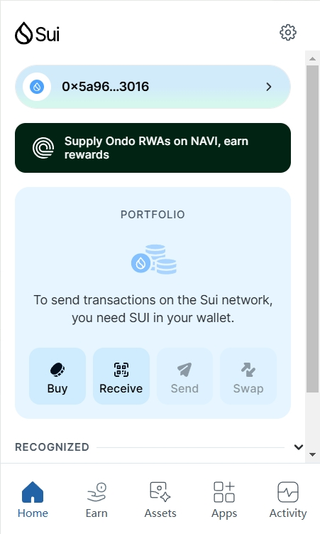
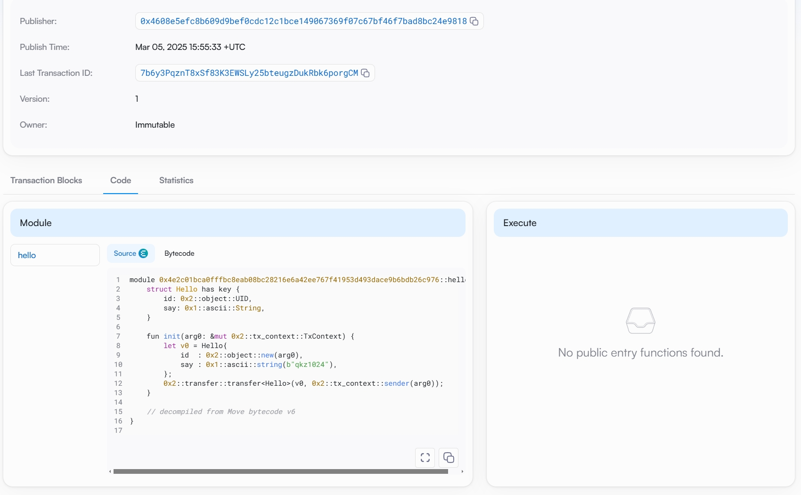

## 基本信息
- Sui钱包地址: `0x5a96c6a93f3574abc5a47865d31e4cc28edc213ca1a5823e85a86971214b3016`
> 首次参与需要完成第一个任务注册好钱包地址才被合并，并且后续学习奖励会打入这个地址
- github: `qkz1024`

## 个人简介
- 工作经验: 5年
- 技术栈: `NestJS` `JavaScript` `VUE` `React`
> 重要提示 请认真写自己的简介
- 我拥有5年Web2前端开发经验，同时也涉猎后端开发，具备扎实的全栈基础。一直以来，我对新技术充满热情，始终保持着强烈的学习欲望。近期，我对Move语言产生了浓厚的兴趣，它在区块链领域的创新特性让我看到了新的技术发展方向。我渴望通过深入学习Move语言，正式踏入Web3领域，探索更多可能性，为区块链应用开发贡献自己的力量。
- 联系方式: tg: `qkz1024` 

## 任务

##   01 hello move  
- [√] Sui cli version:
- [√] Sui钱包截图: 
- [√] package id: 0x4e2c01bca0fffbc8eab08bc28216e6a42ee767f41953d493dace9b6bdb26c976
- [√] package id 在 scan上的查看截图:

##   02 move coin
- [√] My Coin package id : 0x80dc1ac38e0d2d17f2bde95950564f74b373e0469ae5152e54d5a7094710baf2
- [√] Faucet package id : 0x0d51e10cd9e9e8f3d67e05fda2abf41ff7b1a4f63c7044dca5d1c4df537a80bd
- [√] 转账 `My Coin` hash: EswQJ7dPqeS3ETvBFjVqxGd5AxzE667T8FMs8m6HxWyv
- [√] `Faucet Coin` address1 mint hash: 9EabAUnBCKS4PfvAgUK9qUuzDPo85P2GXVeUpn8SLsY4
- [√] `Faucet Coin` address2 mint hash: 3rUC17krSkfRtnzw6FJhBu5Bmx5CzrGyD5E9MLSDudkf

##   03 move NFT
- [] nft package id :
- [] nft object id : 
- [] 转账 nft  hash:
- [] scan上的NFT截图:

##   04 Move Game
- [] game package id :
- [] deposit Coin hash:
- [] withdraw `Coin` hash:
- [] play game hash:

##   05 Move Swap
- [] swap package id :
- [] call swap CoinA-> CoinB  hash :
- [] call swap CoinB-> CoinA  hash :

##   06 Dapp-kit SDK PTB
- [] save hash :

##   07 Move CTF Check In
- [] CLI call 截图 : 
- [] flag hash :

##   08 Move CTF Lets Move
- [] proof : 
- [] flag hash :

